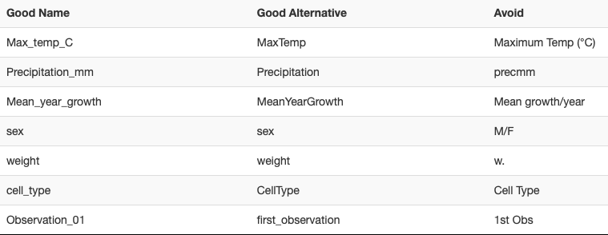

# The R Language and Tidy Data

This week is devoted to basic tutorials on R programming and using Tidy Data, building on our intro to Rstudio/Posit and Markdown last week. Just like learning a foreign language, to learn programming and get comfortable, you'll need to practice and immerse yourself! If you attempt to plow through in one sitting, unless you're a genius, you're unlikely to retain much. My suggestion is to start working early - start with either watching the assigned video or the reading. I've noted that you can choose one or the other; for extra reinforcement, read and watch (the video is only 15 minutes)! Then go ahead and get started with the in-class activities.

There are so many excellent resources to augment what we're working together on learning. If you want to dive deeper, check out this freely available online resource - [R for Data Science](https://r4ds.had.co.nz). Lastly, I hope you all take time to reflect on this week, make adjustments, think about your time management, and lastly make some time to relax and unwind. With the skills you learned last week it would only take a little more learning to make your own personal github-hosted webpage. You can see mine here: \<wrightrc.github.io\>

### Data Organization and manipulation in Spreadsheets

Spreadsheets are commonly employed software applications for entering, storing, analyzing, and visualizing data. Concentrating on the data entry and storage components, this [article](https://www.tandfonline.com/doi/full/10.1080/00031305.2017.1375989) provides practical suggestions on structuring spreadsheet data to minimize errors and facilitate subsequent analyses.

## Reading and Pre-class Materials

1.  Reading - choose 1 based on your learning style:

-   Read section 12.2 Tidy data of R for Data Science: <https://r4ds.had.co.nz/tidy-data.html#tidy-data-1>
-   Watch **a** [video on Tidy data](https://www.google.com/search?sca_esv=601299113&rlz=1C5GCEM_enUS1074US1075&sxsrf=ACQVn0-7iHIDCHJOozW2rO9jp7L-rkFjRg:1706153738901&q=tidy+data&tbm=vid&source=lnms&sa=X&sqi=2&ved=2ahUKEwjd8qf8zfeDAxX2L1kFHSTkDVAQ0pQJegQICBAB&biw=907&bih=822&dpr=2) - The [one from Posit](https://www.youtube.com/watch?v=1ELALQlO-yM&ab_channel=PositPBC), is pretty good, but in the quick check I did all of the first page for my search above were OK.
    -   Whichever reading or video you choose, I'd recommend opening up Posit/RStudio and following along with the reading material/video. For most of the content, you can duplicate the exercises in Rstudio. For example, once you create a student account, you'll be able to create your own project (RUwithMe covers this aspect)

2.  Work through the Tidy Data and R Basics intro materials in this document below which are based in part on: [Posit Cloud R Basics Recipes](https://posit.cloud/learn/primers).

Have a great weekend! Post any questions in Teams.

## Tidy data

Tidy data is pretty important for coding reproducible data analyses, because when data is tidy your code can operate on it in a consistent way.

### Top 12 Tips for Data Organization

(from [Broman and Woo, 2018](https://www.tandfonline.com/doi/full/10.1080/00031305.2017.1375989)).

1.  Organize data as a series of rectangles in separate sheets.
    -   1 row for column IDs., remaining rows the observations.
2.  One piece of data per cell.
    -   Imagine you are running an instrument with the racks to hold your samples. Each rack (A,B,C) has 10 sample slots. For the label, you could use A-1, A-2,... or have 2 columns: column 1 containing the rack ID, column 2 containing the sample slot ID. Using the latter (2-columns) is preferred. Why? In subsequent data analysis, this allows you to easily sort based on rackID (imagine there was a problem when the instrument got to rack B).
    -   Add notes in separate columns
    -   Add units in column name or separate column/data dictionary/annotation.
3.  Be consistent
    -   Use consistent "codes" for categorical variables. For example, imagine if you have a list of chemicals with a label for flammable or corrosive. As you enter data, sometimes you write out flammable, but other times just flam. What should you do? Choose one and stick with it! (Once we get into R there are some special jargon: "codes" are "levels" and "categorical variables" are "factors").
    -   Use consistent code for missing values. Fill in every cell even if the value is unknown. While some datasets use a default number (e.g. -9999) to signify no data, it's preferred to use NA.
    -   Never put a note in the data column; rather have a separate column just for notes.
    -   Use consistent variable names. When you have multiple spreadsheets representing the same type of data (e.g. flow record from different sites; experimental data from different days), keep your variable names the **same** and avoid spaces (e.g. "nitrate_mgperml" is preferred over "nitrate mg per ml)
    -   Keep layout consistent between sheets. One approach here is to set up a template, and then work from there.
    -   Use consistent file names. For example, Q_James_2015.csv and Potamac_Q_2015.csv are not consistent making it more difficult to sort, read into software, and view.
    -   Use consistent date formats. This is a **big one**! I prefer using yyyymmdd, or yyyy-mm-dd. If you sometimes show 01/22/2021 and other times 20210122, it'll make it difficult to perform data analysis!
    -   Use consistent notes in your note column.
4.  Choose good names
    -   No spaces, choose with an underscore or hyphen, avoid special characters. Using CamelCase (e.g. ExampleFileName). Include units if possible, avoid abbreviations (but not at the expense of too long)\
        See the table below from datacarpentry.org that illustrates this concept:\
        
5.  Write dates as YYYY-MM-DD. This is a global standard (ISO 8601), and using this consistently is good practice. Unfortunately, Excel is not consistent with how dates are treated across platforms (e.g. mac vs PC). Furthermore, Excel will almost always try to convert the date into a number based on an arbitrary initial date (e.g. 1904). Here are approaches to get around this:
    -   Use plain text format for columns containing text: select column → in the menu bar, select format cells → choose "text"
    -   Add dates as YYYYMMDD (e.g. 20210122)
    -   Add dates in between **apostrophes** ('2021-01-22'). This approach saves as text and not numeric.
6.  No empty cells - use "NA" when you do not have data for a given cell in a spreadsheet (for a column or row that is otherwise full of data)

Are the following spreadsheets following good practice? Why or why not?


Figures A & B - you'd need to rearrange and figure out what is going on

Figure C - data is already processed to some degree, and you don't have access to raw data

Figure D - Incomplete table, either fill out completely or break into 2 tables. See figure 6 in reading.

7.  Use a data dictionary. Keep data in a data file, **use a complimentary README file (or a metadata/annotation sheet)** that contains 'metadata'.

    -   This should include explanation of the variable, units, expected values (minimum and maximum). It may also include information about how the data was collected and how the experiment was performed.
    -   [There is an example README](images/Vermont-COVID-19) from the Vermont Covid dashboard in the images folder, "images/VT_COVID-19_Cases_by_County_Time_Series_modify_README.rtf".
    -   This could be a txt file, rtf, html, csv or any other file type.

8.  Do not perform calculations in **raw data files.** Use a separate file for visualizations, calculations, analysis, etc.

9.  Do not use color or highlighting in data files. Rather, use a column that provides a note instead of highlighting cells. (This is because the color or highlighting is data! Every datum gets its own cell - #2.)

10. Backup data. Use version control---if anything is added, updated, etc save a new version of the file.

11. Validate data. Excel, Data → Validation (see icon at right), or Data → Data Validation in Google Sheets. Then you can set up logical rules to check that your columns of data contain valid values (for example a column of percent values should be between 0 and 100). Any values that don't pass your logical test will be highlighted. To see the rules you have created [follow these instructions](https://support.microsoft.com/en-us/office/find-cells-that-have-data-validation-rules-7940468a-c95d-422f-a3fb-8fa0b90e5810). In R you can write code to validate data. More on R code below!

12. Save data in plain text files. Save as -\> Format -\> csv. Why? Simplified archive, preservation of data for future scientists and engineers. When data is saved in a proprietary format, sharing across versions/platforms and the future may be hampered.

Also check out the useful list of [shortcut keys in Excel](https://support.microsoft.com/en-us/office/keyboard-shortcuts-in-excel-1798d9d5-842a-42b8-9c99-9b7213f0040f), or [shortcut keys in Google Sheets](https://support.google.com/docs/answer/181110?visit_id=638102624813361659-1097526140&p=spreadsheets_shortcuts&rd=1).

## R Basics

While Excel certainly has its uses, it can often do more harm than good. And after all this course is, in part, about R. So here we are going to jump in to using R to analyze data.

### Basic Math to Linear Algebra

#### Arithmetic with single numbers

You want to use R to do simple arithmetic, as if R were a calculator.

**Step 1 - Write the mathematical expression you wish to evaluate.** R recognizes the following operators:

| Operator | Operation | Example |
|----------------|----------------|-----------------------------------------|
| `+` | Addition | `1 + 2` |
| `-` | Subtraction | `2 - 1` |
| `*` | Multiplication | `2 * 3` |
| `/` | Division | `4 / 2` |
| `^` | Exponentiation | `4 ^ 2`, i.e. $4^2$ |
| `%%` | Modulo | `5 %% 3`, i.e what is the remainder when you divide five by three? |
| `%/%` | Integer division | `5 %/% 3`, i.e how many times does three go into five? |

**Step 2 - Run the expression.** R will return the result.

##### Example

Suppose we want to divide the difference between `111` and `75` by `3`.

Using the operators above, we can write `111 - 75 / 3`, but R will evaluate this as `111` minus `75 / 3`


``` r
111 - 75 / 3
```

```
## [1] 86
```

R isn't doing anything funny, R is just following the standard order of mathematical operations. To correct the order of operations, we add parentheses.


``` r
(111 - 75) / 3
```

```
## [1] 12
```

**Remember PEMDAS**

PEMDAS is an acronym that describes the order of operations in arithmetic. We first evaluate expressions that are grouped together by *P*arentheses. Next, we evaluate *E*xponentiation, followed by *M*ultiplication or *D*ivision. Finally, we evaluate *A*ddition and *S*ubtraction.

Use `(` and `)` when you need to control the order of mathematical operations in R.

## Functions

### What is a function?

-   a way to reuse a chunk of code easily without having to copy and paste
-   performs simple to complex operations
-   often requires inputs \[known as the arguments\], some of which are optional
-   used when a task is performed over and over again

An example function is abs(x) where abs is the function name and x is the input argument. This function computes the absolute value of the input argument. You can learn more about this function by typing ?abs into the console.


``` r
abs(-19)
```

```
## [1] 19
```

#### Call a function on a number

R provides thousands of *functions* to use. Functions are prepackaged pieces of code that perform useful tasks. To use a function in R:

**Step 1 - Write the name of the function.** Do *not* surround it in quotes. The name tells R which function you would like to run.

**Step 2 - Place a pair of parentheses after the name.** Parentheses are the trigger that runs the function.

**Step 3 - If the function needs a piece of input to do its job, place the input inside of the parentheses.** Your function call will now look something like this, `factorial(4)`.

**Step 4 - Click Run.** Or press Enter if you are using R from a command line. R will run your function and return the result.

#### Example

Suppose we'd like to find the square root of `1764`. We can do this with a function named `sqrt`, which is short for *square root*.

To call `sqrt`, we first write its name. Notice that if we run just the name of `sqrt`, R shows us the code associated with `sqrt`. That's not what we want.

```         
sqrt
```

```         
## function (x)  .Primitive("sqrt")
```

Next, we place a pair of parentheses after `sqrt`. When we click Run, the parentheses will cause R to execute our function. Our function call is not yet complete because `sqrt()` requires a piece of input to do its job. Which number should square root take the square of? If we run our command in this unfinished state, R will return an error message.


``` r
sqrt()
```

```
## Error in sqrt(): 0 arguments passed to 'sqrt' which requires 1
```

We finish our command by giving `sqrt()` a number to take the square of, in this case, `1764`.


``` r
sqrt(1764)
```

```
## [1] 42
```

In markdown we will use a special convention whenever we mention a function: we will write the function's name in code font and follow it with a pair of parentheses, like this `sqrt()`.

R users have several names for the code that runs a function. You may see it referred to as:

-   A command

-   A function call

-   An expression

Or some variation of the above. They all mean the same thing: a bit of code to run.

Watch our for this common mistake. it is easy to create an error by omitting the *closing parenthesis* of a function call:


``` r
sqrt(1764
```

```
## Error in parse(text = input): <text>:2:0: unexpected end of input
## 1: sqrt(1764
##    ^
```

## Objects - Variables and Functions

R is an object-oriented programming language. This means we can use R to create abstracted objects that contain data (of any type, shape or size) called variables or procedures/methods (individual blocks of code) called functions. There are numerous functions and datasets included in the base R installation. Also, as an open source language countless programmers in the R community have written useful functions and created useful datasets that are freely available in the form of R-packages (more on these later). You can also write your own!

### Obey R's naming rules

You want to give a valid name to an object in R.

**Step 1 - Choose a name that includes valid characters.** Names in R may be made up of three types of characters:

-   Capital and lowercase letters

-   Numbers

-   The symbols `.` and `_`

Other characters are forbidden because we use them *with* names to perform actions. R wouldn't be able to distinguish the name `x+y` from the command `x + y` written without spaces.

**Step 2 - Double-check that the first character is a letter or `.`.** Names in R may not start with a number or `_`, even though these symbols can appear anywhere else in the name.

**Step 3 - Assign an object to the name.** Use the assignment arrow (`<-`) with the name on the left and the object on the right.

#### Example

Suppose we'd like to create an object storing the number of trials in an experiment. In our first attempt, we give the object the name `#_of_trials`.


``` r
#_of_trials <- 15 
#_of_trials
```

This doesn't give us any output, because `#` is not a valid character for an object name. Let's try again, using only valid characters:


``` r
number_of_trials <- 15
number_of_trials
```

```
## [1] 15
```

That worked! Now let's record the observed value of our first trial:


``` r
1st_trial <- 476.2
1st_trial
```

```
## Error in parse(text = input): <text>:1:2: unexpected symbol
## 1: 1st_trial
##      ^
```

That didn't work either. Even though all the characters were valid, object names canonly start with a letter or `.`, not a number or `_`. Let's try again.


``` r
first_trial <- 476.2 
first_trial
```

```
## [1] 476.2
```

Success!

Object names can include capital and lowercase letters in any order, but names in R are case sensitive. Look what happens if you try to get the value of an object with the wrong capitalization:


``` r
my_value <- 100
My_Value
```

```
## Error: object 'My_Value' not found
```

Some names follow all of R's rules, but can't be used because they are reserved for a special purpose. Look what happens if you try to assign an object to the name `TRUE`.


``` r
TRUE <- 100
```

```
## Error in TRUE <- 100: invalid (do_set) left-hand side to assignment
```

Names like `TRUE`, `FALSE`, `NA`, and `function` can't be assigned to objects, because they already have important uses in R.

### Variables and data types

You can create objects (variables\~values, large data structures\~think spreadsheets and databases, and functions) using the `=`, `<-` or `->` operators. You can see what type of data (or data type) a variable is using the `class` function. Go ahead, try `class(x)`. Data in R can be of several different, basic types:

| Data Type | aka         | Example                             |
|-----------|-------------|-------------------------------------|
| Logical   | Boolean     | TRUE, FALSE                         |
| Numeric   | float       | 42, 3.14,                           |
| Character | string      | 'a' , "good", "TRUE", '23.4'        |
| Integer   |             | 2L, 34L, 0L                         |
| Complex   |             | 3 + 2i                              |
| Raw       | hexadecimal | "Hello" is stored as 48 65 6c 6c 6f |

### Vectors

Vectors in R are simply ordered lists of values. These values can be of any type (strings, numerics, Boolean, etc), **but they must all be of the same type, or R will force them to be the same.** We can construct vectors using the `c()` function.

Let's run through a quick example:


``` r
col_names <- c('plant', 'genotype')
col_names
```

```
## [1] "plant"    "genotype"
```

------------------------------------------------------------------------

#####???Question??? What is `c` abbreviating? (i.e. what is the title of the `c()` function?) *answer here*

What are the arguments that you can pass to `c()`? *answer here*

------------------------------------------------------------------------

Now we have a vector of strings. We can access the individual elements (the values we put in our vector) using the square bracket operator.


``` r
col_names[1]
```

```
## [1] "plant"
```

``` r
col_names[2]
```

```
## [1] "genotype"
```

``` r
#Note that the indices begin at 1 in R!!!
col_names[0]
```

```
## character(0)
```

We can also change elements or add elements to the vector using the bracket operator.


``` r
col_names[2] <- 'phenotype'
col_names[3] <- 'root_length'
col_names
```

```
## [1] "plant"       "phenotype"   "root_length"
```

``` r
col_names[4] <- FALSE
col_names
```

```
## [1] "plant"       "phenotype"   "root_length" "FALSE"
```

------------------------------------------------------------------------

#####???Question???\
What happened to FALSE (is it a Boolean)? *answer here*

Write a block of code to test what would happen if we instead added a character string to a vector of logical values (i.e. make a new variable containing a few Boolean values, then add a string to that vector)! What happens? *answer here*


------------------------------------------------------------------------

We can also do mathematical or logical operations on entire vectors.


``` r
col_names == FALSE
```

```
## [1] FALSE FALSE FALSE  TRUE
```

``` r
vector <- c(1, 2, 3, 4, 5)
6*vector
```

```
## [1]  6 12 18 24 30
```

``` r
vector^2
```

```
## [1]  1  4  9 16 25
```

``` r
vector > 2
```

```
## [1] FALSE FALSE  TRUE  TRUE  TRUE
```

### Matrices, Arrays and Lists

**Matrices** are two dimensional data sets and **Arrays** are N-dimensional data sets. Like vectors these must be made of a single data type. For more info `?matrix` and `?array`.

Lists are more complex data structures that are similar to vectors but allow multiple data types. Lists can contain vectors as elements and even other lists! This makes them potentially N-dimensional but clunky to work with. You might encounter them if you use R in the future. For more info `?list`.

### Data frames

Variables in R are not limited to just strings or integers or even matrices. You can store and operate on entire spreadsheets with columns of defined data types, using what R calls 'data frames'. Data frames have columns that are made of vectors. The data frame is one of the most fundamental data structures used in R. `?data.frame` provides a wealth of knowledge about data frames, but let's just go ahead and make one! Run the following code.


``` r
L3 <- LETTERS[1:3]
fac <- sample(L3, 10, replace = TRUE)
d <- data.frame(x = 1, y = 1:10, fac = fac)
#notice how the columns of the data frame can be named using '=', just as if we were creating individual vectors
d
```

```
##    x  y fac
## 1  1  1   B
## 2  1  2   A
## 3  1  3   C
## 4  1  4   B
## 5  1  5   C
## 6  1  6   A
## 7  1  7   B
## 8  1  8   C
## 9  1  9   A
## 10 1 10   A
```

``` r
class(d)
```

```
## [1] "data.frame"
```

------------------------------------------------------------------------

#####???Questions???\
What is `LETTERS`? What is L3? *answer here*

What does `sample` do? *answer here*

What does setting the `replace` argument of `sample` to `TRUE` do? Try `sample(L3, 10, replace = FALSE)`

------------------------------------------------------------------------

Now we have a data frame `d` with 10 rows and 3 columns. You can retrieve individual columns using the `$` operator. Try it, `d$fac`!. Wait a minute, why is this no longer a column? The columns of a data frame are actually just vectors.

------------------------------------------------------------------------

#####???Question??? What class of data is `d$fac`? *answer here*

------------------------------------------------------------------------

You can also create new columns using the `$` operator. For example we could make a column called `new_column` that contains `"new_column"` by executing `d$new_column <- "new_column"`.

#### Factors

Factors used to be an efficient way of storing large vectors of repetitive discrete or categorical data. Factors do this by translating the potentially long individual pieces of data into integers, using a table called levels. Try `levels(d$fac)`. This gives us a list of all the unique possible values in `d$fac`. R creates a key (1 = A, 2 = B, 3 = C) to read and write this factor. In this way long level values, like sentences, or large datasets, like thousands of lines, are compressed. To see the compressed version of `d$fac` we can use `as.integer(d$fac)`. R now stores large data structures by indexing values like this regardless of whether it's a factor or not. Despite this fact there are still some useful features of factors. For example, if we are adding a dataset from a new replicate of an experiment to an existing dataset, columns that are factors will only allow us to add values that match our existing levels. This will often help you find typos in your dataset. Additionally, some functions require factor variables, like the ANOVA functions we will use later. \> \>Giving `?factor` a look, you will see that we can also assign a particular order to the levels of a factor. This can be handy for ordering variables when plotting. We can also assign labels to the levels, just in case your level names are too abstracted to be understandable. \> \>However when manipulating data frames containing factors you must be careful because some functions may interpret factors as their integer values! We could also avoid creating a factor in our data frame and just keep this column as characters by including `stringsAsFactors = F` in our call to `data.frame()`.

Going back to our data frame `d`, similar to vectors we can access rows, columns and elements of the data frame using the square bracket operator. I'll suppress the output below and let you run these examples yourself.


``` r
#get the first row of d
d[1,]
#get the first column of d
d[,1]
#get the column named 'fac'
d[,'fac']
#or
d[['fac']]
#or (most efficient and readable)
d$fac
#get the element in the 5th row and 3rd column
d[5,3]
```

We can also perform calculations or other operations on the elements of a data frame.


``` r
d[,2] + 1
d[[2]] + 1
d[,2] * 2
#similarly for logical operations, note that logical 'is equivalent to' is '=='
d[,3] == 'B'
d$y <= 5

#we can also use functions to perform complex calculations
mean(d$y)
median(d$y)
sum(d$y)
```

Just like with vectors we can change elements or add elements to a data frame.

------------------------------------------------------------------------

#####???Question??? How would you add a column to `d` with the integer values representing `d$fac`? *answer here*

What is the mean of your new column of `d`? Copy the code you used. *answer here*

What is the median or your new column of `d`? Copy the code you used. *answer here*

What is the sum of your new column? Copy the code you used. *answer here*

What fraction of the sum of your new column is each row's value? Make a new column for `d` showing this fraction. Copy the code you used. *answer here*

------------------------------------------------------------------------

### Run a function

You want to run a function on a single value, for instance, to perform a calculation.

**Step 1 - Write the name of the function.** Each function in R is saved as an object. To use an object, we call its name.

**Step 2 - Type a pair of parentheses `( )` after the name.** Parentheses tell R that you would like to *run* the function that is stored in the object.

**Step 3 - Place any input inside of the parentheses.** Most functions need a value to do their job, like `abs(-4)` or `round(pi)`.

**Step 4 - Click Run.** Or press Enter if you are using R from a command line. R will run your function and return the result.

#### Example

Suppose we want to apply a trigonometric function, like sine, cosine, or tangent, to an angle (in radians). In R, the functions are `sin()`, `cos()`, and `tan()`.

To call cosine, we first write its name `cos`.

Next, we place a pair of parentheses after the name. Our call to the `cos()` function is not yet complete, since cosine needs *an angle* to do its computation. If we run our command in this unfinished state, R will return an error message.


``` r
cos()
```

```
## Error in cos(): 0 arguments passed to 'cos' which requires 1
```

We can complete the command in one of two ways. We can give `cos()` a specific angle to act on, in this case, `0`.


``` r
cos(0)
```

```
## [1] 1
```

Or we could give `cos()` an object that contains an angle to act on, such as `pi`.


``` r
cos(pi)
```

```
## [1] -1
```

Some of the most common mathematical functions in R are:

| Function | Operation | Example |
|----------------|----------------|----------------------------------------|
| `sin()` | Sine | `sin(pi/2)` |
| `cos()` | Cosine | `cos(3*pi/2)` |
| `tan()` | Tangent | `tan(pi/4)` |
| `sign()` | Sign | `sign(-2)`, i.e. is -2 positive or negative? |
| `log()` | Natural logarithm | `log(2.718282)` |
| `exp()` | Exponential | `exp(1)` |
| `floor()` | Integer floor | `floor(pi)`, i.e. what is the largest integer less than `pi`? |
| `ceiling()` | Integer ceiling | `ceiling(pi)`, i.e. what is the smallest integer greater than `pi`? |

## Tidyverse tables

The programmer who wrote the R for Data Science book, along with his research group and now company Posit, have written and maintain several packages of R code functions to deal with data from reading and writing to tidying and wrangling. These packages are called the Tidyverse. You can install all of these packages at once using


``` r
install.packages("tidyverse")
```

We will use some of the functions from these packages below to deal with tables of data.

### Create a Table Manually

You want to create a data frame by typing in each value by hand. This is an alternative to reading a file that contains the data.

**Step 1 - Call `tibble::tibble().`** `tibble()` constructs a tibble, a type of data frame.

**Step 2 - Choose a column name for your tibble.** Pass the name as an argument name to `tibble()`, e.g.

```         
tibble(col_1)
```

**Step 3 - Provide a vector of values for the column.** Assign them to the column name, e.g.

```         
tibble(col_1 = c("a", "b", "c"))
```

**Step 4 - Repeat for every column in your tibble.** Every column should have the same number of values. If you pass a column a single value, `tibble()` will repeat that value for each row of the data frame.

Remember to separate each new argument/column name with a comma.

**Step 5 - Save the tibble to an object**, so you can access it later.

```         
data <- tibble(   col_1 = c("a", "b", "c"),   col_2 = 1:3 )
```

#### Example

We want to create a data frame to keep track of:

1.  The teachers at Grove Middle School

2.  The number of students in their classrooms

3.  The grade levels of the students

We begin by loading the tibble package which contains `tibble()`. Next we input our data into `tibble()`. Our tibble will have the column names `teacher`, `class_size`, and `grade` with the values provided below.


``` r
library(tibble)
tibble(teacher = c("Gaines", "Johnson", "Hernandez"),   
          class_size = c(30, 26, 28),   
          grade = c(6, 7, 8))
```

```
## # A tibble: 3 × 3
##   teacher   class_size grade
##   <chr>          <dbl> <dbl>
## 1 Gaines            30     6
## 2 Johnson           26     7
## 3 Hernandez         28     8
```

After checking out the created tibble, we realize it would be a good idea to include the school name in the data frame in case we decide to include other schools in the future. If we pass only a single value to this column, R will use its recycling rules to reuse that value for each row in the tibble.


``` r
tibble(   teacher = c("Gaines", "Johnson", "Hernandez"),   
          class_size = c(30, 26, 28),   
          grade = c(6, 7, 8),   
          school = "Grove MS")
```

```
## # A tibble: 3 × 4
##   teacher   class_size grade school  
##   <chr>          <dbl> <dbl> <chr>   
## 1 Gaines            30     6 Grove MS
## 2 Johnson           26     7 Grove MS
## 3 Hernandez         28     8 Grove MS
```

Lastly, we assign the created tibble to the object, `teachers`, so we can access is later.


``` r
teachers <- tibble(   teacher = c("Gaines", "Johnson", "Hernandez"),  
                      class_size = c(30, 26, 28),   
                      grade = c(6, 7, 8),   
                      school = "Grove MS")
```

### `tribble()`

You can also define your tibble row by row with `tibble:tribble()`. Place a `~` before each value in the first row to indicate that the values are column names. If you watch your spaces, `tribble()` will provide a low-fi preview of your table as you write it.


``` r
tribble(    
  ~teacher, ~class_size, ~grade,    ~school,    
  "Gaines",     30,       6,    "Grove MS",   
  "Johnson",   26,      7, "Grove MS", 
  "Hernandez",  28,      8, "Grove MS")
```

```
## # A tibble: 3 × 4
##   teacher   class_size grade school  
##   <chr>          <dbl> <dbl> <chr>   
## 1 Gaines            30     6 Grove MS
## 2 Johnson           26     7 Grove MS
## 3 Hernandez         28     8 Grove MS
```

**Other ways to read in raw data**

Any of the readr::read\_\* functions, such as `readr::read_csv()` or `readr::read_delim()`, can be used to create a table manually as a character string wrapped in `I()`.


``` r
readr::read_csv(I("col_1,col_2\na,1\nb,2\nc,3"))
```

```
## Rows: 3 Columns: 2
## ── Column specification ────────────────────────────────────────────────────────
## Delimiter: ","
## chr (1): col_1
## dbl (1): col_2
## 
## ℹ Use `spec()` to retrieve the full column specification for this data.
## ℹ Specify the column types or set `show_col_types = FALSE` to quiet this message.
```

```
## # A tibble: 3 × 2
##   col_1 col_2
##   <chr> <dbl>
## 1 a         1
## 2 b         2
## 3 c         3
```

### Read a CSV file (.csv)

You want to read a CSV file into your R session, where you can manipulate its contents. The file has the extension .csv. A CSV file is a text file that contains a table whose values are separated by commas, i.e. a **C**omma **S**eparated **V**alues file.

**Step 1 - Call `readr::read_csv()`.** `read_csv()` is designed to read in .csv files with `,` as the field separator.

**Step 2 - Give `read_csv()` the filepath to your file as a character string.** R will read the filepath as if it begins at your working directory. For example:

```         
read_csv("my/file.csv")
```

**Step 3 - Save the output to an object**, so you can access it later.

```         
csv_table <- read_csv("my/file.csv")
```

#### Example

We want to read in the drought records dataset which is a CSV file. We have this file saved on cloud at /data/Drought_paneldata.csv.

We begin by loading the readr package which contains `read_csv()`. Next, we pass `read_csv()` the filepath for our CSV file in order to read in the dataset. The file is in the data folder. The output looks like this:


``` r
library(readr) 
read_csv("data/Drought_paneldata.csv")
```

```
## Rows: 137 Columns: 12
## ── Column specification ────────────────────────────────────────────────────────
## Delimiter: ","
## chr  (2): Hazard, unique_id
## dbl  (6): CountyFP, DurationDays, CropDmg, avg_tmax, avg_tmin, avg_ppt
## lgl  (1): duplicate
## date (3): Time_fornow_enddate, StartDate, EndDate
## 
## ℹ Use `spec()` to retrieve the full column specification for this data.
## ℹ Specify the column types or set `show_col_types = FALSE` to quiet this message.
```

```
## # A tibble: 137 × 12
##    CountyFP Time_fornow_enddate StartDate  EndDate    DurationDays Hazard
##       <dbl> <date>              <date>     <date>            <dbl> <chr> 
##  1    10003 2016-09-10          2016-09-10 2016-09-10            1 Heat  
##  2    10003 2016-08-20          2016-08-20 2016-08-20            1 Heat  
##  3    10005 2014-06-19          2014-06-18 2014-06-19            2 Heat  
##  4    10003 2013-07-20          2013-07-15 2013-07-20            6 Heat  
##  5    10003 2011-06-09          2011-06-08 2011-06-09            2 Heat  
##  6    10001 2011-06-09          2011-06-09 2011-06-09            1 Heat  
##  7    24011 2011-06-09          2011-06-09 2011-06-09            1 Heat  
##  8    24015 2010-06-24          2010-06-23 2010-06-24            2 Heat  
##  9    10001 2006-08-03          2006-08-01 2006-08-03            3 Heat  
## 10    10003 2006-08-03          2006-08-01 2006-08-03            3 Heat  
## # ℹ 127 more rows
## # ℹ 6 more variables: CropDmg <dbl>, avg_tmax <dbl>, avg_tmin <dbl>,
## #   avg_ppt <dbl>, unique_id <chr>, duplicate <lgl>
```

Notice that `read_csv()` automatically chose intelligent data types for each of the columns.

Lastly, we assign the dataset read in by `read_csv()` to an object, `Drought_rec`, so we can access it later.


``` r
Duoght_rec <- read_csv("data/Drought_paneldata.csv")
```

```
## Rows: 137 Columns: 12
## ── Column specification ────────────────────────────────────────────────────────
## Delimiter: ","
## chr  (2): Hazard, unique_id
## dbl  (6): CountyFP, DurationDays, CropDmg, avg_tmax, avg_tmin, avg_ppt
## lgl  (1): duplicate
## date (3): Time_fornow_enddate, StartDate, EndDate
## 
## ℹ Use `spec()` to retrieve the full column specification for this data.
## ℹ Specify the column types or set `show_col_types = FALSE` to quiet this message.
```

``` r
Duoght_rec
```

```
## # A tibble: 137 × 12
##    CountyFP Time_fornow_enddate StartDate  EndDate    DurationDays Hazard
##       <dbl> <date>              <date>     <date>            <dbl> <chr> 
##  1    10003 2016-09-10          2016-09-10 2016-09-10            1 Heat  
##  2    10003 2016-08-20          2016-08-20 2016-08-20            1 Heat  
##  3    10005 2014-06-19          2014-06-18 2014-06-19            2 Heat  
##  4    10003 2013-07-20          2013-07-15 2013-07-20            6 Heat  
##  5    10003 2011-06-09          2011-06-08 2011-06-09            2 Heat  
##  6    10001 2011-06-09          2011-06-09 2011-06-09            1 Heat  
##  7    24011 2011-06-09          2011-06-09 2011-06-09            1 Heat  
##  8    24015 2010-06-24          2010-06-23 2010-06-24            2 Heat  
##  9    10001 2006-08-03          2006-08-01 2006-08-03            3 Heat  
## 10    10003 2006-08-03          2006-08-01 2006-08-03            3 Heat  
## # ℹ 127 more rows
## # ℹ 6 more variables: CropDmg <dbl>, avg_tmax <dbl>, avg_tmin <dbl>,
## #   avg_ppt <dbl>, unique_id <chr>, duplicate <lgl>
```

`read_csv()` comes with many arguments that you can use to customize which parts of the file will be read in and how. Here are a few of the most useful:

| Argument | Description |
|-----------------|-------------------------------------------------------|
| `col_names` | Should the first row be read in as column names? Defaults to `TRUE`. Can also be a character vector of column names. |
| `col_types` | Explicitly set the data type for each column. |
| `skip` | Number of rows to skip before reading any data. |
| `guess_max` | Maximum number of lines to read for guessing column types. |

Read the help page at `?read_csv` to learn more.

### Read a character-delimited file (.txt)

You want to read a delimited data file into your R session, where you can manipulate its contents. The file typically has the file extension .txt. Within each row of a delimited file, the column fields are separated by a character delimiter. Some common choices for the delimiter are `|`, `:`, `;`, `,`, or `~`.

**Step 1 - Call `readr::read_delim()`.**

**Step 2 - Give `read_delim()` the filepath to your dataset as a character string.** For example:

```         
read_delim("my/file.txt")
```

**Step 3 - Specify the `delim` argument** to tell `read_delim()` the delimiter character.

```         
read_delim("my/file.txt", delim = ",")
```

**Step 4 - Save the output to an object**, so you can access it later.

```         
delim_table <- read_delim("my/file.txt", delim = ",")
```

#### Example

We want to read in the drought records dataset in text format which is a delimited dataset .txt file and uses the delimiting character `,`. This dataset contains drought/heat hazard records and associated weather characteristics for different dates and counties in Delmarva Peninsula. We have this file saved on cloud as data/Drought_paneldatatx.txt.

We begin by loading the readr package which contains `read_delim()`. Then, we pass `read_delim()` the filepath for our .txt file in order to read in the dataset. The file is in the data folder in our working directory. The output looks like this:


``` r
library(readr) 
read_delim("data/Drought_paneldatatx.txt", delim = ",")
```

```
## Rows: 137 Columns: 12
## ── Column specification ────────────────────────────────────────────────────────
## Delimiter: ","
## chr (5): Time_fornow_enddate, StartDate, EndDate, Hazard, unique_id
## dbl (6): CountyFP, DurationDays, CropDmg, avg_tmax, avg_tmin, avg_ppt
## lgl (1): duplicate
## 
## ℹ Use `spec()` to retrieve the full column specification for this data.
## ℹ Specify the column types or set `show_col_types = FALSE` to quiet this message.
```

```
## # A tibble: 137 × 12
##    CountyFP Time_fornow_enddate StartDate EndDate   DurationDays Hazard CropDmg
##       <dbl> <chr>               <chr>     <chr>            <dbl> <chr>    <dbl>
##  1    10003 9/10/2016           9/10/2016 9/10/2016            1 Heat         0
##  2    10003 8/20/2016           8/20/2016 8/20/2016            1 Heat         0
##  3    10005 6/19/2014           6/18/2014 6/19/2014            2 Heat         0
##  4    10003 7/20/2013           7/15/2013 7/20/2013            6 Heat         0
##  5    10003 6/9/2011            6/8/2011  6/9/2011             2 Heat         0
##  6    10001 6/9/2011            6/9/2011  6/9/2011             1 Heat         0
##  7    24011 6/9/2011            6/9/2011  6/9/2011             1 Heat         0
##  8    24015 6/24/2010           6/23/2010 6/24/2010            2 Heat         0
##  9    10001 8/3/2006            8/1/2006  8/3/2006             3 Heat         0
## 10    10003 8/3/2006            8/1/2006  8/3/2006             3 Heat         0
## # ℹ 127 more rows
## # ℹ 5 more variables: avg_tmax <dbl>, avg_tmin <dbl>, avg_ppt <dbl>,
## #   unique_id <chr>, duplicate <lgl>
```

Notice that `read_delim()` automatically chose intelligent data types for each of the columns.

Lastly, we assign the solar dataset read in by `read_delim()` to an object, `solar`, so we can access it later.


``` r
data <- read_delim("data/Drought_paneldatatx.txt", delim = ",")
```

```
## Rows: 137 Columns: 12
## ── Column specification ────────────────────────────────────────────────────────
## Delimiter: ","
## chr (5): Time_fornow_enddate, StartDate, EndDate, Hazard, unique_id
## dbl (6): CountyFP, DurationDays, CropDmg, avg_tmax, avg_tmin, avg_ppt
## lgl (1): duplicate
## 
## ℹ Use `spec()` to retrieve the full column specification for this data.
## ℹ Specify the column types or set `show_col_types = FALSE` to quiet this message.
```

**`read_delim()` is a more general case of `readr::read_csv()` and `readr::read_tsv()`**

`read_csv()` is the equivalent of calling `read_delim()` with `delim = ","`. `read_tsv()` is the equivalent of `read_delim()` with `delim - "\t"`.

### Read an Excel file (.xls, .xlsx)

You want to read a Microsoft Excel file into your R session, where you can manipulate its contents. The file has the extension .xls or .xlsx.

**Step 1 - Call `readxl::read_excel()`.** `read_excel()` is designed to read in .xls or .xlsx files.

**Step 2 - Give `read_excel()` the filepath to your file as a character string.** For example:

```         
read_excel("my/file.xlsx")
```

**Step 3 - Specify the sheet you want to read in with the `sheet` argument.** By default, `read_excel()` reads in the first sheet of an Excel file. You can set `sheet` to the name of a different sheet (as a character string) or the location of a different sheet (as a number).

```         
read_excel("my/file.xlsx", sheet = "Sheet_B")
```

**Step 4 - Save the output to an object**, so you can access it later.

```         
xl_table <- read_excel("my/file.xlsx", sheet = "Sheet_B")
```

#### Example

We want to read in an hazards dataset which is a Excel file containing financial agricultural loss records and associated weather conditions for three types of climatic hazards. Hazard column defines the hazard type (drought, storm, heat). We have saved the dataset on cloud at /data/hazards.xlsx.

We begin by loading the readxl package which contains `read_excel()`. Next, we pass `read_excel()` the filepath for our Excel file in order to read in the dataset. The file is in our working directory, therefore we do not need the entire filepath. We only need the portion that goes from our working directory to the file. The output looks like this:


``` r
library(readxl) 
read_excel("data/hazards.xlsx")
```

```
## # A tibble: 1,321 × 14
##    Date                County monthly.ppt max.daily.ppt rain.shortage
##    <dttm>               <dbl>       <dbl>         <dbl>         <dbl>
##  1 1989-07-01 00:00:00  24045        7.93         3.75           3.29
##  2 1990-06-01 00:00:00  24045        1.34         0.823          3.83
##  3 1990-07-01 00:00:00  10003        4.29         1.31           1.90
##  4 1990-07-01 00:00:00  24011        4.96         0.902          1.90
##  5 1990-07-01 00:00:00  24019        4.24         0.919          1.65
##  6 1990-07-01 00:00:00  24045        4.15         0.969          1.52
##  7 1990-08-01 00:00:00  24015        7.53         1.49           1.65
##  8 1990-08-01 00:00:00  10001        5.71         0.811          1.10
##  9 1990-09-01 00:00:00  24045        1.82         0.705          3.03
## 10 1990-10-01 00:00:00  24045        2.30         0.927          3.71
## # ℹ 1,311 more rows
## # ℹ 9 more variables: max.5.day.ppt <dbl>, monthly.tmin <dbl>,
## #   monthly.tmax <dbl>, ndays.more.30tmax <dbl>, Hazard <chr>, TotalLoss <dbl>,
## #   TotalLoss_drought <dbl>, TotalLoss_heat <dbl>, TotalLoss_storm <dbl>
```

Looking at the "Hazard" column of the data frame, we realize `read_excel()` automatically read in the first sheet of the file. We are looking for data on storm hazard events, not drought. However, we cannot remember what the sheet was named. We can call `readxl::excel_sheets()` on the filepath to see the names of the sheets in the "hazards" file.


``` r
excel_sheets(path = "data/hazards.xlsx")
```

```
## [1] "drought" "storm"   "heat"
```

Now we can see that we wanted to read in Sheet 2 from the file. We can do this by specifying the `sheet` argument in `read_excel()`.


``` r
read_excel(path = "data/hazards.xlsx", sheet = 2)
```

```
## # A tibble: 1,609 × 14
##    Date                County monthly.ppt max.daily.ppt rain.shortage
##    <dttm>               <dbl>       <dbl>         <dbl>         <dbl>
##  1 1981-06-01 00:00:00  24015        4.21         0.826          1.23
##  2 1982-05-01 00:00:00  24015        3.67         2.02           4.06
##  3 1983-04-01 00:00:00  24019        7.03         2.21           2.33
##  4 1983-07-01 00:00:00  24047        1.94         0.915          5.32
##  5 1983-08-01 00:00:00  24015        2.00         0.992          6   
##  6 1984-03-01 00:00:00  51001        6.85         1.77           1.87
##  7 1984-05-01 00:00:00  10005        7.64         2.60           3.81
##  8 1985-09-01 00:00:00  51001        5.73         4.65           4.53
##  9 1988-05-01 00:00:00  10003        6.03         2.12           1.68
## 10 1989-03-01 00:00:00  10003        4.57         1.06           3.23
## # ℹ 1,599 more rows
## # ℹ 9 more variables: max.5.day.ppt <dbl>, monthly.tmin <dbl>,
## #   monthly.tmax <dbl>, ndays.more.30tmax <dbl>, Hazard <chr>, TotalLoss <dbl>,
## #   TotalLoss_drought <dbl>, TotalLoss_heat <dbl>, TotalLoss_storm <dbl>
```

Lastly, we assign the earthquake data frame read in by `read_excel()` to an object so we can access it later.


``` r
storm <- read_excel(path = "data/hazards.xlsx", sheet = 2)
storm
```

```
## # A tibble: 1,609 × 14
##    Date                County monthly.ppt max.daily.ppt rain.shortage
##    <dttm>               <dbl>       <dbl>         <dbl>         <dbl>
##  1 1981-06-01 00:00:00  24015        4.21         0.826          1.23
##  2 1982-05-01 00:00:00  24015        3.67         2.02           4.06
##  3 1983-04-01 00:00:00  24019        7.03         2.21           2.33
##  4 1983-07-01 00:00:00  24047        1.94         0.915          5.32
##  5 1983-08-01 00:00:00  24015        2.00         0.992          6   
##  6 1984-03-01 00:00:00  51001        6.85         1.77           1.87
##  7 1984-05-01 00:00:00  10005        7.64         2.60           3.81
##  8 1985-09-01 00:00:00  51001        5.73         4.65           4.53
##  9 1988-05-01 00:00:00  10003        6.03         2.12           1.68
## 10 1989-03-01 00:00:00  10003        4.57         1.06           3.23
## # ℹ 1,599 more rows
## # ℹ 9 more variables: max.5.day.ppt <dbl>, monthly.tmin <dbl>,
## #   monthly.tmax <dbl>, ndays.more.30tmax <dbl>, Hazard <chr>, TotalLoss <dbl>,
## #   TotalLoss_drought <dbl>, TotalLoss_heat <dbl>, TotalLoss_storm <dbl>
```

`read_excel()` comes with many arguments that you can use to customize which parts of the spreadsheet will be read in and how. Here are a few of the most useful:

| Argument | Description |
|-----------------|-------------------------------------------------------|
| `col_names` | Should the first row be read in as column names? Defaults to `TRUE`. Can also be a character vector of column names. |
| `col_types` | Explicitly set the data type for each column. |
| `skip` | Number of rows to skip before reading any data. |
| `range` | Specify a subset of cells to read in. |

Read the help page at `?read_excel` to learn more.
