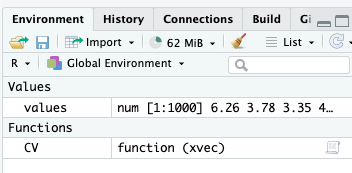

# Functions, Best-coding Practices, and Debugging Intro


```{r setup, include = FALSE}

library(tidyverse)
```

Now that we have introduced Rstudio, markdown, R basics, and Tidy data,
it is our goal this week to improve our programming skills such that as
we go forward you will be able to practice your problem solving
efficiently by staying organized, avoiding common errors, and
effectively debugging errors when they occur.

This week our goals are to be able to:

-   Understand the value of abstraction and "reusability" provided by
    functional programming
-   Create basic functions
-   Use Packages to access functions from the R community
-   Organize code into logical blocks and use comments to help
    understand code
-   Use RStudio's formatting tools to avoid common errors
-   Identify common errors and strategies for fixing/debugging them

Reading:

-   Skim <https://r4ds.hadley.nz/program>
-   Skim
    <https://rstudio-education.github.io/hopr/basics.html#functions>
    down through 2.7 Summary
-   Skim <https://rstudio-education.github.io/hopr/packages.html>
-   Skim <https://r4ds.hadley.nz/workflow-style>
-   Skim one of
    -   <https://statsandr.com/blog/top-10-errors-in-r/>
    -   <https://bookdown.org/yih_huynh/Guide-to-R-Book/trouble.html>

Ooof, videos on these topics were pretty rough. Let me know if you find
any that you liked!

## Functions

Functions in programming are just like functions in math. In R they are
even written just like they are in math

$f(x)$ in math is the same as `F(x)` in R

Structured/Modular/Functional programming: a general programming concept
where developers separate program functions into independent, modular,
organized pieces, primarily functions.

### Functions... why and how

-   Write functions to encapsulate sections of code

-   Allows you to avoid global variables that can be accessed and
    changed anywhere (functions only know about arguments you
    specifically pass to them)

-   To avoid duplicating code: if you have multiple copies of almost
    identical code, put it into a function

-   Create a function when R does not have a built-in function for your
    needs

-   When running an analysis over and over again, can just call the
    function (one line) instead of running many lines of code

### A simple function: CV()

There is no R function for CV, or coefficient of variation (standard
deviation divided by mean)

```{r}
# create the CV function
CV <- function(xvec) { 
   CV.value <- sd(xvec)/mean(xvec) 
   return(CV.value) 
}
```

Our CV function takes a single argument `xvec` which has no default
value. (We could set a default value of 1 for example by using
`xvec = 1` inside the `function(...)` function).

It calculates the standard deviation divided by the mean and returns the
result.

The `return(CV.value)` indicates what is returned by the function. If
there is no `return` function the result of the last line is returned.

### Now we need to apply our function.

```{r}
# pick 1000 random values from a normal distribution with mean 5 and sd 2
values <- rnorm(n=1000, mean=5, sd=2) 

# now lets test our function
CV(values)
```

### What objects are available?

Check out the environment now.



-   Only the new function `CV` and the object `values` are available in
    the Global Environment (they are global objects)

-   Object `CV.value` (defined inside the function) is encapsulated
    within the function `CV` and not available outside it

### Optional arguments

Some functions have optional arguments. Optional arguments often have a
default value, that is a value that is used if one isn't provided by the
user.

For example, our CV function doesn't work if `xvec` includes missing
values.

```{r}
# Set the 100th value in values to NA
values[100] <- NA

CV(values)
```

We could add an optional argument to allow it to remove NA values, as
`sd` and `mean` both have `na.rm` optional arguments. When set to
`na.rm = TRUE`, `NA` values are removed before the respective
calculation.

```{r}
CVnew <- function(xvec, na.rm=F) { 
   CV.value <- sd(xvec, na.rm=na.rm)/mean(xvec, na.rm=na.rm) 
   return(CV.value) 
}

## this code could be tidied up, with Reformat Code
## try highlighting the code and using Code>Reformat Code in the menu bar

# Test out the new function
CVnew(values)
CVnew(values, na.rm = T)
```

## Packages

-   Packages, as we have discussed, are collections of functions, code,
    and data collected and curated by the R community.
-   Packages are available through 3 primary sources
    -   CRAN <https://cran.r-project.org/> see "Packages" on the left
    -   Bioconductor <https://www.bioconductor.org/>
    -   GitHub
-   CRAN and Bioconductor packages have undergone some peer review
-   GitHub packages may or may not have been reviewed

### Installing and using packages

-   To install CRAN packages you can
    -   use the `install.packages` function with the argument being a
        character string of the package name
    -   use the Packages pane (which runs `install.packages` for you)
-   Bioconductor and Github packages are a bit more tricky requiring
    packages to install their packages
    -   Bioconductor install instructions
        <https://www.bioconductor.org/install/>
    -   To install Github packages you can use the remotes package
        <https://cran.r-project.org/web/packages/remotes/index.html>

### Installing and using packages

**Clicking on the link to a package in the package pane takes you to the
documentation of the package**

-   Documentation for most all CRAN and Bioconductor include
    -   description files
    -   help pages for their functions
    -   examples for their functions
-   Many also have "vignettes" which are worked examples of how to use
    the package
-   You can find all of this in the Help pane for that package.

## Best coding practices

### Reproducibility

-   I (almost) never save my R workspace

-   It contains global variables that could mess up your future code

-   I regularly clear the workspace or run rm(list=ls())

-   Much better practice to rerun the entire script in an empty
    workspace

-   Exception

    -   Results from analyses that take hours or days to run

### Style guides

-   Big companies have strict guidelines on how to organize your code,
    e.g. Google Style Guide

    -   <https://google.github.io/styleguide/Rguide.html>

    -   <http://adv-r.had.co.nz/Style.html> (Hadley Wickham’s guide)

-   Indent your code inside a function, inside an if-statement, inside a
    for-loop, and if a statement goes over two lines

-   Use meaningful object names

    -   Too long and you will get tired of typing

    -   Too short and you won’t know what the object contains

-   Objects in R are **global** and available everywhere (more on this
    later)

### Automated code styling/formatting

-   Fortunately people have also written code to properly style your
    code according to common guidelines.

-   In R-studio you can go to "Code" in the menu bar and "Reformat
    Code".

-   There is also a package called "styler" described a bit in
    <https://r4ds.hadley.nz/workflow-style>

## Debugging

The origin of debugging comes from literally removing a moth that
shorted out one of the early computers at NASA. Admiral Grace Hopper
said in a famous report they were "debugging" the computer and the term
has stuck for all computers and code.

### Verifying code

-   Test your code, test your code, test your code!

-   Write the smallest possible amount of code (a portion of one line if
    possible)

-   Then try simple examples you know the answer to (zero, negative
    number, positive number)

-   Show the results: is this what you expected?

-   Pay special attention if you are copying sections of code and
    changing a variable name (common to forget to change all
    occurrences)

### Commenting your code

-   R ignores everything on a line that follows a `#`

-   Comment at the top of your script/markdown

    -   What the code does, your name, email, date started

-   Comment before each function or section of code

    -   What is the purpose of that section of code, what does it do

-   Comment throughout

    -   Whenever an unusual function is used

    -   Whenever the code is hard to understand

    -   Whenever an algorithm is particularly useful

### “Commenting out” code

-   Instead of deleting code you might not need, or

-   When you make modifications to your code, or

-   During debugging

    -   Copy the code that works then comment it out by prefixing it
        with `#`

    -   Change the new copy of the code

-   If you need to revert to the old code, just remove the \# before
    each line (“uncomment”)

    -   Delete the old commented out code only once you have thoroughly
        tested the new code

-   ctrl+shift+C is a shortcut in Rstudio to comment/uncomment large
    blocks of code

```{r}
#plot(iris$Sepal.Length)
plot(iris$Petal.Length)
```

### Common errors and How to Fix Them

**Semantic errors = mistyping errors**

-   Missing parentheses/brackets
-   Missing quotes
-   Misplaced commas
-   Misspelled object names
-   **R is case-sensitive**

**Resolving semantic errors**

-   Semantic errors generally have useful error messages, except missing
    parentheses brackets

-   Always make sure there is a `>` in the console! A `+` means the last
    line wasn't completed.

    -   Use ESC to get from `+` back to `>`

#### Missing Parentheses or Brackets

If you forget a closing parenthesis `)`, bracket `]`, or curly brace
`}`, R will show a continuation prompt in the console (`+`), meaning
it’s waiting for you to finish the expression.

Example (Missing Parenthesis)

```{r, error=TRUE}
mean(c(1, 2, 3)  # Missing closing parenthesis
```

**Error Message:** None, but look in the console

`+ # Cursor is stuck at the continuation prompt`

**Fix:**

Press ESC to return to the `>` prompt, then add the missing `)`.

```{r}
mean(c(1, 2, 3))  # Corrected
```

##### Missing or Mismatched Quotes

If you forget to close a string with a quotation mark (`"` or `'`), R
doesn’t know where the string ends.

Example (Missing Quote)

```{r, error=TRUE}
x <- "Hello  # Missing closing quote
```

**Error Message:** None, but again look in the console

`+ # Cursor is stuck at the continuation prompt`

**Fix:**

Press ESC to return to the `>` prompt, then add the missing `)`.

```{r}
x <- "Hello"  # Corrected
```

#### Unexpected Symbols (e.g., Typos, Missing Commas)

If you forget a comma between function arguments or mistype a variable
name, R will return an "unexpected symbol" error.

Example (Missing Comma)

```{r, error=TRUE}
x <- c(1 3, 5, 7)  # Missing comma between 1 and 3
```

**Error Message:** `Error: unexpected numeric constant in "x <- c(1 3"`

**Fix:**

Add the missing comma.

```{r}
x <- c(1, 3, 5, 7)  # Corrected
```

#### Object Not Found (Using Undefined Variables and Functions)

If you try to use a variable or function that hasn’t been defined, R
will return an object not found error.

Example (Misspelled Function)

```{r, error=TRUE}
meann(c(1, 2, 3))  # Function name is incorrect
```

**Error Message:**

`Error in meann(c(1, 2, 3)) : could not find function "meann"`

**Fix:**

Check for typos and use tab-completion.

```{r}
mean(c(1, 2, 3))  # Corrected
```

Example (Undefined Variable)

```{r}
y <- x + 10  # x has not been defined yet

```

**Error Message:**

`Error: object 'x' not found`

**Fix:**

Make sure x exists before using it.

```{r}
x <- 5
y <- x + 10  # Now it works
```

#### Type Mismatches (Coercion Issues)

R automatically converts mixed types in vectors. If you try to perform
numeric operations on character strings, you’ll get an error or warning.

Example (Mixing Numbers and Text)

```{r}
x <- c(1, 3, "Emma")  # Mixed data types
as.numeric(x)  # Convert to numeric
```

**Warning message:**

`Warning: NAs introduced by coercion`

**Fix:**

Ensure all elements are numeric or remove text values.

```{r}
x <- c(1, 3, 5)  # All numeric
as.numeric(x)  # Works fine
```

If you must handle mixed data, filter out text:

```{r}
x <- c(1, 3, "Emma")
x_numeric <- as.numeric(x[!is.na(as.numeric(x))])  # Removes text
```

### Warning or Error?

-   Warnings are OK, just meant to inform you about something you might
    not intend to do.

```{r, error=TRUE}
x <- c(1, 3, 7, "Emma")

as.numeric(x)
```

-   Errors mean the code didn't run properly

```{r, error=TRUE}
x <- c(1 3, 7, "Emma")

as.numeric(x)
```

### Debugging is scientific

-   Hypothesis: If I execute this line of code, then variable `A` will
    change from value x to value y
-   Method: create an observation to report the value of `A`, then run
    the line of code
-   Results: is `A == y`?
-   Discussion: If `A == y`, then we move to our next investigation.
    `A != y` then you have found the bug (or your hypothesis is wrong)
