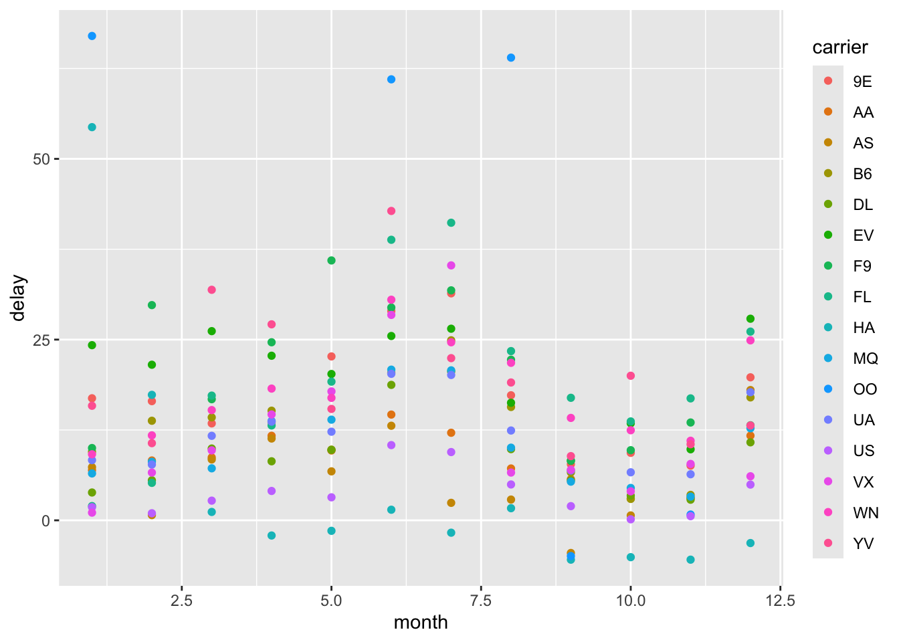

# Data Wrangling Examples {.unnumbered}


These examples are adapted from R4DS
<https://r4ds.hadley.nz/data-transform>.

### Filter

These are additional practice to those in the book to reinforce the
reading and try by doing. Solutions for each are given below. Our
suggestion is to try first and test your skill.


``` r
nycflights13::flights
```

```
## # A tibble: 336,776 × 19
##     year month   day dep_time sched_dep_time dep_delay arr_time sched_arr_time
##    <int> <int> <int>    <int>          <int>     <dbl>    <int>          <int>
##  1  2013     1     1      517            515         2      830            819
##  2  2013     1     1      533            529         4      850            830
##  3  2013     1     1      542            540         2      923            850
##  4  2013     1     1      544            545        -1     1004           1022
##  5  2013     1     1      554            600        -6      812            837
##  6  2013     1     1      554            558        -4      740            728
##  7  2013     1     1      555            600        -5      913            854
##  8  2013     1     1      557            600        -3      709            723
##  9  2013     1     1      557            600        -3      838            846
## 10  2013     1     1      558            600        -2      753            745
## # ℹ 336,766 more rows
## # ℹ 11 more variables: arr_delay <dbl>, carrier <chr>, flight <int>,
## #   tailnum <chr>, origin <chr>, dest <chr>, air_time <dbl>, distance <dbl>,
## #   hour <dbl>, minute <dbl>, time_hour <dttm>
```

1.  Find all flights that:


``` r
# 1.1 Had an arrival delay of two or more hours (10,034 flights)

flights |> 
  # Had an arrival delay of two or more hours
  filter(arr_delay > 120) 
```

```
## # A tibble: 10,034 × 19
##     year month   day dep_time sched_dep_time dep_delay arr_time sched_arr_time
##    <int> <int> <int>    <int>          <int>     <dbl>    <int>          <int>
##  1  2013     1     1      811            630       101     1047            830
##  2  2013     1     1      848           1835       853     1001           1950
##  3  2013     1     1      957            733       144     1056            853
##  4  2013     1     1     1114            900       134     1447           1222
##  5  2013     1     1     1505           1310       115     1638           1431
##  6  2013     1     1     1525           1340       105     1831           1626
##  7  2013     1     1     1549           1445        64     1912           1656
##  8  2013     1     1     1558           1359       119     1718           1515
##  9  2013     1     1     1732           1630        62     2028           1825
## 10  2013     1     1     1803           1620       103     2008           1750
## # ℹ 10,024 more rows
## # ℹ 11 more variables: arr_delay <dbl>, carrier <chr>, flight <int>,
## #   tailnum <chr>, origin <chr>, dest <chr>, air_time <dbl>, distance <dbl>,
## #   hour <dbl>, minute <dbl>, time_hour <dttm>
```


``` r
# 1.2 Flew to Houston (IAH or HOU) (9,313 flights)
flights |> 
  filter(dest %in% c("IAH","HOU")) 
```

```
## # A tibble: 9,313 × 19
##     year month   day dep_time sched_dep_time dep_delay arr_time sched_arr_time
##    <int> <int> <int>    <int>          <int>     <dbl>    <int>          <int>
##  1  2013     1     1      517            515         2      830            819
##  2  2013     1     1      533            529         4      850            830
##  3  2013     1     1      623            627        -4      933            932
##  4  2013     1     1      728            732        -4     1041           1038
##  5  2013     1     1      739            739         0     1104           1038
##  6  2013     1     1      908            908         0     1228           1219
##  7  2013     1     1     1028           1026         2     1350           1339
##  8  2013     1     1     1044           1045        -1     1352           1351
##  9  2013     1     1     1114            900       134     1447           1222
## 10  2013     1     1     1205           1200         5     1503           1505
## # ℹ 9,303 more rows
## # ℹ 11 more variables: arr_delay <dbl>, carrier <chr>, flight <int>,
## #   tailnum <chr>, origin <chr>, dest <chr>, air_time <dbl>, distance <dbl>,
## #   hour <dbl>, minute <dbl>, time_hour <dttm>
```


``` r
# 1.3 Were operated by United, American, or Delta (139,504 flights)
```


``` r
# 1.4 Departed in summer (July, August, and September) (86,326 flights)
```


``` r
# 1.5 Arrived more than two hours late, but didn't leave late (3 flights)
```


``` r
# 1.6 Were delayed by at least an hour, but made up over 30 minutes in flight (1,819 flights)
```


``` r
# 1.7 Departed between midnight and 6am (inclusive) (9,373 flights)
```

2.  Another useful dplyr filtering helper is between(). What does it do?
    Can you use it to simplify the code needed to answer 1.7? (hint:
    look up between in the help menu. You'll see the required syntax,
    where x = vector, and left and right at the boundary values. You
    will also need to add an OR statement to include departure times at
    exactly 2400 since the dataframe has departures at both 0 and 2400)


``` r
flights %>% 
  filter(dep_time |> between(0, 600))|> 
  arrange(desc(month), -day)
```

```
## # A tibble: 9,344 × 19
##     year month   day dep_time sched_dep_time dep_delay arr_time sched_arr_time
##    <int> <int> <int>    <int>          <int>     <dbl>    <int>          <int>
##  1  2013    12    31       13           2359        14      439            437
##  2  2013    12    31       18           2359        19      449            444
##  3  2013    12    31       26           2245       101      129           2353
##  4  2013    12    31      459            500        -1      655            651
##  5  2013    12    31      514            515        -1      814            812
##  6  2013    12    31      549            551        -2      925            900
##  7  2013    12    31      550            600       -10      725            745
##  8  2013    12    31      552            600        -8      811            826
##  9  2013    12    31      553            600        -7      741            754
## 10  2013    12    31      554            550         4     1024           1027
## # ℹ 9,334 more rows
## # ℹ 11 more variables: arr_delay <dbl>, carrier <chr>, flight <int>,
## #   tailnum <chr>, origin <chr>, dest <chr>, air_time <dbl>, distance <dbl>,
## #   hour <dbl>, minute <dbl>, time_hour <dttm>
```

3.  How many flights have a missing dep_time? What other variables are
    missing? What might these rows represent?


#### solutions:

1.1 k \<- filter(flights,(arr_delay \> 120)) 1.2 k \<-
filter(flights,dest == "IAH"\|dest=="HOU") 1.3 k \<-
filter(flights,carrier=="DL"\|carrier=="UA"\|carrier=="AA") 1.4 k \<-
filter(flights,month==7 \| month==8 \| month==9) 1.5 k \<-
filter(flights,arr_delay \>120 & dep_delay == 0) 1.6
filter(flights,dep_delay \>60 & arr_delay \<(dep_delay-30))) 1.7 k \<-
filter(flights,dep_time==2400 \| (dep_time\<0601)) 2. m \<-
filter(flights,between(dep_time,0,0600)\|dep_time==2400) 3. y \<-
filter(flights, is.na(dep_time))

### Arrange

1.  Use desc() to re-order by a column in descending order:


``` r
flights |> arrange(desc(month), -day)
```

```
## # A tibble: 336,776 × 19
##     year month   day dep_time sched_dep_time dep_delay arr_time sched_arr_time
##    <int> <int> <int>    <int>          <int>     <dbl>    <int>          <int>
##  1  2013    12    31       13           2359        14      439            437
##  2  2013    12    31       18           2359        19      449            444
##  3  2013    12    31       26           2245       101      129           2353
##  4  2013    12    31      459            500        -1      655            651
##  5  2013    12    31      514            515        -1      814            812
##  6  2013    12    31      549            551        -2      925            900
##  7  2013    12    31      550            600       -10      725            745
##  8  2013    12    31      552            600        -8      811            826
##  9  2013    12    31      553            600        -7      741            754
## 10  2013    12    31      554            550         4     1024           1027
## # ℹ 336,766 more rows
## # ℹ 11 more variables: arr_delay <dbl>, carrier <chr>, flight <int>,
## #   tailnum <chr>, origin <chr>, dest <chr>, air_time <dbl>, distance <dbl>,
## #   hour <dbl>, minute <dbl>, time_hour <dttm>
```

2.  Sort flights to find the most delayed flights. Find the flights that
    left earliest.


3.  Sort flights to find the fastest (highest speed) flights. Here you
    are creating a metric by using the existing data in the dataframe to
    calculate speed.


4.  Which flights traveled the farthest? Which traveled the shortest?

(flights 1632 and 51)


``` r
arrange(flights, -distance)
```

```
## # A tibble: 336,776 × 19
##     year month   day dep_time sched_dep_time dep_delay arr_time sched_arr_time
##    <int> <int> <int>    <int>          <int>     <dbl>    <int>          <int>
##  1  2013     1     1      857            900        -3     1516           1530
##  2  2013     1     2      909            900         9     1525           1530
##  3  2013     1     3      914            900        14     1504           1530
##  4  2013     1     4      900            900         0     1516           1530
##  5  2013     1     5      858            900        -2     1519           1530
##  6  2013     1     6     1019            900        79     1558           1530
##  7  2013     1     7     1042            900       102     1620           1530
##  8  2013     1     8      901            900         1     1504           1530
##  9  2013     1     9      641            900      1301     1242           1530
## 10  2013     1    10      859            900        -1     1449           1530
## # ℹ 336,766 more rows
## # ℹ 11 more variables: arr_delay <dbl>, carrier <chr>, flight <int>,
## #   tailnum <chr>, origin <chr>, dest <chr>, air_time <dbl>, distance <dbl>,
## #   hour <dbl>, minute <dbl>, time_hour <dttm>
```

### Mutate - adds a new column


``` r
#flights1 <- 
flights |> mutate(check_arr_delay = sched_arr_time - arr_time, 
                  check_dep_delay = sched_dep_time - dep_time) #-> 
```

```
## # A tibble: 336,776 × 21
##     year month   day dep_time sched_dep_time dep_delay arr_time sched_arr_time
##    <int> <int> <int>    <int>          <int>     <dbl>    <int>          <int>
##  1  2013     1     1      517            515         2      830            819
##  2  2013     1     1      533            529         4      850            830
##  3  2013     1     1      542            540         2      923            850
##  4  2013     1     1      544            545        -1     1004           1022
##  5  2013     1     1      554            600        -6      812            837
##  6  2013     1     1      554            558        -4      740            728
##  7  2013     1     1      555            600        -5      913            854
##  8  2013     1     1      557            600        -3      709            723
##  9  2013     1     1      557            600        -3      838            846
## 10  2013     1     1      558            600        -2      753            745
## # ℹ 336,766 more rows
## # ℹ 13 more variables: arr_delay <dbl>, carrier <chr>, flight <int>,
## #   tailnum <chr>, origin <chr>, dest <chr>, air_time <dbl>, distance <dbl>,
## #   hour <dbl>, minute <dbl>, time_hour <dttm>, check_arr_delay <int>,
## #   check_dep_delay <int>
```

``` r
 # flights1
```

### Select


``` r
flights |> mutate(check_arr_delay = arr_time - sched_arr_time, 
                  check_dep_delay = sched_dep_time - dep_time) |>
  select(arr_time, sched_arr_time, check_arr_delay, arr_delay) |>
  mutate(arr_check_boolean = arr_delay == check_arr_delay) |>
  filter(arr_check_boolean == FALSE)
```

```
## # A tibble: 114,963 × 5
##    arr_time sched_arr_time check_arr_delay arr_delay arr_check_boolean
##       <int>          <int>           <int>     <dbl> <lgl>            
##  1      923            850              73        33 FALSE            
##  2      913            854              59        19 FALSE            
##  3      854            902             -48        -8 FALSE            
##  4      858            910             -52       -12 FALSE            
##  5      858            915             -57       -17 FALSE            
##  6      807            735              72        32 FALSE            
##  7     1039           1100             -61       -21 FALSE            
##  8      909            840              69        29 FALSE            
##  9     1016            947              69        29 FALSE            
## 10     1028            940              88        48 FALSE            
## # ℹ 114,953 more rows
```


``` r
flights |> mutate(arr_time = lubridate::hm(arr_time)) |>
  head()
```

```
## Warning: There was 1 warning in `mutate()`.
## ℹ In argument: `arr_time = lubridate::hm(arr_time)`.
## Caused by warning in `.parse_hms()`:
## ! Some strings failed to parse
```

```
## # A tibble: 6 × 19
##    year month   day dep_time sched_dep_time dep_delay arr_time sched_arr_time
##   <int> <int> <int>    <int>          <int>     <dbl> <Period>          <int>
## 1  2013     1     1      517            515         2 NA                  819
## 2  2013     1     1      533            529         4 NA                  830
## 3  2013     1     1      542            540         2 NA                  850
## 4  2013     1     1      544            545        -1 NA                 1022
## 5  2013     1     1      554            600        -6 NA                  837
## 6  2013     1     1      554            558        -4 NA                  728
## # ℹ 11 more variables: arr_delay <dbl>, carrier <chr>, flight <int>,
## #   tailnum <chr>, origin <chr>, dest <chr>, air_time <dbl>, distance <dbl>,
## #   hour <dbl>, minute <dbl>, time_hour <dttm>
```


### Grouped summaries

To make summary tables we will use the pipe combining `group_by` and
`summarize`.


``` r
summary_FlightDelay <-
  # I like to use a new line here so that I can easily comment out the
  # assignment while building my pipe
  flights |>
  group_by(month, carrier) |> # group flights by month
  summarise(delay = mean(dep_delay, na.rm = TRUE)) # make a new column of average dep delay
```

```
## `summarise()` has grouped output by 'month'. You can override using the
## `.groups` argument.
```

``` r
summary_FlightDelay |> ggplot(mapping = aes(x = month, y = delay, color = carrier)) + geom_point()
```



We could also figure out which carrier had the longest and shortest
delay in December, if we were trying to plan a timely winter break
flight.


``` r
carrier_delay <- # I like to use a new line here so that I can easily comment out this assignment line while building my pipe
  flights |>
  arrange(-distance) |>
  filter(month == 12) |>
  select(flight, dep_delay, carrier)

carrier_delay
```

```
## # A tibble: 28,135 × 3
##    flight dep_delay carrier
##     <int>     <dbl> <chr>  
##  1     51        -2 HA     
##  2     51       -10 HA     
##  3     51         3 HA     
##  4     51       -10 HA     
##  5     51        -6 HA     
##  6     51        -3 HA     
##  7     51         5 HA     
##  8     51        -2 HA     
##  9     51         0 HA     
## 10     51        -1 HA     
## # ℹ 28,125 more rows
```


``` r
carrier_delay |> 
  group_by(carrier) |> # want to find the average for each carrier
  summarise(average_dep_delay = mean(dep_delay, na.rm = TRUE)) |>
  # calculate average delay
  arrange(average_dep_delay)
```

```
## # A tibble: 15 × 2
##    carrier average_dep_delay
##    <chr>               <dbl>
##  1 HA                  -3.14
##  2 US                   4.94
##  3 VX                   6.10
##  4 DL                  10.8 
##  5 AA                  11.7 
##  6 MQ                  12.7 
##  7 YV                  13.1 
##  8 F9                  13.1 
##  9 B6                  17.0 
## 10 UA                  17.7 
## 11 AS                  18.0 
## 12 9E                  19.8 
## 13 WN                  24.9 
## 14 FL                  26.1 
## 15 EV                  27.9
```
