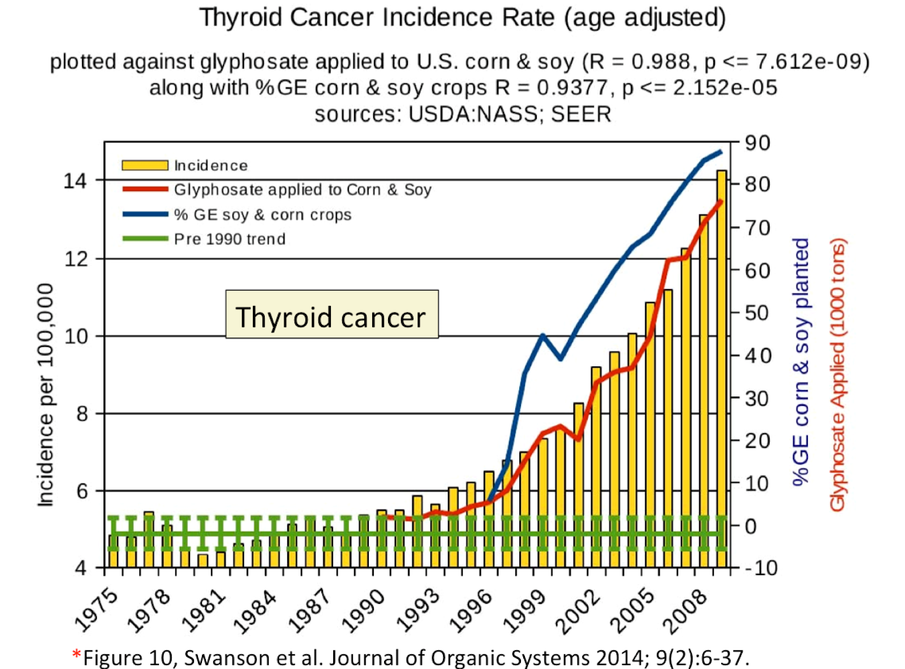
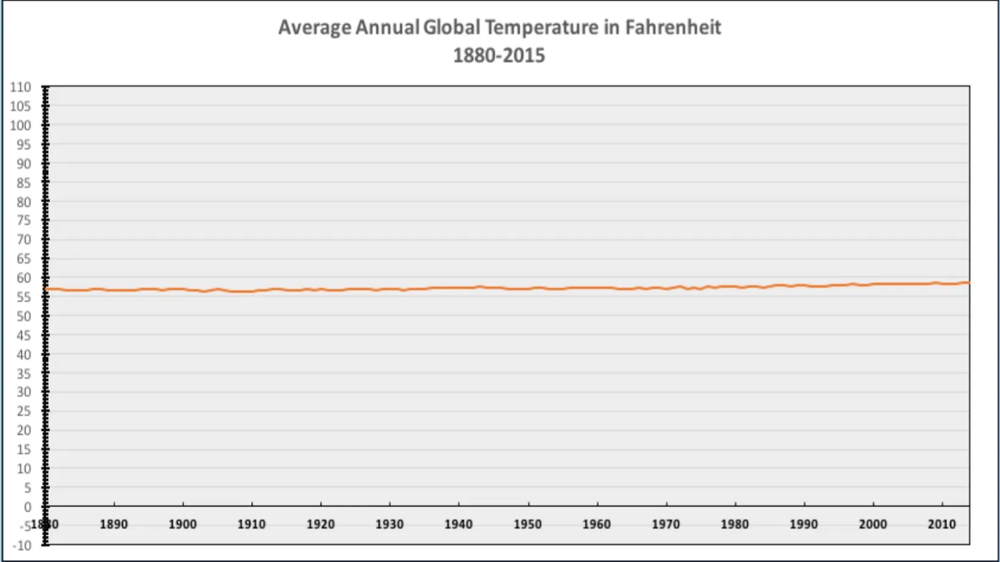

# Data Visualization

This week, we’ll start digging into visualizations of the data we have been wrangling. I should rephrase this - we are really only going to scratch the surface of visualizations.

Data visualizations are all around us. From what we read in the popular press to how we tackle problems within Biological Systems Engineering. In this unit, we’re going to focus on making some simple visualizations within RStudio. Prior to doing this, I wanted to begin with some tips to consider in preparing your own visualizations and spotting data visualizations that may inadvertently (or purposely) mislead the viewer. For example, the plot above shows the incidence of thyroid cancer with respect to time, and insinuates that glyphosate (Roundup) correlates to the rising rates of thyroid cancer. Key: Correlation is not causation. What else is wrong with the figure - specifically the secondary y-axis for glyphosate applied? Answer: you can’t have a negative value of glyphosate applied! Here, the authors adjusted the secondary y-axis scale so the red line followed thyroid cancer, which is clearly misleading.

This is just one example that Bergstrom and West use in their recent book “Calling Bullshit”. In the table below are key points they implore us to learn and consider as we evaluate visualizations and make our own:

|                                              |                                                                                                                                                            |
|------------------|------------------------------------------------------|
| CALLING BULLSHIT - TOP ISSUES WITH PLOTS     | Why?                                                                                                                                                       |
| 1\. Bar chart axes should include zero.      | Size gaps can mislead interpretation, and bar graphs meant to look at absolute magnnitude. [visual weight of each bar = value of bar, or proportional ink] |
| 2\. Line plots need not include zero.        | Line graphs emphasize the change in the dependent variable as the independent variable changes.                                                            |
| 3\. Multiple axes on a single graph          | Correlation is not causality!                                                                                                                              |
| 4\. Axis should not change scale mid-stream. | Clearly can mislead!                                                                                                                                       |

**Learning Objectives:**

-   Identify and avoid misleading plots
-   Become familiar with types of visualizations
-   Effectively map data values into quantifiable features of the resulting graphic: these are called *aesthetics.*
-   Practice basic plotting within R using ggplot

## Reading (complete by class on Monday)

This week we will use a resource developed by Clause Wilke, who wrote the book [*Fundamentals of Data Visualization*](https://clauswilke.com/dataviz/). We’ll also start by looking at a section of another book by Carl Bergstrom and Jevin West - Calling Bullshit.

1.  [Calling Bullshit page devoted to Visualizations](https://www.callingbullshit.org/tools/tools_misleading_axes.html). Here, read through this page to identify the common pitfalls associated with misleading plots.
2.  Correlation does not imply causation (be able to describe what this means)
3.  Rule of proportional ink
4.  Why a 0-axis for bar graphs, but not when plotting 2 lines on a x-y scatterplot?

<!-- -->

The below also have LearnR interactive examples you can find in the Files pane (files 06-0-1, 06-0-2, 06-0-3). You can 

2.  [Mapping data.](https://clauswilke.com/dataviz/aesthetic-mapping.html) “Whenever we visualize data, we take data values and convert them in a systematic and logical way into the visual elements that make up the final graphic. Even though there are many different types of data visualizations, and on first glance a scatter plot, a pie chart, and a heatmap don’t seem to have much in common, all these visualizations can be described with a common language that captures how data values are turned into blobs of ink on paper or colored pixels on screen." The key insight is the following: All data visualizations map data values into quantifiable features of the resulting graphic. We refer to these features as **aesthetics**. [Wilke’s cliffnote slides](https://wilkelab.org/SDS375/slides/aesthetic-mappings.html#22) are here (optional).

3.  [Types of visualizations](https://clauswilke.com/dataviz/directory-of-visualizations.html). Here, you’ll see examples of different visualizations that are useful in our field: amounts, distributions, proportions, x-y scatterplots, uncertainty, and geospatial data.

4.  [Visualizing distributions](https://wilkelab.org/SDS375/slides/visualizing-distributions-2.html#1). We’ll follow this up with an exercise from C. Wilke.

*Optional reading/resource:* [Visualization chapter in R for Data Science.](https://r4ds.had.co.nz/data-visualisation.html)

## Tutorials to walk through on your own

Here, the idea is to reinforce the readings, and prepare you for success in the assignment.

There are 3 exercises within the Posit workspace for this week. These are built using the learnr package which makes websites that have r code chunks in them so you can practice coding, in a cleaner and easier environment than Posit. You can also Dr. Scott previously created a short video for each that may be helpful: [Exercise 1](https://video.vt.edu/media/BSE%203144:%20Week6,%20Visualization:%20Exercise%20Aesthetics/1_3x0gx5za), [Exercise 2](https://video.vt.edu/media/BSE%203144:%20Week6,%20Exercise:%20Amounts/1_kvv01k7l), and [Exercise 3](https://video.vt.edu/media/BSE%203144:%20Week%206,%20Exercise%20on%20Distributions/1_o05vjga1).

I am not going to expect any of you to memorize these functions and approaches; rather, I want you to be able to consider what type of visualization you can use, and have the background to dive into creating your own visualization using aesthetics and geoms. This will require you to do some reading in the help documentation of these different functions and refer back to the readings. From my perspective, simple, legible visualizations are best. Regardless, the exercises below will give you a great jumping off point.

1.  Aesthetics Exercise 1 - [see Wilke’s slides here](https://wilkelab.org/SDS375/slides/aesthetic-mappings.html#1). Use this to try yourself; the solution for each follows. The point is to learn how the data is “mapped” - the aesthetics.

2.  Amounts Exercise 2 - [see Wilke’s slides here.](https://wilkelab.org/SDS375/slides/visualizing-amounts.html#1) Again, this is for you to apply and practice, building on aesthetics but with bar data.

3.  Distributions Exercise 3 - [see Wilke’s slides here](https://wilkelab.org/SDS375/slides/visualizing-distributions-2.html#31). Lastly, this series highlights approaches to show distributions of data.

## More on Color Palettes

Also included in this weeks materials is a vignette from the Viridis package which has colorblind friendly color palletes.

R Markdown enables you to weave together content and executable code into a finished document. To learn more about R Markdown see [rmarkdown.rstudio.org](https://rmarkdown.rstudio.com/). This template uses R Markdown to demonstrate the color palettes of R's Viridis package in three mediums:

-   as an HTML, PDF, or Word document in `colors_document.Rmd`
-   as a slide deck in `colors_presentation.Rmd`
-   as a web page with interactive Shiny components in `colors_app.Rmd`

### Previewing

#### To preview the document

1.  Open the file `colors_document.Rmd`.
2.  Then click the Knit button that will appear above the opened file. This will display the document as an HTML file.
3.  To display the document as a pdf or MS Word file, click the drop down menu to the left of the Knit icon and select one of:
    a.  Knit to PDF
    b.  Knit to Word

#### To preview the presentation

1.  Open the file `colors_presentation.Rmd`.
2.  Then click the Knit button that will appear above the opened file. This will display the document as an ioslides HTML slide deck, which can be presented with any web browser.
3.  To display the presentation as a Slidy (HTML), beamer (PDF), or MS PowerPoint slide deck, click the drop down menu to the left of the Knit icon and select one of:
    a.  Knit to HTML (Slidy)
    b.  Knit to PDF (Beamer)
    c.  Knit to PowerPoint

#### To preview the interactive document with Shiny components

1.  Open the file `06-0-4_colors_app.Rmd`.
2.  Then click the Run Document button that will appear above the opened file. Because the file contains the YAML line `runtime: shiny`, R Markdown will run the file as an interactive [Shiny](https://shiny.posit.co/) app.

