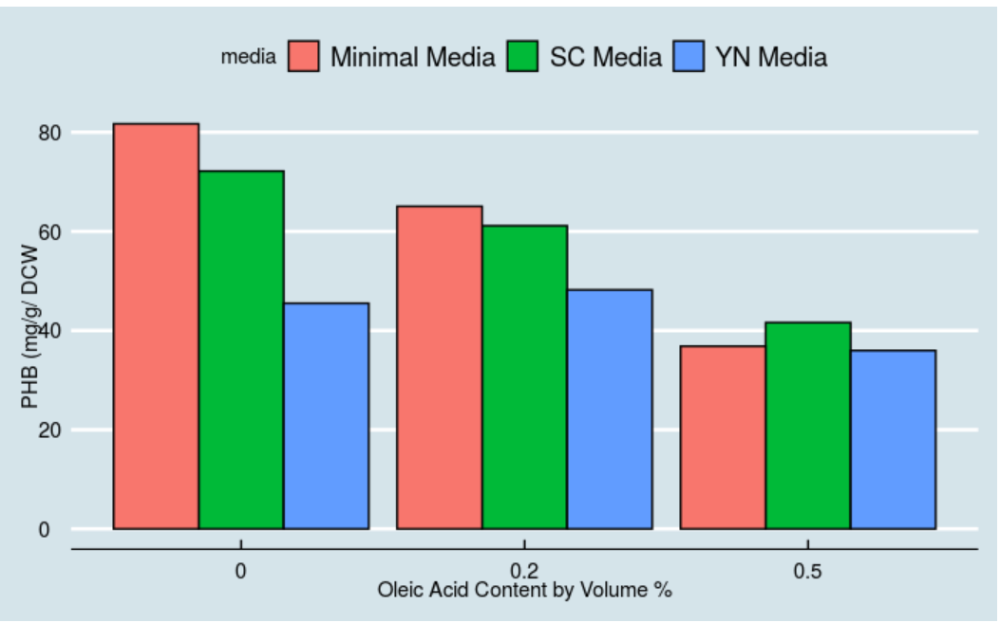
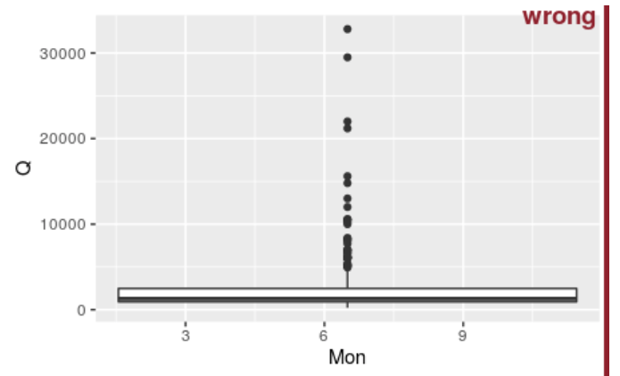
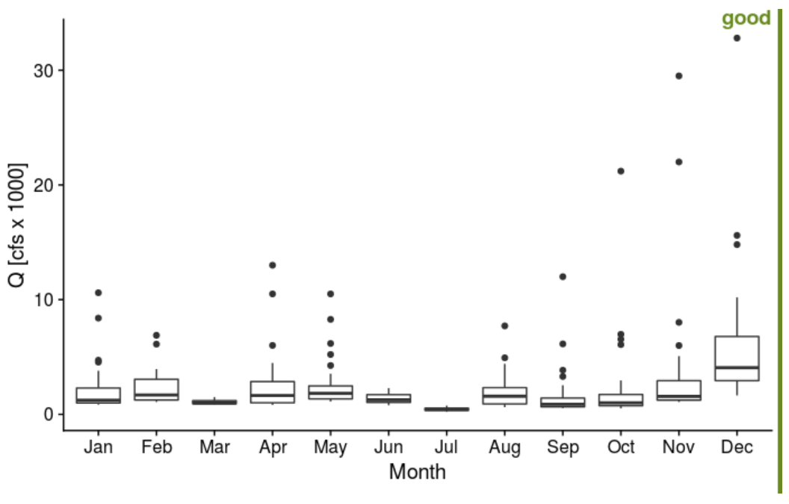
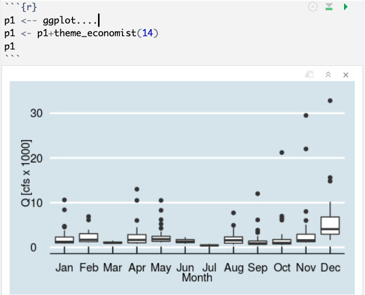
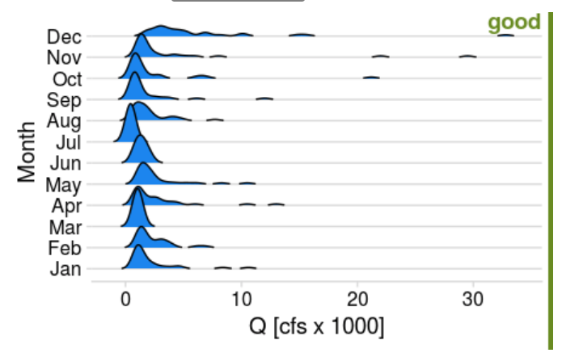

# Data Visualization Examples {-}

## Setup for the Homework

[*Video introduction / help for homework*](https://video.vt.edu/media/BSE%203144:%20Week6,%20Homework%20Hints_Help/1_zo40gr7q)

Hand in: a single pdf document with part 1 and part 2. Be sure that you explain why you chose the particular plots, and that the plots contain proper axis labels, formatting, etc.

**Part 1.**

Dr. Senger is a Metabolic Engineer in our department; perhaps you’ll have him or had him for Thermo. His work includes developing biosensors, and he has a recent publication in Pubmed ([see here](https://peerj.com/articles/9805/)). Imagine you’re an undergrad researcher in Dr. Senger’s group, and are asked to recreate Figure 2a from the publication within Rstudio. The raw data for the figure is available in the supplemental information, and in the Rstudio workspace for this week as an excel file (file contains data for all figures). *Follow examples for bar graphs from the exercises (visualizing amounts).*

You’ll want your final bar graph to look similar to this one, but you can choose the theme/color scheme. Below, I used theme_economist().

**Part 2.**

Dr. Shortridge is a Hydrologist in our department, and her work includes analyzing large hydrologic datasets. Here, imagine you’re asked to compare approaches for visualizing the distribution of monthly streamflow in 2020 for the Rappahannock River at Fredericksburg. Based on the distribution exercise, create a boxplot, violin plot, strip-jitter plot, and ridge plot. See the examples below for good and bad plots; you’ll want your plots to be “good”. **Choose one figure that you like the best, and provide an explanation why.**

-   Axis labels missing labels, data does not make sense (e.g. not grouped by month)
-   Ticks for y-axis are not between 0.1 - 100.

-   Used simple theme in cowplot package
-   Used x-variable in factor form (by using month function within lubridate and include label and abbr; type ?month)
-   Normalized y-axis to 1000 :: aes (x = xvar, y =yvar/1000)
-   Added group attribute in aes statement
-   Added theme (e.g. theme_cowplot). Check out the cowplot package and ggthemes. There are many to choose from! Why do I like the theme above? Simple, axis labels slightly larger than tick labels, clear.

Here’s another example using theme_economist. When you create a plot, assign it a variable. Then you can easily change themes/attributes of the plot.

For your ridge-line plot, choose a fill color that you like. You add the fill color within the `geom_density_ridges` function (e.g. `geom_density_ridges(rel_min_height = 0.01,fill="dodgerblue2")`. A list of colors can be found here: <http://www.stat.columbia.edu/~tzheng/files/Rcolor.pdf>

