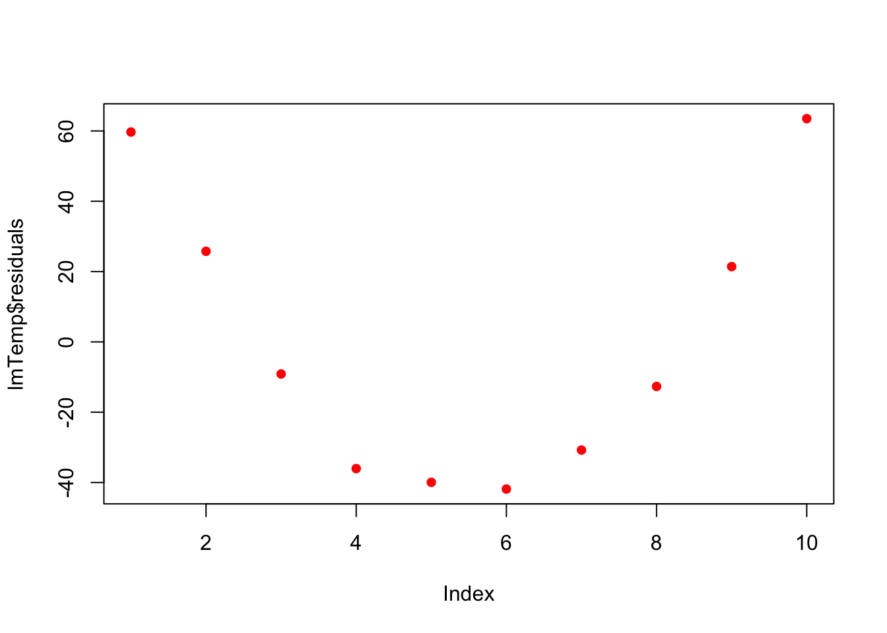

# Introduction to Linear Regression in R


## Objectives

This week our goals are to be able to:

1. **Linear Regression Fundamentals**:
   - Understand the basics of linear regression analysis in R.
   - Learn how to interpret model output and assess model performance.

2. **Assumptions and Diagnostics**:
   - Identify and understand the assumptions of linear regression.
   - Gain proficiency in diagnosing model assumptions using plots and tests.

3. **Workflow and Data Preparation**:
   - Develop a structured workflow for conducting linear regression analysis.
   - Learn techniques for data preparation and visualization.

4. **Data Transformation and Model Improvement**:
   - Explore methods for transforming data to meet model assumptions.
   - Understand how data transformations can enhance model fit.

5. **Interpretation of Diagnostic Plots**:
   - Learn to interpret diagnostic plots to assess model adequacy.

6. **Prediction and Inference**:
   - Use regression models for prediction and inference.
   - Understand how to compute and interpret confidence and prediction intervals.
   


## Reading

- [Chapter 3 A Review of R Modeling Fundamentals](https://www.tmwr.org/base-r) from *Tidy Modeling with R* by Max Kuhn and Julia Silge

## Active Package Libraries

This tutorial is derive from https://www.datacamp.com/community/tutorials/linear-regression-R


``` r
library(ggplot2)
library(cowplot)
library(readxl)
```

## Linear Regression

R-studio provides the ability to create linear regressions easily, sometimes too easily. While this is not meant to be a substitute for a statistics course, the objective in this short tutorial is to develop a workflow approach that allows you to test the validity of regressions.

### Assumptions

Below is a figure from <https://pubs.usgs.gov/tm/04/a03/tm4a3.pdf>.


### Workflow:

1.  Read in data
2.  Plot data & visualize linearity
3.  Transform data as appropriate
4.  Create linear model using lm function.

-   Assess assumption 1
    -   review t-values from linear model summary. If the slope and intercept values have resulting \|t\| \> 2, then they are significant.
    -   review leverage/influence of data points on regression. When data points have high leverage, one of 3 options come into play: (1) Someone made a recording error, (2) Someone made a fundamental mistake collecting the observation; or (3) The data point is perfectly valid, in which case the model cannot account for the behavior
    
5.  Test for homoscedasticity

-   Assess assumption 3, the variability in the residuals does not vary over the range of predicted values
-     if fails, transform data or choose an alternate model/independent variable

6.  Test for bias 

-   Assess assumption 4, e values generally plot equally above and below zero

7.  Test for normality

### Example

#### Step 1. Read in data


``` r
ageandheight <- read_excel("data/ageandheight.xls",sheet="Hoja2")

## There is one data point that does not read in correctly, thus the statement below corrects for this.
ageandheight$height[7] <- 79.9
```

#### Step 2. Plot data & visualize linearity


``` r
## here you can either start a ggplot or just use the simple plot command. Since we're practicing ggplot, let's stick with this.
p <- ggplot(ageandheight, aes(age,height)) + geom_point() + 
  cowplot::theme_cowplot() + ## adds theme
  scale_y_continuous(breaks=seq(76,84,2)) + ## changes scale to min and max with prescribed spacing
  scale_x_continuous(breaks=seq(16,31,2)) + 
  ylab("Height [cm]") + ## adds y-label with units
  xlab("Age [months]")
p
```


**Check**: The resulting plot looks fairly linear; let's proceed!

#### Step 3. Transform data


``` r
## not required here; if required, repeat step 2.
```

#### Step 4. Linear model

Create linear model using the `lm` function. 
-   Assess assumption 1 
    -   review t-values from linear model summary. If the slope and intercept values have resulting \|t\| \> 2, then they are significant. 
    -   review leverage/influence of data points on regression. When data points have high leverage, one of 3 options come into play: 
        (1) Someone made a recording error, 
        (2) Someone made a fundamental mistake collecting the observation; or 
        (3) The data point is perfectly valid, in which case the model cannot account for the behavior


``` r
## Create linear model
model.lm <- lm(height~age, data=ageandheight)
summary(model.lm)
```

```
## 
## Call:
## lm(formula = height ~ age, data = ageandheight)
## 
## Residuals:
##      Min       1Q   Median       3Q      Max 
## -0.27238 -0.24248 -0.02762  0.16014  0.47238 
## 
## Coefficients:
##             Estimate Std. Error t value Pr(>|t|)    
## (Intercept)  64.9283     0.5084  127.71  < 2e-16 ***
## age           0.6350     0.0214   29.66 4.43e-11 ***
## ---
## Signif. codes:  0 '***' 0.001 '**' 0.01 '*' 0.05 '.' 0.1 ' ' 1
## 
## Residual standard error: 0.256 on 10 degrees of freedom
## Multiple R-squared:  0.9888,	Adjusted R-squared:  0.9876 
## F-statistic:   880 on 1 and 10 DF,  p-value: 4.428e-11
```

**Check**: \|t-values\| \>\> 2, proceed


``` r
## review leverage/influence of data points on regression. Use plot of Cook's D, evaluate subset of Cooks D above threshold, and evaluate DFFITS (another influence diagnostic)

plot(cooks.distance(model.lm), pch = 16, col = "blue") #Plot the Cooks Distances.
```


There are a few high points here at the beginning. Let's see if any fall outside of the critical value on the F-distribution (the `qf` function determines the critical value for our number of observations and number of coefficients).  


``` r
n <- length(model.lm$residuals) ## n = the number of observations
p <- length(model.lm$coefficients) # p = the number of coefficients
subset(cooks.distance(model.lm), cooks.distance(model.lm) > qf(0.1, p, n - p, lower.tail = FALSE)) # determines if there are any flagged observations from Cooks D
```

```
## named numeric(0)
```

For SLR (simple linear regression) with more than about 30 observations, the critical value for D would be about 2.4. So we don't get any values out, hence the `named numeric(0)`, zero observations were flagged. 

What about DFFITS (difference in fits with and without that point)?


``` r
subset(dffits(model.lm), dffits(model.lm) > 2 * sqrt(p / n)) # determines if there are any flagged observations from DFFITS
```

```
##        3 
## 1.127423
```

Now, observation 3 was identified as having higher influence on the fit than other points. Consider options 1-3 described in workflow. Is there something wrong with this point?

#### Step 5. Test for homoscedasaticity


``` r
# Here, the which variable provides the ability to create 4 plots of interest: "Residuals vs Fitted", "Normal Q-Q", "Scale-Location", "Cook's distance", "Residuals vs Leverage"

# To test for homoscedasticity, review plot of standardized residuals
plot(model.lm,  which = 3, ask = FALSE)
```


**Check**: Variability is not significant over fitted values

#### Step 6. Test for bias


``` r
# To test for bias, review plot of  residuals
plot(model.lm,  which = 1, ask = FALSE)
```


**Check**: Variability above and below 0 is similar without a distinct pattern

#### Step 7. Test for Normality


``` r
# To test for normality, review plot
plot(model.lm,  which = 2, ask = FALSE)
```


**Check**: Most points (with exception of observation 1) fall on the line, suggesting a normal distribution of residuals

### Predicting values: Applications of linear models

The following workflow provides predicted values and confidence intervals of these estimates for new values based on a linear regression model. The final steps are to create a plot with uncertainty bounds and the ability to predict a value and associated uncertainty in that predicted value.

#### Workflow:

**Confidence intervals** are computed using the predict command:


``` r
predict(lmheight, newdata = data.frame(age=22.5), interval = "confidence", level = 0.95)
```

**Prediction intervals** are computed as follows:


``` r
predict(lmheight, newdata = data.frame(age=22.5), interval = "prediction", level = 0.95)
```

Prediction intervals are always greater than confidence intervals. While they include the uncertainty in the regression coefficients, the slope and intercept, they also includes the unexplained variability in y within the original data.

#### Example


``` r
# Use model to create prediction intervals

model.predict <- predict(model.lm, interval = "predict")
```

```
## Warning in predict.lm(model.lm, interval = "predict"): predictions on current data refer to _future_ responses
```

``` r
# Use model to create confidence intervals

model.confidence <- predict(model.lm, interval = "confidence")
colnames(model.confidence) <- c("cfit", "clwr", "cupr") #rename columns


# Create dataset that merges dataset

data.all <- cbind(ageandheight,model.predict, model.confidence)

# Create ggplot

p <- ggplot(data.all, aes(x = age, y = height)) +
  geom_point() + # adds points
  geom_line(aes(y=lwr), col = "coral2", linetype = "dashed") + #lower prediction interval
  geom_line(aes(y=upr), col = "coral2", linetype = "dashed") + 
  geom_ribbon(aes(ymin=clwr,ymax=cupr),alpha=0.3) +  # confidence band
  geom_line(aes(y=fit), col = "blue") +  # confidence band
  theme_cowplot() +
  ylab("Height [cm]") +
  xlab("Age [months]") +
  scale_y_continuous(breaks=seq(76,84,2)) + 
  scale_x_continuous(breaks=seq(16,31,2))

p
```


The resulting plot contains the confidence and prediction intervals over the range of x-values.

## Now, let's say you want to predict a y-value for a given age.

When making predictions, you'll want to use predict and not confidence. The rationale is that this approach provides a better sense of incorporating not just the confidence in the intercept and slope, but also the unexplained variation in the y-values.


``` r
a <- data.frame("age" = 18.1) # key here is to label column name the same as what is used in the model.lm!
value.predict <- predict(model.lm, newdata=a, interval = "predict", level = 0.95)
value.predict
```

```
##        fit      lwr      upr
## 1 76.42119 75.77412 77.06826
```

Thus, for an age of 18.1 months, the predicted height is 76.4 (75.77 - 77.1, alpha = 95%).'

## Example 2 from reading


``` r
# Read in data
press <- read_excel("data/pressure.xlsx")

# Plot data

p <- ggplot(press,aes(Temperature,Pressure)) + geom_point() + geom_smooth(method = "lm", level = 0.95)
p
```

```
## `geom_smooth()` using formula = 'y ~ x'
```


What do you notice??? Are the residuals going to be random? Does negative pressure make sense?


``` r
lmTemp = lm(Pressure~Temperature, data = press) #Create the linear regression

plot(lmTemp$residuals, pch = 16, col = "red")
```



So what to do? Transformation!We will learn more about these on Wednesday.


``` r
press$x2 <- press$Temperature^2

lmTemp2 = lm(Pressure~Temperature + I(Temperature^2), data = press) #Create the linear regression

plot(lmTemp2$residuals, pch = 16, col = "red")
```


``` r
summary(lmTemp2)
```

```
## 
## Call:
## lm(formula = Pressure ~ Temperature + I(Temperature^2), data = press)
## 
## Residuals:
##     Min      1Q  Median      3Q     Max 
## -4.6045 -1.6330  0.5545  1.1795  4.8273 
## 
## Coefficients:
##                   Estimate Std. Error t value Pr(>|t|)    
## (Intercept)      33.750000   3.615591   9.335 3.36e-05 ***
## Temperature      -1.731591   0.151002 -11.467 8.62e-06 ***
## I(Temperature^2)  0.052386   0.001338  39.158 1.84e-09 ***
## ---
## Signif. codes:  0 '***' 0.001 '**' 0.01 '*' 0.05 '.' 0.1 ' ' 1
## 
## Residual standard error: 3.074 on 7 degrees of freedom
## Multiple R-squared:  0.9996,	Adjusted R-squared:  0.9994 
## F-statistic:  7859 on 2 and 7 DF,  p-value: 1.861e-12
```


``` r
# plot fitted smooth line

lmTemp2plot<- data.frame(lmTemp2$fitted.values,press$Temperature)
p <- p + geom_line(data = lmTemp2plot, aes(x = press.Temperature,y=lmTemp2.fitted.values),color = '#E51837')
p
```

```
## `geom_smooth()` using formula = 'y ~ x'
```


