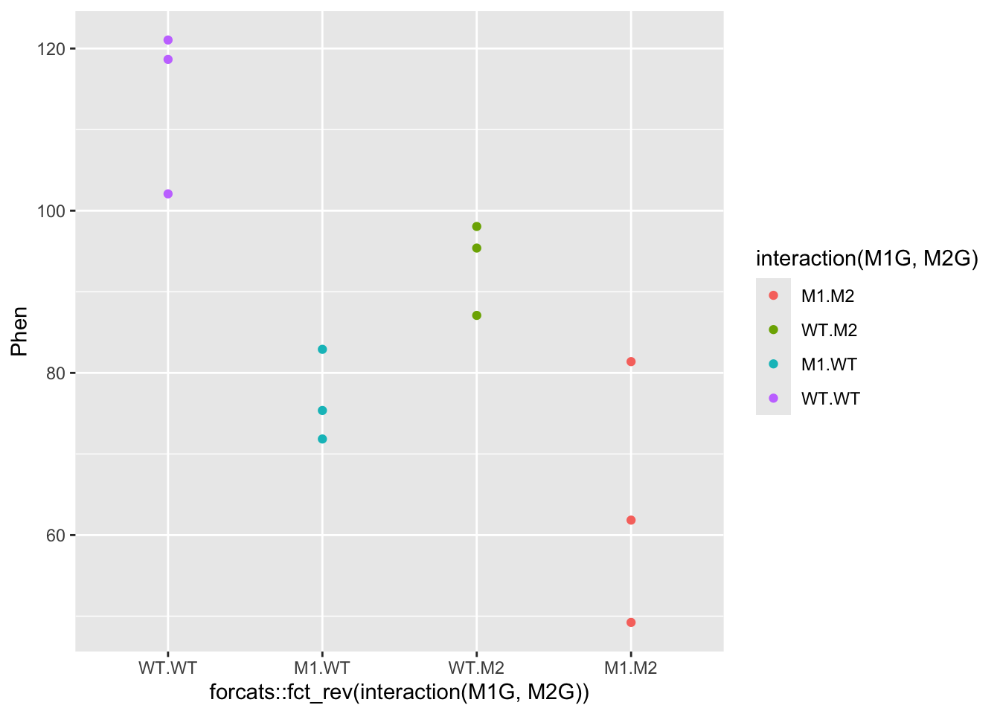
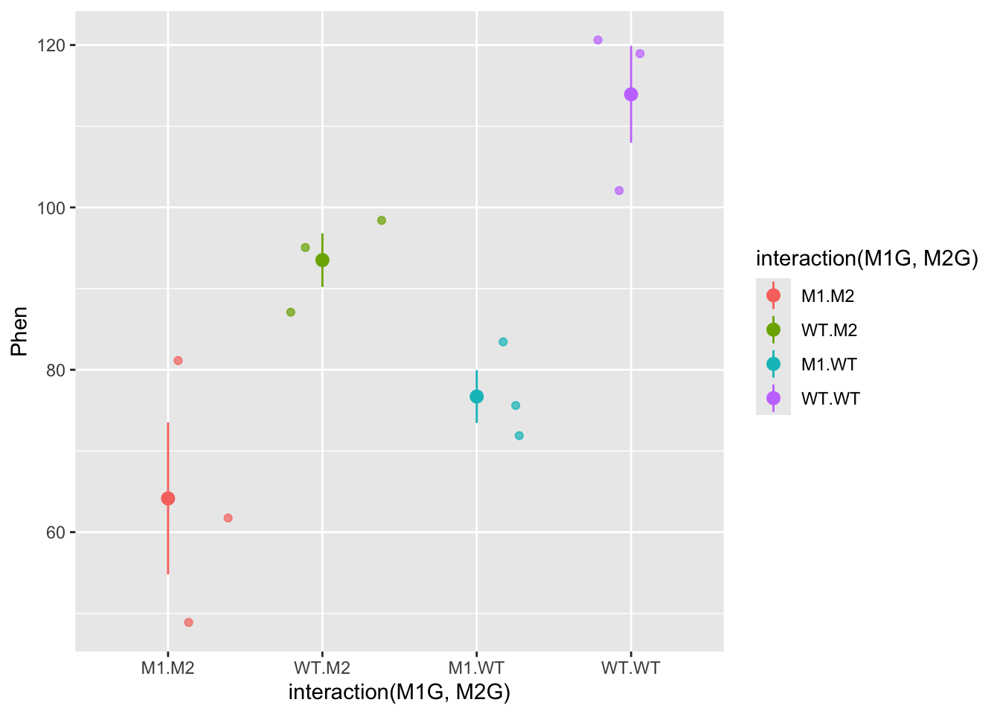
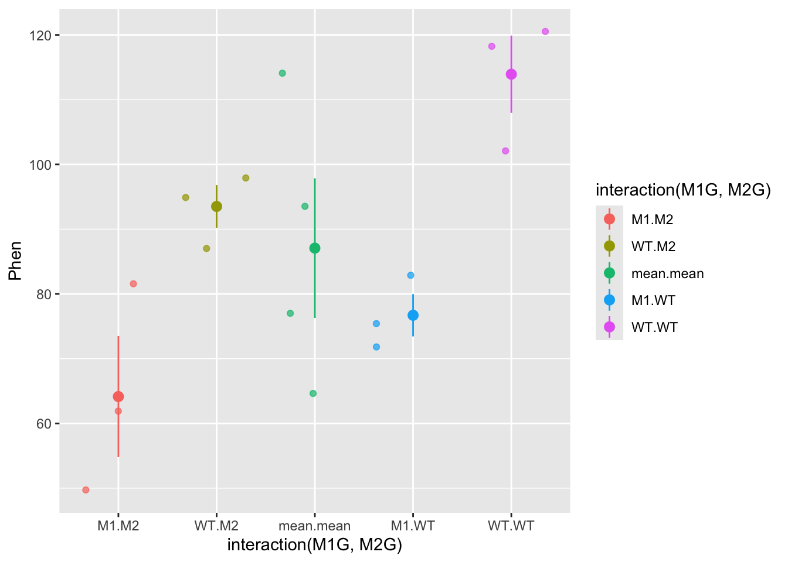
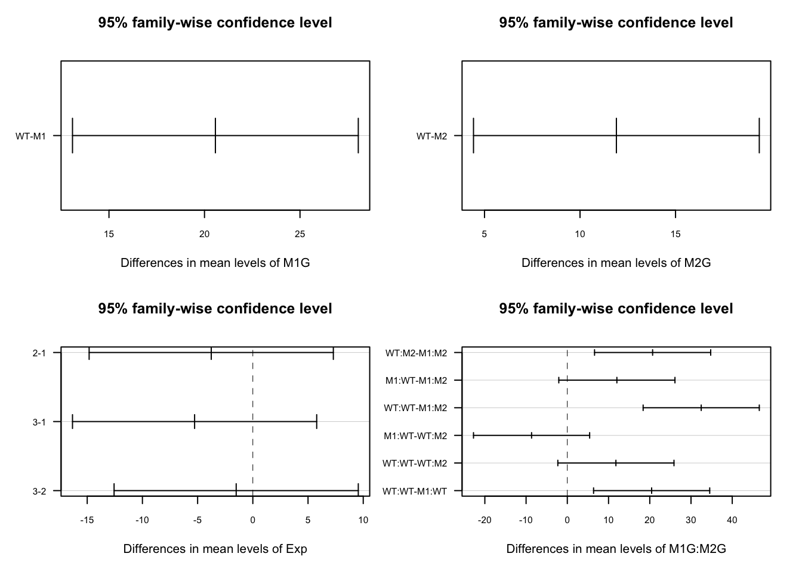
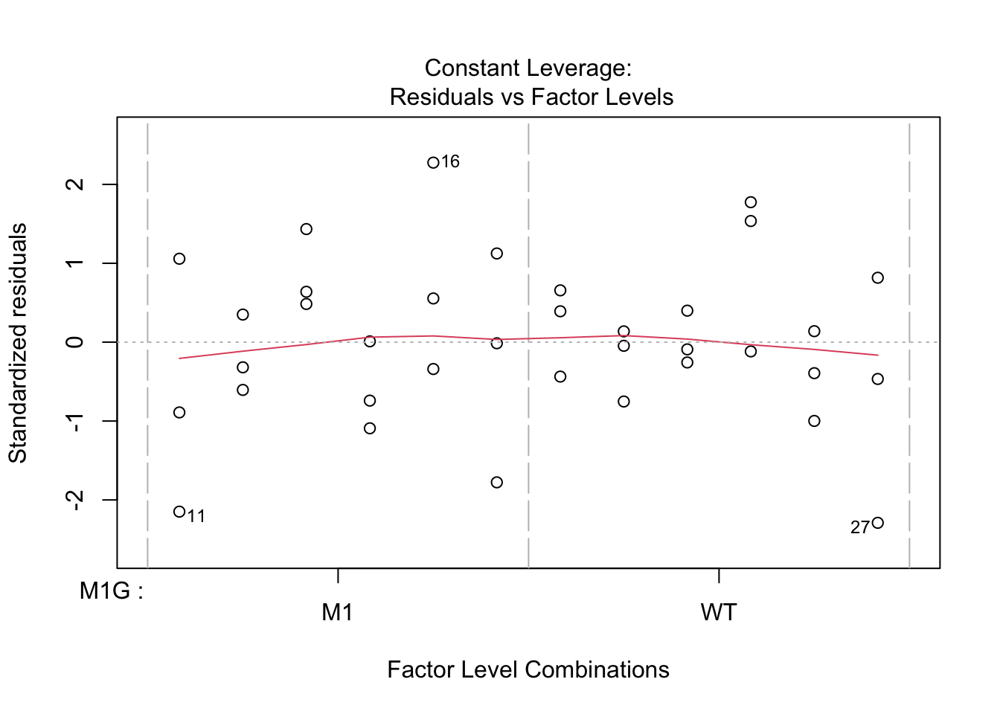

# Intro to ANOVA and non-linear least squares regression


This week our goals are to be able to:

- Conduct analysis of variance (ANOVA) for comparing means across multiple groups.
- Interpret the results of statistical tests and ANOVA, including understanding p-values, confidence intervals, and model summaries.
- Check assumptions such as normality of residuals in statistical models.
- Explore interaction effects in ANOVA models.
- Compare different models using the `anova` function.


## Reading

- Read through section 3 of [the Data Carpentries Statistics with R](https://mq-software-carpentry.github.io/statistics-with-r/index.html)
- Read through [Chapter 24 Non-linear regression in R here](https://tuos-bio-data-skills.github.io/intro-stats-book/non-linear-regression-in-R.html)


## ANOVA tests interactions between variables

This lesson in basic analysis of variance focuses and extends upon an example originally published in [Brady et al. 2015](https://www.ncbi.nlm.nih.gov/pubmed/26220933). Read through the introduction of this paper and come back when you're at the "ANOVA PROPERLY TESTS GENETIC INTERACTIONS" section.


[ANOVA (Analysis of Variance)](https://en.wikipedia.org/wiki/Analysis_of_variance) facilitates comparisons of quantitative outcome variables between and among different categorical, grouping variables as well as interactions between these variables. It is an extension of linear regression that allows us to compare group means in a more rigorous way than using pairwise T-tests.

Let's simulate an experiment in which we want to determine if two genes interact to contribute to a particular phenotype. These genes could be redundant or interact in some epistatic (non-linear) manner. To figure this out we will need to measure the phenotype of interest for the two single mutants, the wild type, and the double mutant. For this example, let's use root length as the phenotype. Suppose we have two mutants in two genes that we suspect have an effect on root length, as well as a double mutant containing mutations in both genes. 

First, we will simulate an experiment by drawing root length values from a random normal distribution for each genotype, and then compile these values we drew into a data frame. We will pick means and standard deviations for the normal distributions from thin-air for now. Feel free to come back later and change these values to see how differences in means and standard deviations will affect the outcomes. 

### Experiment 1

``` r
# Draw 3 measurements from a random normal distribution for each plant line
WT <- rnorm(n = 3, mean=100, sd=10) # WT genotype
M1 <- rnorm(n = 3, mean=85, sd=10)  # Single mutant in Gene 1
M2 <- rnorm(n = 3, mean=85, sd=10)  # Single mutant in Gene 2
DM <- rnorm(n = 3, mean=70, sd=10)  # Double mutant in Gene 1 and Gene 2
# Create a column of the simulated phenotype measurements that we randomly drew above
Phen <- c(WT, M1, M2, DM)
```
Now we will create a dataframe with columns for the status of each gene, that this is the first experiment, and the measurement of phenotype. Then we will combine these columns with our root length measurements in a data frame.

``` r
# Create a column for the genotype at gene 1
# 3 wild-types, 3 single mutants in Gene 1, 3 single mutants in Gene 2, 3 double mutants
M1G <- c("WT", "WT", "WT", "M1", "M1", "M1", "WT", "WT", "WT", "M1", "M1", "M1")
# Create a column for the genotype at gene 2
M2G <- c("WT", "WT", "WT", "WT", "WT", "WT", "M2", "M2", "M2", "M2", "M2", "M2") 
# Create a column for the repeat of the experiment, as we will be repeating this process several times
Exp <- c("1", "1", "1", "1", "1", "1", "1", "1", "1", "1", "1", "1")

Rep1 <- data.frame(Exp,M1G,M2G,Phen)
Rep1
```

```
##    Exp M1G M2G      Phen
## 1    1  WT  WT 118.65613
## 2    1  WT  WT 102.07606
## 3    1  WT  WT 121.04956
## 4    1  M1  WT  82.90370
## 5    1  M1  WT  71.84620
## 6    1  M1  WT  75.36325
## 7    1  WT  M2  95.39074
## 8    1  WT  M2  87.08630
## 9    1  WT  M2  98.05237
## 10   1  M1  M2  61.84168
## 11   1  M1  M2  49.22498
## 12   1  M1  M2  81.38668
```

Note that the values you drew will be different from those above and different from everyone else.
Now we also need to convert each of these independent variables from strings to factors, as required by the ANOVA function.


``` r
class(Rep1$M1G)
```

```
## [1] "character"
```

``` r
Rep1$M1G <- factor(Rep1$M1G) 
Rep1$M2G <- factor(Rep1$M2G) 
Rep1$Exp <- factor(Rep1$Exp)
```

Now that we have our data frame set up we can visualize our data and test our hypothesis. 

First, let's plot these data to get an idea of what they look like


``` r
#install a package from CRAN 
install.packages('ggplot2')


#we will also need the 'magrittr', ‘dplyr’, 'forcats', 'car', 'agricolae', and 'plyr' packages later on
install.packages('magrittr')
install.packages('dplyr')
install.packages("forcats")
install.packages("car")
install.packages("agricolae")
install.packages("plyr")
```


Let's explore this data a bit using the `qplot` function.

``` r
#before using any package we must load it into our workspace
library('ggplot2')
ggplot(data = Rep1, mapping  = aes(x = interaction(M1G, M2G) |> forcats::fct_rev(), y = Phen, color = interaction(M1G, M2G))) + geom_point()
```



***
#####???Question???  
What can we say about this data? Write a quick summary of this graph and formulate a hypothesis. 
*answer here*

Is one gene contributing more to the root length phenotype than another? 
*answer here*

Does the double mutant have a more or less severe phenotype than the individual mutants? 
*answer here*

Do you think the genes interact to contribute to the phenotype?  
*answer here*

***  

OK! Back to our analysis of variance. We want to ask whether or not the root length values for  wildtype plants, the single mutants in each gene, and the double mutant all came from the same distribution. To ask this question analysis of variance, as the name implies, compares different variances in our experiment. **ANOVA compares the variance between the groups we are comparing to the variance within each group. So in this case we want to compare the phenotypic variance between the means of the WT and each mutant to the phenotypic variance within each of these groups. Another way of thinking about this is that we are comparing the effect of the variable that separates the groups, to the precision of our measurment of this effect.** The variance between groups is called the systematic variance and the variance within groups is called the error variance. 

$$\frac{variance\ between}{variance\ within} = \frac{systematic\ variance}{error\ variance}$$ 


Let's visually explore this ANOVA idea a bit.
For each genotype we can calculate the mean phenotype and the variance around the mean. These is the "within" group variance. We'll add means and standard error to this plot using the `stat_summary` function to represent "within" variance. We can use the `alpha` aesthetic to change the saturation of the colors to make the mean stand out a bit more and hide the raw data somewhat. We can also use the `geom` argument `jitter` in the qplot function to prevent the mean and standard error from being plotted overtop of the raw data. 

``` r
ggplot(data = Rep1, mapping = aes(x = interaction(M1G, M2G), y = Phen, color = interaction(M1G, M2G))) + 
  geom_jitter( alpha = 0.7) +
  stat_summary(fun.data = "mean_se", alpha = 1)
```



The "between" group mean and variance is calculated using the mean for each group. Here, we'll split up our data frame `Rep1` into groups by the experiment, genotype at gene1, and genotype at gene2. Then we will calculate the mean for each of these groups. To do this we will use the `dplyr` package. We will also use the pipe function `%>%` from the `magrittr` package. The pipe function passes the result of the code on the left side to the first argument of the code on the right side. 


``` r
# Load the necessary packages 
library(dplyr)
```

```
## 
## Attaching package: 'dplyr'
```

```
## The following objects are masked from 'package:stats':
## 
##     filter, lag
```

```
## The following objects are masked from 'package:base':
## 
##     intersect, setdiff, setequal, union
```

``` r
# library(magrittr) no longer necessary 
# Take the Rep1 dataset and split it into groups
Rep1 |> group_by(Exp, M1G, M2G) |>
# Note that we don't need to use quotes with functions from the dplyr package
# Technically each of Exp, M1G, and M2G are passed to the "..." argument of the group_by function
# We added a pipe function to the end of this line so we can pass these groups to the `summarise` function to calculation the mean of each group
# We can then use the right arrow to assign this new data frame of the means to an object
  summarise(Phen = mean(Phen)) -> means
```

```
## `summarise()` has grouped output by 'Exp', 'M1G'. You can override using the
## `.groups` argument.
```

``` r
means$M1G <- "mean"
means$M2G <- "mean"
# Create a new data frame with the mean rows combined with our data
Rep1means <- bind_rows(Rep1, means)
ggplot(data = Rep1means, mapping = aes(x = interaction(M1G, M2G), y = Phen, color = interaction(M1G, M2G))) + 
         geom_jitter(alpha = 0.7) +
         stat_summary(fun.data = "mean_se", alpha = 1)
```



So now the mean.mean column contains four points representing the means of the four groups. The mean of these means, called the grand mean, is represented by the large point and the variance of the group means about the grand mean represents the between groups variance, but here we've used the `mean_se` function to calculate standard error. The true value of the variance is the difference between each data point and the mean. We can write our own function to calculate the true variance. Don't get bogged down in the code here (unless you want to :), just pay attention to the graphs. We can also use the `forcats` package to move the mean.mean column to the end of the graph and relabel each of the columns. In general the forcats package has functions that allow us to arrange factors (forcats is a rearrangement of factor, haha!). Let's also clean up the axis labels by adding `labs` to the plot. 


``` r
library(forcats)
ggplot(data = Rep1means, mapping = aes(x = fct_recode(fct_relevel(fct_rev(interaction(M1G, M2G)), "mean.mean", after = Inf),
                                                      double = "M1.M2", mut2 = "WT.M2", mut1 = "M1.WT", 
                                                      WT = "WT.WT", grand_means = "mean.mean"), 
                                       y = Phen,
                                       color = interaction(M1G, M2G))) + 
         geom_jitter(alpha = 0.7) +
  stat_summary(fun.data = function(y){
    data.frame(
      ymin = mean(y) - sum(mean(y) - y[which(y<mean(y))]),
      y = mean(y),
      ymax = mean(y) + sum(y[which(y>mean(y))] - mean(y)))
    }, alpha = 1) + 
  labs(x = "genotype", y = "root length (mm)")
```


Now we have a pretty graph showing the mean and variance for each genotype (the first four columns) as well as the grand mean and variance (the last column).

***
#####???Question???  
How does the variance in each group compare to the variance in the grand mean?
*answer here*

***

Now, let's formulate that hypothesis as a mathematical model so that we can perform the ANOVA analysis in R. 

Generally, we know that we have a response variable that we are measuring, that is a function of some set of predictors. 
$$response \sim f(predictors)$$
The ~ here means that this is a hypothetical or approximate relationship between the response and predictors as there are certainly other factors that we cannot predict or error that we cannot account for in our model.

***
#####???Question???  
What is the dependent variable in our simulated experiment? This is also known as the response variable and is typically continuous. 
*answer here* 

What are the independent or predictor variables of that response? These are typically discrete or categorical for ANOVA analysis. 
*answer here*  

***   

$$phenotype \sim f(Gene 1, Gene2)$$

Expanding this function a bit, we can assess each individual genes functional contribution to the phenotype as well as the extent to which they interact (or interfere) with one another. Therefore, our final model that we would like to test is

$$Phen \sim M1G + M2G + M1G:M2G$$

This is called a general linear model. This should remind you of a linear regression analysis from way back in Algebra II. We have written out an equation that we think should fit our data. ANOVA assigns the deviation or error between our model and our data into groups based on the predictors. It does this by comparing the variance between groups of predictors to the variance within groups of predictors. 

Now that we have our model formulated, let's set this up in the ANOVA framework in R to finally get an answer to our question: "Are these genes interacting to regulate to root length?"


``` r
?aov
Exp1 <- aov(Phen ~ M1G + M2G + M1G:M2G, data=Rep1) 
Exp1 <- aov(Phen ~ M1G*M2G, data=Rep1)
## TODO add in explanation of cross product
summary(Exp1)
```

```
##             Df Sum Sq Mean Sq F value  Pr(>F)    
## M1G          1   3325    3325  30.644 0.00055 ***
## M2G          1    815     815   7.514 0.02540 *  
## M1G:M2G      1     46      46   0.428 0.53156    
## Residuals    8    868     108                    
## ---
## Signif. codes:  0 '***' 0.001 '**' 0.01 '*' 0.05 '.' 0.1 ' ' 1
```

So what does this summary tell us? `Sum Sq` stands for sum of squares. This is the sum of the squared deviation between the groups of the variable. `Mean Sq` is `Sum Sq` divided by the degrees of freedom or `Df` in that variable and is essentially the variance of that variable. The degrees of freedom are the number of groups for that variable minus one. `Residuals` is the total within groups variance. 

Now for the comparison of the variances that we've been talking about all along. The `F value` is the ratio of the `Mean Sq` of the variable over the `Residuals`. So the larger the `F value` the more the variance between the predictor levels dominates the variance within predictor levels (i.e. the between treatment variance is greater than the sampling variance). So for our experiment a gene with an F value much greater than one indicates that the variance among genotypes is much greater than the variance within genotypes. The Pr(>F), is the probability that the data are consistent with the null hypothesis, which in this case is that the variance between genotypes of gene is not different from the variance within the genotypes. This is referred to as the p-value. So if this p-value is less than the confidence threshold you have set for your experiment (frequently 0.05), you can reject the null hypothesis and conclude that the gene has a significant effect on the phenotype.

However, **we cannot accept the null hypothesis** for those independent variables with p-values greater than our confidence threshold!!! We can only fail to reject the null, meaning we can only say that we don't have enough data to detect an effect on the phenotype. 

Chances are with this first small experiment you don't have enough data to say anything significant about the interaction between gene1 and gene2 (i.e. we don't have enough evidence to reject the null hypothesis). 

Let's repeat the experiment!

##Experiment 2


``` r
WT <- rnorm(3, mean=100, sd=10)
M1 <- rnorm(3, mean=85, sd=10)
M2 <- rnorm(3, mean=85, sd=10)
DM <- rnorm(3, mean=70, sd=10)
Exp <- c("2", "2", "2", "2", "2", "2", "2", "2", "2", "2", "2", "2") 
Phen <- c(WT, M1, M2, DM)

Rep2 <- data.frame(Exp,M1G,M2G,Phen) 
Rep2$M1G <- factor(Rep2$M1G) 
Rep2$M2G <- factor(Rep2$M2G) 
Rep2$Exp <- factor(Rep2$Exp)
```

ANOVA analysis for trial 2


``` r
Exp2 <- aov(Phen ~ M1G + M2G + M1G:M2G , data=Rep2) 
summary(Exp2)
```

```
##             Df Sum Sq Mean Sq F value  Pr(>F)   
## M1G          1  602.3   602.3   9.377 0.01553 * 
## M2G          1  771.8   771.8  12.018 0.00848 **
## M1G:M2G      1  116.4   116.4   1.812 0.21520   
## Residuals    8  513.8    64.2                   
## ---
## Signif. codes:  0 '***' 0.001 '**' 0.01 '*' 0.05 '.' 0.1 ' ' 1
```

***
#####???Question???  
What can you conclude from this experiment?
*answer here*

***

Because all good things come in threes, and the conclusions likely differ between experiments, let's repeat the experiment a third time. 

##Experiment 3


``` r
WT <- rnorm(3, mean=100, sd=10)
M1 <- rnorm(3, mean=85, sd=10)
M2 <- rnorm(3, mean=85, sd=10)
DM <- rnorm(3, mean=70, sd=10)
Exp <- c("3", "3", "3", "3", "3", "3", "3", "3", "3", "3", "3", "3") 
Phen <- c(WT, M1, M2, DM)

Rep3 <- data.frame(Exp,M1G,M2G,Phen) 
Rep3$M1G <- factor(Rep3$M1G) 
Rep3$M2G <- factor(Rep3$M2G) 
Rep3$Exp <- factor(Rep3$Exp)
```

ANOVA analysis for trial 3


``` r
Exp3 <- aov(Phen ~ M1G + M2G + M1G:M2G , data=Rep3) 
summary(Exp3)
```

```
##             Df Sum Sq Mean Sq F value Pr(>F)  
## M1G          1  609.4   609.4   4.894 0.0579 .
## M2G          1   30.5    30.5   0.245 0.6342  
## M1G:M2G      1   11.3    11.3   0.091 0.7707  
## Residuals    8  996.3   124.5                 
## ---
## Signif. codes:  0 '***' 0.001 '**' 0.01 '*' 0.05 '.' 0.1 ' ' 1
```

##Combined ANOVA
Now we can combine the experiments and control control for trial number effects.


``` r
AllExp <- rbind(Rep1, Rep2, Rep3)
# Notice how we add an Exp variable to the model
Full <- aov(Phen ~ M1G + M2G + M1G:M2G + Exp , data=AllExp) 
summary(Full)
```

```
##             Df Sum Sq Mean Sq F value   Pr(>F)    
## M1G          1   3808    3808  31.541 4.09e-06 ***
## M2G          1   1275    1275  10.562  0.00285 ** 
## Exp          2    177      89   0.733  0.48872    
## M1G:M2G      1      0       0   0.001  0.97460    
## Residuals   30   3622     121                     
## ---
## Signif. codes:  0 '***' 0.001 '**' 0.01 '*' 0.05 '.' 0.1 ' ' 1
```

### Ploting the full dataset

Let's plot the full data set and see if the ANOVA results match our visual expectations. 


``` r
ggplot(data = AllExp, mapping = aes(x = interaction(M1G, M2G), y = Phen, color = interaction(M1G, M2G))) + geom_point(mapping = aes(shape = Exp), alpha = 0.7, position = "jitter") + stat_summary(fun.data = "mean_se", alpha = 1)
```


Let's try plotting this as a boxplot as well. All we have to do is specify a a different geom. 


``` r
ggplot(data = AllExp, aes(x = interaction(M1G, M2G), y = Phen, color = interaction(M1G, M2G))) + geom_boxplot()
```


In the end you will likely be able to conclude that both gene1 and gene2 have significant effects on the phenotype, but that there is not evidence to suggest that there is a significant interaction between the two genes. Also, the experimental trial most likely does not have an effect. This is all dependent on the mean and variance of the distributions we set in the beginning. 


``` r
# Draw 3 measurements from a random normal distribution for each plant line
WT <- rnorm(n = 3, mean=100, sd=10) # WT genotype
M1 <- rnorm(n = 3, mean=85, sd=10)  # Single mutant in Gene 1
M2 <- rnorm(n = 3, mean=85, sd=10)  # Single mutant in Gene 2
DM <- rnorm(n = 3, mean=70, sd=10)  # Double mutant in Gene 1 and Gene 2
```

***
#####???Question???
What value of the mean of the double mutant distribution would be likely to result in a significant interaction between the two genes?
*answer here*

***

## Post hoc testing

While the ANOVA summary tells us which independent variables explain a significant amount of variance in the experiment, it doesn't allow us to compare the levels of the independent variables. How can we tell if the mutant in gene 1 has a different phenotype from the mutant in gene 2?
What if the experimental trial did have an effect? How could we figure out which trial is different from the others? 

To compare group or level means and variances and answer these questions we will need to do what is called a *post hoc* test, following our ANOVA analysis. One of the most commonly used post hoc tests is Tukey's Honest Significant Difference test. This compares all of the group means in a pairwise manner and corrects the confidence threshold since we are making multiple comparisons. We do this test on our ANOVA object `Full` from above.


``` r
tuk <- TukeyHSD(Full)
tuk
```

```
##   Tukey multiple comparisons of means
##     95% family-wise confidence level
## 
## Fit: aov(formula = Phen ~ M1G + M2G + M1G:M2G + Exp, data = AllExp)
## 
## $M1G
##           diff      lwr      upr   p adj
## WT-M1 20.57078 13.09031 28.05124 4.1e-06
## 
## $M2G
##          diff      lwr      upr     p adj
## WT-M2 11.9041 4.423635 19.38457 0.0028461
## 
## $Exp
##          diff       lwr      upr     p adj
## 2-1 -3.766752 -14.82599 7.292489 0.6816931
## 3-1 -5.273803 -16.33304 5.785438 0.4765718
## 3-2 -1.507051 -12.56629 9.552190 0.9398097
## 
## $`M1G:M2G`
##                  diff        lwr       upr     p adj
## WT:M2-M1:M2 20.688353   6.603360 34.773347 0.0020880
## M1:WT-M1:M2 12.021678  -2.063315 26.106671 0.1158099
## WT:WT-M1:M2 32.474877  18.389884 46.559871 0.0000038
## M1:WT-WT:M2 -8.666675 -22.751668  5.418318 0.3551120
## WT:WT-WT:M2 11.786524  -2.298469 25.871517 0.1266157
## WT:WT-M1:WT 20.453199   6.368206 34.538192 0.0023579
```

So more than likely, you will see for your full experiment with 3 replications that WT is significantly different from M1 and M2. This is shown in the first two sections of the `TukeyHSD` summary which compare the levels (wildtype vs mutant) of the factors M1G and M2G. The `p adj` is the p-value (adjusted for the multiple comparisons) resulting from the equivalent of a *t*-test comparing the two groups. So if the `p adj` value is less than the accepted confidence level (typically 0.05), then the two compared groups are significantly different from one another. Hopefully, each replication of the experiment will not be significantly different from the others, i.e. the adjusted p-values will be greater than 0.05. We can visualize the differences in the means by plotting the `TukeyHSD` results. This uses base R plotting which is much less user-friendly than ggplot. Don't get bogged down in the code here, just pay attention to the graphs.


``` r
par(mfrow = c(2,2), cex = 0.65)
plot(tuk, las = 1, cex.axis = 0.75) 
```



This plots the confidence intervals around the difference between the means for each pair of groups. If these confidence intervals intersect zero we cannot conclude that the two groups being compared are significantly different. 

We could also use the `HSD.test` function from the `agricolae` package, which puts the groups into groups that are not significantly different from each other.


``` r
library("agricolae")
HSD.test(y = Full, trt = c("M1G","M2G"), console = TRUE)
```

```
## 
## Study: Full ~ c("M1G", "M2G")
## 
## HSD Test for Phen 
## 
## Mean Square Error:  120.7459 
## 
## M1G:M2G,  means
## 
##            Phen       std r       se      Min       Max      Q25       Q50
## M1:M2  67.76339 10.031101 9 3.662815 49.22498  81.38668 61.84168  70.35960
## M1:WT  79.78507 11.783062 9 3.662815 59.69811 101.86151 75.36325  77.38375
## WT:M2  88.45175  5.584788 9 3.662815 80.15181  98.05237 85.27537  87.23379
## WT:WT 100.23827 14.292659 9 3.662815 75.00520 121.04956 93.29713 100.88102
##             Q75
## M1:M2  71.91020
## M1:WT  84.59030
## WT:M2  90.19705
## WT:WT 106.16942
## 
## Alpha: 0.05 ; DF Error: 30 
## Critical Value of Studentized Range: 3.845401 
## 
## Minimun Significant Difference: 14.08499 
## 
## Treatments with the same letter are not significantly different.
## 
##            Phen groups
## WT:WT 100.23827      a
## WT:M2  88.45175     ab
## M1:WT  79.78507     bc
## M1:M2  67.76339      c
```

Finally we can add these groups to our graph and make the titles a bit more understandable. We'll add a text geometry to add the post hoc comparisons. Another tricky point is that we have to make sure that the x-axis labels match between our data and our HSD test. To do this we use `gsub` to swap out the colons for periods. 


``` r
HSD.groups <- HSD.test(y = Full, trt = c("M1G","M2G"))$groups
HSD.groups$trt <- row.names(HSD.groups)
ggplot(data = AllExp, aes(x = interaction(M1G, M2G), y = Phen, color = interaction(M1G, M2G))) + geom_boxplot() + geom_text(data = HSD.groups, mapping = aes(x = gsub(":", ".", trt), y = max(Phen) + 20, label = groups), color = "black")
```


Now let's clean this up a bit by changing the axis titles and labels. We'll use `forcats` functions like before but this time with pipes to make the process a little more readable. We'll also use a new theme to clean up the plot a bit and get rid of the legend. 

``` r
library(magrittr)
# First we will use mutate from `dplyr` to add a column for the full genotype
AllExp %<>% mutate(genotype = interaction(M1G, M2G))
# %<>% is a two way pipe that passes AllExp as the first argument to mutate and then assigns the result back to AllExp

# Now to recode genotype we will unfurl the nested forcats function using pipes
AllExp$genotype %<>%
  fct_rev() %>%
  fct_recode(double_mutant = "M1.M2", mut2 = "WT.M2", 
             mut1 = "M1.WT", WT = "WT.WT")

HSD.groups$trt %<>%
  fct_rev() %>%
  fct_recode(double_mutant = "M1:M2", mut2 = "WT:M2", 
             mut1 = "M1:WT", WT = "WT:WT")

ggplot(data = AllExp, aes(x = genotype, y = Phen, color = genotype)) + geom_boxplot() + geom_text(data = HSD.groups, mapping = aes(x = trt, y = max(Phen) + 20, label = groups), color = "black") + xlab("genotype") + ylab("root length (mm)") + theme_classic() + theme(legend.position="none")
```


## Assumptions of ANOVA

Before making any final conclusions we should check and make sure that our data satisfies the assumptions of the F-statistic, and really the assumptions of nearly any statistical test. These are normality (that the groups are normally distributed), *homogeneity of variance* (that the variances are similar for each group) and independence (that each observation is independent of the others, e.g. each measurement was of a different plant). It's not a deal-breaker if our data defies one of these assumptions. There are variations of ANOVA procedures that are robust to certain violations, but these will have to wait for another class.

How do you test these assumptions? 

We can use our diagnostic plots.


``` r
plot(Full, ask = FALSE)
```




### Normality of residuals 

Based on the qq plot above which shows very little deviation from a straight line 

### Homogeneity of variance

The test for homo/heterogeneity of variance is called Levene's Test. The null hypothesis of this test is that there is no difference in the variance of each group. So a significant Levene's test with $p < 0.5$ would mean that the assumption of homogeneity is violated. The function `leveneTest` is in the car package.  


``` r
library('car')
```

```
## Loading required package: carData
```

```
## 
## Attaching package: 'car'
```

```
## The following object is masked from 'package:dplyr':
## 
##     recode
```

``` r
leveneTest(AllExp$Phen, interaction(AllExp$M1G, AllExp$M2G), center = median)
```

```
## Levene's Test for Homogeneity of Variance (center = median)
##       Df F value Pr(>F)
## group  3  1.2687 0.3017
##       32
```

### Independence

To test for independence we have to think "is there any reason that any measurements might be dependent on another measurement?" Typically this is due to a *repeated-measures design*. This might be that you have measured the same phenotype of different leaves from the same plant, or measured the same leaf at two different times. 

Hopefully with this introduction you can now you can proceed to analyze the data you have collected in lab. Follow the same steps of formulating your hypothesis as a mathematical model, graphing the data, and performing an ANOVA and post hoc test to test your hypothesis. 

## Non-linear least squares

We will walk through an example of using non-linear least squares regression in class Monday. Be sure to look through the reading [Chapter 24 Non-linear regression in R here](https://tuos-bio-data-skills.github.io/intro-stats-book/non-linear-regression-in-R.html)

