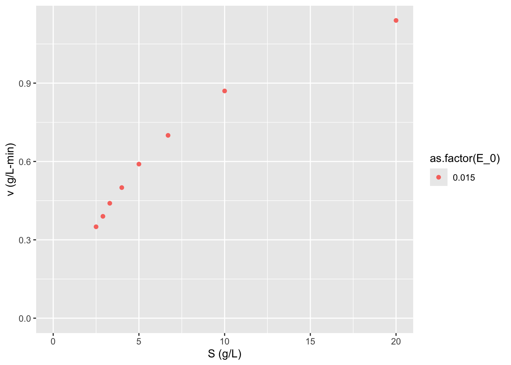
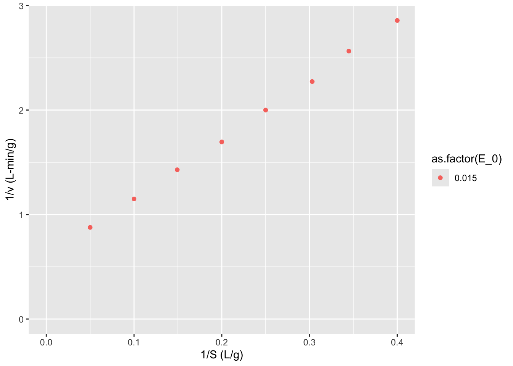
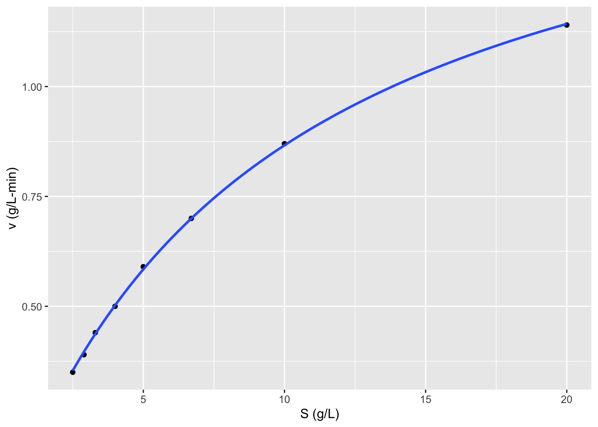
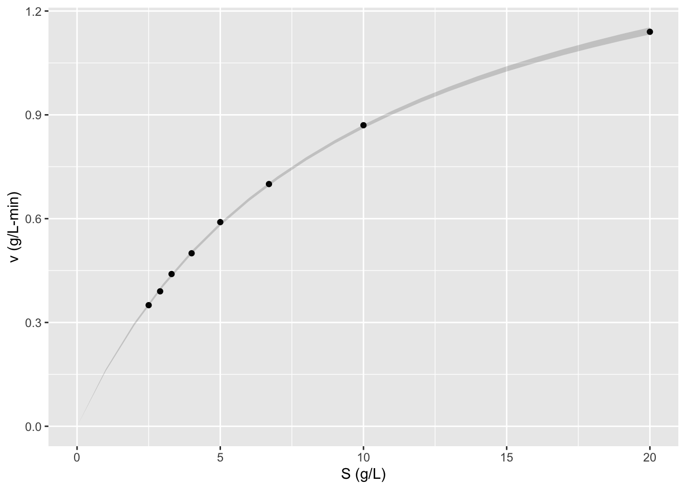

# ANOVA and non-linear least squares regression examples

The substrate concentration dependence on the rate or "velocity" of an enzymatic reaction in most cases can be described by the following equation:

$$\nu = \frac{V_mS}{K_m + S}$$

where the maximum reaction velocity is $V_m = k_{cat}E_0 = k_2E_0$, with $E_0$ the initial enzyme concentration and $k_{cat}$ the catalytic rate constant. $K_m$ is the Michaelis constant which represents the binding equilibrium of substrate-enzyme. We often need to estimate the two parameters, $V_m$ and $K_m$  based on experimental data. Although with today's computational power these parameters could be estimated in many possible ways with non-linear regression, historically and still often today linearizations of this enzyme kinetic model are used to fit these parameters to experimental data. 

Last week we used the Lineweaver-Burke linearization. This week we will use non-linear least squares regression. 

### Lineweaver-Burk plot

One method of linearization would be to invert the entire model equation.
$$\frac{1}{\nu} = \frac{1}{V_m} + \frac{K_m}{V_m} \frac{1}{S}$$
The resulting plot is called a Lineweaver-Burk plot. 

#### ???Questions??? 

What would you plot as x and y, and what would be the slope and y-intercept of  the plot be. 

>*A Lineweaver-Burke plot is $1/\nu$ (y) vs $1/S$ (x). The slope is $K_m/V_m$ and the y-intercept is $1/V_m$*

*** 

This plot is also sometimes called a double-reciprocal plot, because we plot the reciprocal of our independent variable $\nu$ versus our dependent variable $S$. 

To use this plot to find $V_m$ and $K_m$ we need to collect reaction velocity data ($\nu = dP/dt = -dS/dt$) at different initial substrate concentrations. The reaction velocity will of course decrease throughout the experiment, but to match the initial substrate concentrations, we want to find the initial velocity, i.e. the initial slope of the curve of product or substrate versus time. 

You can perhaps see how determining the instantaneous initial velocity of this curve can be difficult and error prone. We need very rapid and accurate measurements of product or substrate in order to determine this initial slope. Due to the properties of the reciprocal, the error at low substrate concentrations is amplified and has a strong influence on the slope and intercept of the graph. For these reasons the Lineweaver-Burke plot provides better estimates of $V_m$ than $K_m$. 

Let's look at an some example data and calculate $V_m$ and $K_m$ in several ways. Here we have performed experiments with two different concentrations of the same purified enzyme across a range of substrate concentrations, and calculated the initial velocity of each reaction.


``` r
S <- c(20, 10, 6.7, 5, 4, 3.3, 2.9, 2.5) # substrate concentration (g/L)
v_0.015 <- c(1.14, 0.87, 0.7, 0.59, 0.50, 0.44, 0.39, 0.35) # reaction velocity (g/L-min) at E_0 = 0.015 g/L

data  <- data.frame(S, v_0.015)
require(knitr)
```

```
## Loading required package: knitr
```

``` r
knitr::kable(data)
```


|    S| v_0.015|
|----:|-------:|
| 20.0|    1.14|
| 10.0|    0.87|
|  6.7|    0.70|
|  5.0|    0.59|
|  4.0|    0.50|
|  3.3|    0.44|
|  2.9|    0.39|
|  2.5|    0.35|

>Sometimes we won't know the concentration of our enzyme, if say we are working with just a cell lysate or if we are unable to completly purify our enzyme. In this case we will just use a *specific activity* of the mixture. Specific activity is just the activity of the enzyme per mass of total protein in the complex mixture. The enzyme activity is measure in units of product formed per time at particular conditions (e.g. temperature, pH, substrate concentration, etc.).  

Let's initially look at this data by plotting $\nu$ vs $S$ as dictated by the Michaelis-Menten equation.


``` r
require(tidyr)
```

```
## Loading required package: tidyr
```

``` r
data <- tidyr::gather(data = data, key = E_0, value = v, v_0.015)
require(stringr)
```

```
## Loading required package: stringr
```

``` r
data$E_0 <- as.numeric(stringr::str_remove(string = data$E_0, pattern = "v_"))
require(ggplot2)
```

```
## Loading required package: ggplot2
```

``` r
ggplot2::ggplot(data = data, 
                mapping = aes(x = S, y = v, 
                              color = as.factor(E_0))) + geom_point() + labs(y = "v (g/L-min)", 
                    x = "S (g/L)") + 
  expand_limits(x = 0, y = 0)
```



#### ???Questions??? 

What can you say about this graph? 

>*The higher concentration of enzyme has a higher velocity across all substrate concentrations. The shape of the two curves is similar. As substrate concentration increases the increase in reaction velocity decreases.*

*** 

Now let's make a Lineweaver-Burk plot. 
$$\frac{1}{\nu} = \frac{1}{V_m} + \frac{K_m}{V_m} \frac{1}{S}$$


``` r
data$LB.y <- 1/data$v
data$LB.x <- 1/data$S
ggplot2::ggplot(data = data, 
                mapping = aes(x = LB.x, y = LB.y, color = as.factor(E_0))) + geom_point() + labs(y = "1/v (L-min/g)", 
                    x = "1/S (L/g)") + 
  expand_limits(x = 0, y = 0)
```



Now we can use linear regression to find the slope and intercept of the line of best fit.


``` r
LB <- lm(formula = LB.y~LB.x, data = data)
summary(LB)
```

```
## 
## Call:
## lm(formula = LB.y ~ LB.x, data = data)
## 
## Residuals:
##       Min        1Q    Median        3Q       Max 
## -0.027826 -0.004796  0.001278  0.007841  0.026257 
## 
## Coefficients:
##             Estimate Std. Error t value Pr(>|t|)    
## (Intercept)  0.58019    0.01462   39.69 1.71e-08 ***
## LB.x         5.67720    0.05801   97.87 7.67e-11 ***
## ---
## Signif. codes:  0 '***' 0.001 '**' 0.01 '*' 0.05 '.' 0.1 ' ' 1
## 
## Residual standard error: 0.01874 on 6 degrees of freedom
## Multiple R-squared:  0.9994,	Adjusted R-squared:  0.9993 
## F-statistic:  9578 on 1 and 6 DF,  p-value: 7.67e-11
```

## Nonlinear least squares regression

With the computational power available today these linearizations are really historical relicts, as we can fit these parameters to our nonlinear model. Nonlinear regression methods essentially sweep through the parameter space, by iteratively changing each parameter and calculating the distance between the model with the current parameter set and the data points. The sum of the squared distance between our model and data is called the residual. The parameter values that minimize the residual are chosen our best fit. 


``` r
# Perform nonlinear least squares regression
nls1 <- nls(formula = v ~ S/(S + Km) * Vm,
            data = data,
            start = list(Km=1, Vm=1))
summary(nls1)
```

```
## 
## Formula: v ~ S/(S + Km) * Vm
## 
## Parameters:
##    Estimate Std. Error t value Pr(>|t|)    
## Km  9.35733    0.13814   67.74 6.96e-10 ***
## Vm  1.67708    0.01314  127.66 1.56e-11 ***
## ---
## Signif. codes:  0 '***' 0.001 '**' 0.01 '*' 0.05 '.' 0.1 ' ' 1
## 
## Residual standard error: 0.004591 on 6 degrees of freedom
## 
## Number of iterations to convergence: 6 
## Achieved convergence tolerance: 3.9e-07
```

Note that we don't get an R^2^ with non-linear least squares. To compare nonlinear vs linear models we must calculate the residuals given the parameters for each model, so plugging back in the `Vm` and `Km` parameters from our `lm` call and `nls` call into the Michaelis-Menten equation and calculating the predictions, then subtract the original `v` values from data from those that our models predict to calculate residuals for each model on the same scale of the original `v` without transformation. 

You can see how this is done in my Bioprocess course packet here: <https://wrightrc.github.io/Bioprocess-Book/05-enzyme-rate-parameters.html#comparing-linearization-vs-nonlinear-methods>.

Another advantage is that our $K_m$ and $k_{cat}$ as well as standard errors do not need any scaling; we get direct estimates of parameters of this enzyme and **uncertainty** in these estimates. While we can calculate these parameters and uncertainties it is cumbersome and inevitably will result in poorer estimates just based on the worse model-fit per the residuals.

Looking back at our linearized model, 
$$\frac{E_0}{\nu} = \frac{K_m}{k_{cat}S} + \frac{1}{k_{cat}}$$
we can calculate our estimate of $k_{cat}=$ 1.7235773 $\pm$ , and our estimate of $K_m =$ 9.7850987. To calculate the uncertainty in these estimates we must propagate the standard error in our slope and intercept, according to the division formula
$$Q = \frac{a}{x}, \delta Q = Q \sqrt{(\frac{\delta a}{a})^2 + (\frac{\delta x}{x})^2}$$

There is a nice wikipedia article on Propagation of Uncertainty describing these formulas for standard error/deviation calculation and how they were derived: <https://en.wikipedia.org/wiki/Propagation_of_uncertainty>


``` r
ggplot2::ggplot(data = data, 
                mapping = aes(x = S, y = v)) + 
                  geom_point() + labs(y = "v (g/L-min)", 
                    x = "S (g/L)") + 
  geom_smooth(method = "nls", se = FALSE,
              formula = y ~ x/(x + Km) * Vm,
              method.args = list(start = list(Km=111, Vm=9.5)))
```



Unfortunately geom smooth doesn't work with nls to make confidence intervals, so we have to use `geom_ribbon` and `predictNLS` to make them separately. But I'm not sure in this case if the confidence intervals really make sense...


``` r
conf.int <- propagate::predictNLS(nls1, newdata = data.frame(S = seq(0, 20, 1)), interval = "confidence", nsim = 100000)
```

```
## predictNLS: Propagating predictor value #1...
```

```
## predictNLS: Propagating predictor value #2...
```

```
## predictNLS: Propagating predictor value #3...
```

```
## predictNLS: Propagating predictor value #4...
```

```
## predictNLS: Propagating predictor value #5...
```

```
## predictNLS: Propagating predictor value #6...
```

```
## predictNLS: Propagating predictor value #7...
```

```
## predictNLS: Propagating predictor value #8...
```

```
## predictNLS: Propagating predictor value #9...
```

```
## predictNLS: Propagating predictor value #10...
```

```
## predictNLS: Propagating predictor value #11...
```

```
## predictNLS: Propagating predictor value #12...
```

```
## predictNLS: Propagating predictor value #13...
```

```
## predictNLS: Propagating predictor value #14...
```

```
## predictNLS: Propagating predictor value #15...
```

```
## predictNLS: Propagating predictor value #16...
```

```
## predictNLS: Propagating predictor value #17...
```

```
## predictNLS: Propagating predictor value #18...
```

```
## predictNLS: Propagating predictor value #19...
```

```
## predictNLS: Propagating predictor value #20...
```

```
## predictNLS: Propagating predictor value #21...
```

``` r
conf.int <- data.frame(x = seq(0, 20, 1), ymin = conf.int$summary[,5], ymax = conf.int$summary[,6])
ggplot2::ggplot(data = data, 
                mapping = aes(x = S, y = v)) + 
                  geom_point() + labs(y = "v (g/L-min)", 
                    x = "S (g/L)") + 
  # geom_smooth(method = "nls", se = FALSE,
  #             formula = y ~ x/(x + Km) * Vm,
  #             method.args = list(start = list(Km=111, Vm=9.5))) + 
  geom_ribbon(data = conf.int, mapping = aes(x = x, ymin = ymin, ymax = ymax), inherit.aes = FALSE, alpha = 0.2)
```




