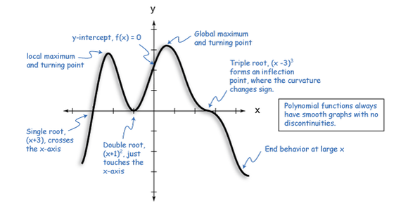

# Roots and Optima Introduction

This week our goals are to be able to:

 - Identify problem statements that are asking to identify roots or optima of equations.
 - Outline the algorithm for solving root and optima problems.
 - Correctly set up equations and solve for roots and optima.
 - Visualize functions to assist in identifying search ranges for roots and optima.
 
Read and/or watch:
 - Read https://en.wikipedia.org/wiki/Newton%27s_method (through Description section) and https://en.wikipedia.org/wiki/Newton%27s_method_in_optimization (through Geometric interpretation section)
 - Watch <https://www.youtube.com/watch?v=lBfqvBJaFmc> first 10 min.
 

 
Then review the following examples in R. 

## Roots

```{r roots-packages}
library(ggplot2)
library(rootSolve)
```

### Example 1

Suppose you have a model that represents the velocity of a bungee jumper ($v$) that depends on the mass of the person ($m$), the drag force ($c_d$), the time in free fall ($t$), and the gravitational constant ($g$). Medical studies have shown that if the velocity increases above 36 m/s after 4 seconds of free fall, the health risk to the jumper is elevated. What is the critical mass of a person given the following:

$$v(t) = \sqrt{\frac{gm}{c_d}} \tanh \left( t\sqrt{\frac{gc_d}{m}} \right)$$

(This equation is written with in-line LaTeX code in Rmarkdown). 

$c_d = 0.25$ kg/m; $g =  9.81$ m/s^2^

How would you solve?

- graph
- root(s)


#### Approach

1. Rearrange equation
2. Plot equation
3. Run uniroot

##### Rearrange equation 

All we need to do here is subtract over $v$ to the right side.

$$0 = \sqrt{\frac{gm}{c_d}} \tanh \left( t\sqrt{\frac{gc_d}{m}} \right) - v(t)$$

Now we can set up this equation along with all of the variable and constant values in our R session.

##### Plot Equation

```{r example1}
c_d <- 0.25 # drag coefficient
g <- 9.81 # gravitational constant
v <- 36 # velocity (m/s)
t <- 4 # time (s)

mp <- seq(0,200) # mass predictions, 
# a range of values where the root might be. 
# You might need to play with this range.

f <- function(mp = 1,c_d = 1,g = 9.8,v = 36,t = 4){ # all variables in the equation are arguments
  sqrt(g*mp/c_d)*tanh(sqrt(g*c_d/mp)*t)-v # what the function does
  # by default our output is the result of the above line
}

f()
f(mp = 147, c_d = c_d, g = g, v = v, t = t) 

plot(mp,f(mp,c_d,g,v,t)) # plot our function f 
# these variables have already been defined

```

##### Solve equation using `uniroot`
Now we can solve for the root of this equation, *i.e.* where the plot crosses the x-axis. We will use the `uniroot` function.

"The function uniroot searches the interval from lower to upper for a root (i.e., zero) of the function f with respect to its first argument."

```{r, eval=FALSE}
# Don't run this, this is from the help documentation of uniroot
uniroot(f, interval, ...,
        lower = min(interval), upper = max(interval),
        f.lower = f(lower, ...), f.upper = f(upper, ...),
        extendInt = c("no", "yes", "downX", "upX"), check.conv = FALSE,
        tol = .Machine$double.eps^0.25, maxiter = 1000, trace = 0)
```

You can set `extendInt = "yes"` to extend the interval if you didn't see a root in your plot.

Now we can use `uniroot` to solve.

```{r}
(mass <- uniroot(f = f, interval = c(50,140), c_d = c_d, g = g, v = v, t = t, extendInt = "yes"))
# c_d, g, v, t are `... =` additional named or unnamed arguments to be passed 
# to f. I've named c_d and g, v and t are not named, so they need to be in the 
# same order as our function definition in lines 45-47.
```

So the root of this equation, the mass at which this maximum velocity without spinal damage is `r mass$root`. It took `r mass$iter` iterations to reach this root, and the function has a value of `r mass$f.root` as this value. If we change the `tol` argument to be lower we could get a more accurate number, but to be safe let's just round down our root a bit to `r floor(mass$root)`; nobody wants spinal damage.


### Example 2

You buy a \$25,000 piece of equipment for nothing down at \$5,500 per year for 6 years. What interest rate are you paying? The formula relating present worth $P$, annual payments $A$, number of years $n$, and interest rate $i$ is

$$ A = P \frac{i(1 + i)^n}{(1 + i)^n - 1}$$

Add your own comments to the code chunk below, describing what each line is doing. 

```{r}
A <- 25000
p <- 6500
n <- 5


i <- seq(0,10)

f <- function(i,A,p,n) (p*i*(1+i)^n)/((1+i)^n-1)-A


plot(i,f(i,A,p,n))

uniroot(f,c(0.1,10),A,p,n)
```


### Example 3 more than 1 root

In this case we will need to use `uniroot.all` to find the multiple roots.

```{r example_2}


x <- seq(3,6,.01)
f <- function(x) sin(10*x)+cos(3*x)
fx <- f(x)
d <- data.frame(x,fx)

ggplot(d,aes(x,fx)) + geom_line()
```

```{r}
uniroot(f, c(3,6))

# uniroot.all is in the rootSolve package
library(rootSolve)
rootSolve::uniroot.all(f, c(3,6)) -> roots
roots
```

## Optima/Optimization

```{r optima-packages}
library(ggplot2)
library(pracma) # has meshgrid
library(plotly)
```

## Optimization, 1-Dimensional

Definition: The `optimize` R function performs one dimensional optimization.

You can find the basic R programming syntax of the `optimize` function below.

```{r, eval = FALSE}
#from 
?optimize
#(You can also spell it `optimise`)
# Usage
optimize(f, interval, ..., lower = min(interval), upper = max(interval),
         maximum = FALSE,
         tol = .Machine$double.eps^0.25)    
# f	
# the function to be optimized. The function is either minimized or maximized over its first argument depending on the value of maximum.

# interval	
# a vector containing the end-points of the interval to be searched for the minimum.

# ...	
# additional named or unnamed arguments to be passed to f.
```

This looks very similar to `uniroot`, right? Our approach to solving these will also be similar.


### Approach:

1. Write function.
2. Plot function.
3. Apply optimize command. Set maximum=TRUE if you want to find maximum.

### Example: Optimizing User-Defined Function Using optimize() in R

#### Write function

The following R programming syntax illustrates how to use the `optimize` function in R. First, we have to create our own function that we want to optimize:
```{r}
my_function <- function(x) x^3 + 2 * x^2 - 10 * x
```

```{r Example1_definefunctionandplot}
# Write Function
f <- function(x) {             # Create function
  x^2/10-2*sin(x)}
```

#### Plot
You can use `geom_function(fun = f)` now to plot functions
```{r}
ggplot() + geom_function(fun = f) + xlim(0,4)

# which is much better than the old way
x <- seq(0,4,0.1) # create x vector, you can change the limits
fx <- f(x) # evaluate using x vector
d <- data.frame(x,fx) # create data frame
ggplot(d,aes(x,fx))+geom_line() # plot
```

#### Find optimum
Finally we can find the local optima of this function. From our plot it is between 1 and 2.

```{r}
# Apply optimize
(f_min <- optimize(f = f, interval = c(1, 2)))
```

The interval range for plotting provides the opportunity to hone in on the minimum. Here, I started larger and then chose to plot between 0 and 4. This allowed me to select a reasonable interval for the optimize function. The minimum value occurs at an x-value of `r round(f_min$minimum, 2)` and the minimum is `r round(f_min$objective, 2)`.


### Example: Finding a maximum

#### Write function
In the example above, we found the minimum. Suppose we want to find the maximum value of a function. Let's imagine we have a soccer ball that we kick into the air at a starting velocity, and we want to compute how high the ball gets. The model equation is below:
$$
z = z_0 + \frac{m}{c} \left( v_0 + \frac{m g}{c}\right)\left( 1 - e^{(-c/mt)}\right) - \frac{mg}{c}t
$$
where 
$z =$ height above surface [m]
$z_0 =$ initial height [m]
$m =$ mass [kg]
$c =$ drag coefficient [kg/s]
$v_0 =$ initial velocity [m/s]
$t =$ time [s]

Given the following values:
```{r}
g = 9.81 #m/s2
z_0 = 0 #m
c = 0.25 #kg/s, https://www.grc.nasa.gov/WWW/K-12/airplane/socdrag.html
m = 0.45 #kg
v_0 = 25 #m/s

f <- function(t,g,z_0,c,m,v_0) z_0 + ((m/c)*(v_0+(m*g/c))*(1-exp(-1*c/m*t)))-(m*g/c*t)

```

#### Plot
```{r}
t <- seq(0,5,.01)
fx <- f(t = t, g = g, z_0 = z_0, c, m, v_0)
d <- data.frame(t,fx)
ggplot(d,aes(t,fx)) + 
  geom_line() + 
  xlab("t [s]") + 
  ylab("Height [m]")
# OR
ggplot() + 
  geom_function(fun = f, args = list(g = g, z_0 = z_0,
                                     c = c,m = m, v_0 = v_0)) + xlim(0,5) +
  xlab("t [s]") + 
  ylab("Height [m]")
# kind of convenient how the args list to our function f is also necessary for 
# optimize...
```

#### Find optimum

```{r}
optimize(f = f, interval = c(0,5),
         g = g, z_0 = z_0,c = c,m = m, v_0 = v_0, maximum = TRUE)
```


## Optimization, 2-Dimensional

Now let's look at a 2-D example. 

Here we will do our plotting and function writing a bit backwards, as plotting in 3D, can be cumbersome. You can create contour or heatmap plots where you define a grid of x and y values using `meshgrid` to the calculate the z value, z(x,y). Once you plot, you can play around with the start and end value under contours to zoom in on the optimum you are interested in. The plot allows you to identify the location in the x and y vector, and from there you can identify the x and y value. We will use `plotly` package to make these plots. Plotly conveniently allows you to see the values of a plot as you hover over it.  

Plotly makes interactive HTML plots, which are really cool but don't play well with PDFs, unfortunately. **So you will not see your `plot_ly` plots if you knit to PDF. You can knit to HTML and then print the page to a PDF if you want to see these plots.** 

### Example: 2-D

Here is a purely mathematical example where we want to solve for the optima of the following function
$$ f(x, y) = 2 + x-y+2x^2+2xy+y^2$$

#### Plot equation 
```{r}

library(plotly)

x <- seq(-3,3,0.01) # define range in x values
y <- seq(-3,3,0.1) # define range in y values
FF <- pracma::meshgrid(x,y) # create grid of x,y pairs to evaluate
# NOTE: meshgrid takes two vectors and makes a matrix of all pairs of these values and renames these values X and Y
Z <- 2 + FF$X-FF$Y+2*FF$X^2+2*FF$X*FF$Y+FF$Y^2 # use grid to create Z values (3rd dimension)
```


```{r}
fig <- plot_ly(z = Z, x = x, y = y, type = "contour", contours = list(
    start = 0,
    end = 10,
    size = 0.5
  ))
fig

 # another option is a heatmap
fig <- plot_ly(z = Z,  x = x, y = y, type = "heatmap")
fig
# we can also add labels to the contour
fig <- plot_ly(z = Z,  x = x, y = y, type = "contour", contours = list(showlabels = TRUE))
fig

```

Try hovering over the plot to find a good guess for the minimum.

We will need this starting value for the `fminsearch` function. You'll also have to rewrite the function as below where `x[1]` is `x`, and `x[2]` is `y`. This helps the code run more efficiently by passing a single `x` object with 2 values, instead of 2 objects `x` and `y`. Then use `fminsearch`, where `x0` is the starting value for the search. If we wanted to find the maximum, set `minimize=FALSE`. 

#### Write function

```{r}

r <- function(xy) 2+xy[1]-xy[2]+2*xy[1]^2+2*xy[1]*xy[2]+xy[2]^2

```

#### Find optimum

```{r}
fminsearch(fn = r, x0 = c(-1, 1.5), method="Nelder-Mead")

# An alternate method:

fminsearch(fn = r, x0 = c(-1.2, 1), method="Hooke-Jeeves")

```


### Example: Another simple example 


```{r}
my_function <- function(c) 2*c/(4+0.8*c+c^2+0.2*c^3)
```

```{r}
# Write Function
f <- function(c) -2*c/(4+0.8*c+c^2+0.2*c^3)
  
# Plot
c <- seq(0,10,0.1) # create x vector, you can change the limits
fc <- f(c) # evaluate using x vector
d <- data.frame(c,fc) # create data frame
ggplot(d,aes(c,fc))+geom_line() # plot

# Apply optimize
optimize(f,interval = c(0, 10))

```