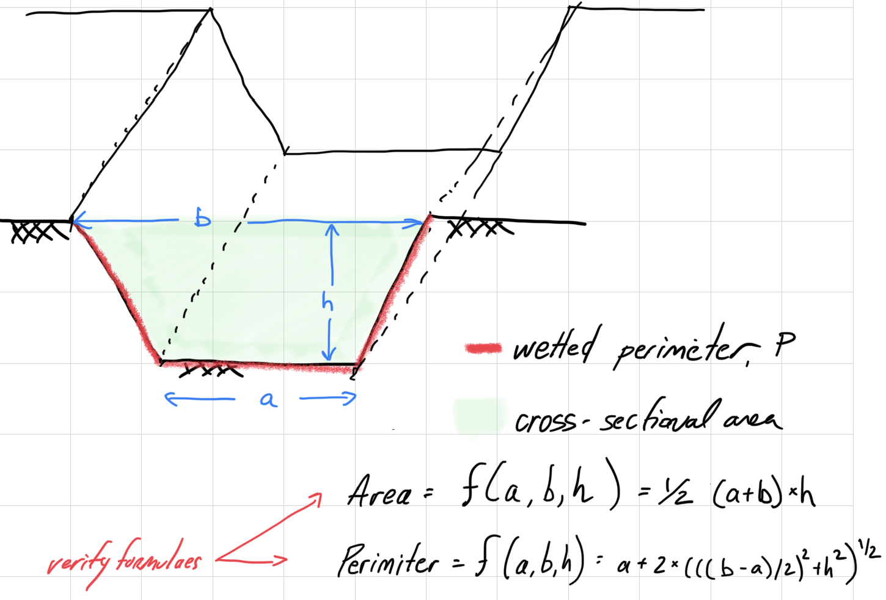

# Roots and Optima Examples {.unnumbered}

## Specific heat

Engineers use thermodynamics in their work to precisely heat and cool solids, liquids and gases. The following equation relates the zero-pressure specific heat of dry air $c_p$ [kJ/(kg K)] to temperature [K]:

$$c_p = 0.99302 + 1.672 \times 10^{-4}T + 9.7216 \times 10^{-8}T^2 - 9.5837 \times 10^{-11}T^3 +1.9320 \times 10^{-14}T^4$$

Make a plot of $c_p$ versus temperature from $T = 0$ to 1200 K. Then, find the temperature that corresponds to a $c_p$  of 1.1 kJ/(kg K).

```{r specific-heat-plot}
# define our variables
A_0 <- 0.99302
A_1 <- 1.672E-4
A_2 <- 9.7216E-8
A_3 <- -9.5837E-11
A_4 <- 1.9320E-14

T_range <- seq(0,1200, by = 1)

c_p0 <- 1.1

# define our function
c_p <- function(T_K, A_0, A_1, A_2, A_3, A_4, c_p0){
  A_0 + A_1 * T_K + A_2 * T_K^2 + A_3 * T_K^3 + A_4 * T_K^4 - c_p0
}

plot(T_range, c_p(T_K = T_range, A_0 = A_0, A_1 = A_1, A_2 = A_2, A_3 = A_3, A_4 = A_4, c_p0 = 1.1))
```

```{r cp-root}
uniroot(f = c_p, interval = c(0, 1200), A_0 = A_0, A_1 = A_1, A_2 = A_2, A_3 = A_3, A_4 = A_4, c_p0 = c_p0)
```


## Channel perimeter

As a Biological Systems Engineer, imagine you are asked to design a trapezoidal channel to carry irrigation water. Determine the optimal dimensions to minimize the wetted perimeter for a cross-sectional area of 50 m^2^.



$$P = a + 2 \sqrt{\left(\frac{b-a}{2}\right)^2 +h^2}$$
$$A = \frac{1}{2} \left(a + b \right) h$$
$$50 = \frac{1}{2} \left(a + b \right) h$$
Solve for h. 
$$h = \frac{100}{\left(a + b \right)}$$

Plug into perimeter function.

$$P = a + 2 \sqrt{\left(\frac{b-a}{2}\right)^2 +\left( \frac{100}{\left(a + b \right)} \right)^2}$$
#### Plot equation 
```{r}

library(plotly)
library(pracma)

a <- seq(1,50,0.1) # define range in a values
b <- seq(1,50,0.1) # define range in y values
ab <- pracma::meshgrid(a,b) # create grid of x,y pairs to evaluate
# NOTE: meshgrid takes two vectors and makes a matrix of all pairs of these values and renames these values X and Y
P <-  ab$X + 2 * sqrt(((ab$Y-ab$X)/2)^2 +(100/(ab$X + ab$Y))^2)
# use grid to create Z values (3rd dimension)
```


```{r}
fig <- plot_ly(z = P, x = a, y = b, type = "contour", contours = list(
    start = 0,
    end = 50,
    size = 0.1
  ))
fig

 # another option is a heatmap
fig <- plot_ly(z = P,  x = a, y = b, type = "heatmap")
fig
# we can also add labels to the contour
fig <- plot_ly(z = P,  x = a, y = b, type = "contour", contours = list(showlabels = TRUE))
fig

```

#### Write function

```{r}
P_func <- function(ab){ 
  ab[1] + 2 * sqrt(((ab[2]-ab[1])/2)^2 +(100/(ab[1] + ab[2]))^2)
  }

P_func(ab = c(5,10))
```

#### Find optimum

```{r}
range_X <- c(5, 10)
range_Y <- c(10, 15)
fminsearch(fn = P_func, x0 = c(7, 13))

```

