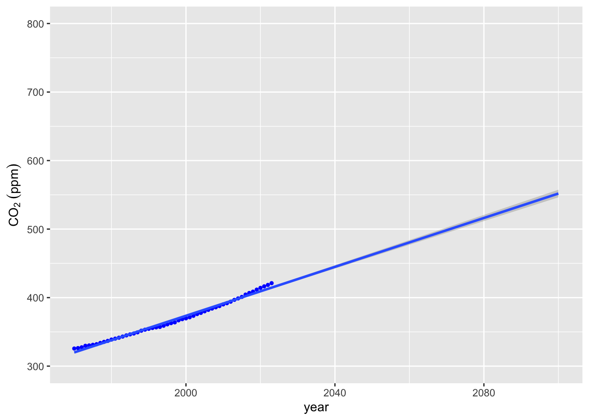
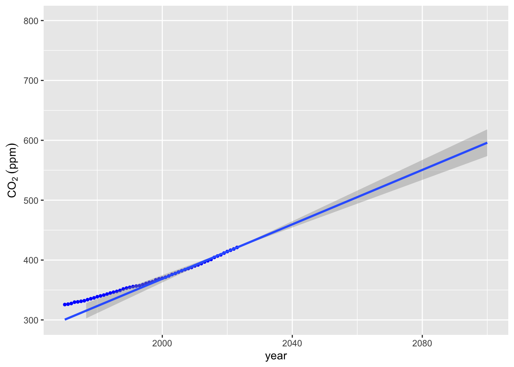
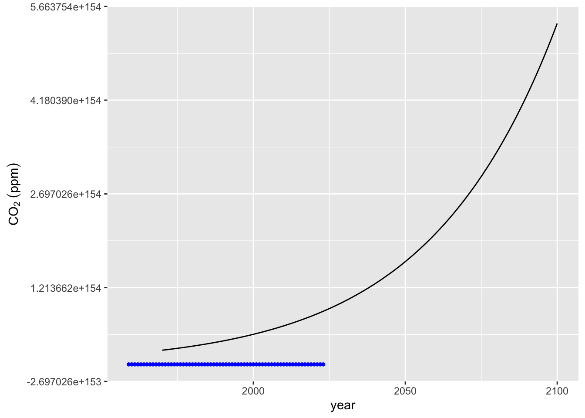
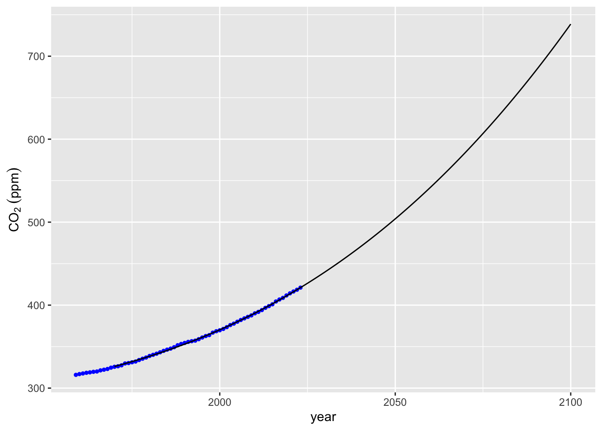

# Interpolation and Extrapolation Examples {.unnumbered}


``` r
# Set global chunk options and load necessary libraries
knitr::opts_chunk$set(echo = TRUE)
library(ggplot2)      # for plotting
library(tidyverse)    # for data manipulation and piping
```

```
## ── Attaching core tidyverse packages ──────────────────────── tidyverse 2.0.0 ──
## ✔ dplyr     1.1.4     ✔ readr     2.1.5
## ✔ forcats   1.0.0     ✔ stringr   1.5.1
## ✔ lubridate 1.9.4     ✔ tibble    3.2.1
## ✔ purrr     1.0.4     ✔ tidyr     1.3.1
## ── Conflicts ────────────────────────────────────────── tidyverse_conflicts() ──
## ✖ dplyr::filter() masks stats::filter()
## ✖ dplyr::lag()    masks stats::lag()
## ℹ Use the conflicted package (<http://conflicted.r-lib.org/>) to force all conflicts to become errors
```

``` r
library(PolynomF)     # for polynomial fitting functions
```

```
## 
## Attaching package: 'PolynomF'
## 
## The following object is masked from 'package:purrr':
## 
##     zap
```

``` r
library(pracma)       # for numerical tools, not used directly here
```

```
## 
## Attaching package: 'pracma'
## 
## The following objects are masked from 'package:PolynomF':
## 
##     integral, neville
## 
## The following object is masked from 'package:purrr':
## 
##     cross
```

## Example - CO~2~ at Mauna Loa Observatory

The Mauna Loa Observatory contains the longest *in situ* record of CO~2~ in the atmosphere. This dataset is ideal for demonstrating interpolation and extrapolation methods. Using this data, let's extrapolate the CO~2~ level at 2100. We'll start with linear interpolation/extrapolation using a few different methods and then we will try polynomial and splines methods.

>  **Interpolation**: Estimating values within known data range.  
>  **Extrapolation**: Predicting values beyond known data range.

We've downloaded this data from  ftp://aftp.cmdl.noaa.gov/products/trends/co2/co2_annmean_mlo.txt. 


Let's read in this data and start by visualizing it.


``` r
# Define column names and read in the dataset, skipping comments
coln <- c("year","co2","y")
mauna_loa_co2 <- read_delim("data/co2_annmean_mlo.txt",delim = "   ", comment = "#",col_names = coln)
```

```
## Rows: 65 Columns: 5
## ── Column specification ────────────────────────────────────────────────────────
## Delimiter: "   "
## chr (1): year
## dbl (2): co2, X5
## lgl (2): y, X4
## 
## ℹ Use `spec()` to retrieve the full column specification for this data.
## ℹ Specify the column types or set `show_col_types = FALSE` to quiet this message.
```

``` r
# Convert columns to numeric types
mauna_loa_co2$year <- as.numeric(mauna_loa_co2$year)
mauna_loa_co2$co2 <- as.numeric((mauna_loa_co2$co2))

# Plot the raw data to see the trend
plot(mauna_loa_co2$year, mauna_loa_co2$co2)
```


### Linear Extrapolation
Let's build a linear model and extrapolate to the year 2100.

**Pros:**
- Simple and interpretable
- Quick to compute

**Cons:**
- Assumes constant trend (which may be invalid for long-term projection)
- Often underestimates curved growth

Instead of using the `lin_interp` function we wrote, we can just make linear regression model of the data.


``` r
# Fit a linear model to the entire dataset
lm_co2 <- lm(co2 ~ year, data = mauna_loa_co2)

# Create a new tibble of years to predict
pred_co2 <- 
  tibble(year = seq(1970, 2100, 1)) |>  # sequence of years
  mutate(lm_pred_co2 = predict(lm_co2, pick(year)))  # predict CO2 values using the model
```

Plot the linear extrapolation


``` r
co2_plot <- ggplot(data = mauna_loa_co2,
    aes(x = year, y = co2)) +
  geom_point(
    size = 1,
    col = 'blue'
  ) + labs(y = expression(CO[2]~(ppm)))
co2_plot
```


``` r
co2_plot + stat_smooth(method = "lm", fullrange = TRUE) +   ylim(300, 800) + 
  xlim(1970, 2100)
```

```
## `geom_smooth()` using formula = 'y ~ x'
```

```
## Warning: Removed 11 rows containing non-finite outside the scale range
## (`stat_smooth()`).
```

```
## Warning: Removed 11 rows containing missing values or values outside the scale range
## (`geom_point()`).
```


Well over 550 ppm CO~2~ by 2100. But this doesn't really fit the data very well. Perhaps we could improve a bit by using our `lin_interp` function on the last 2 datapoints. 

### Manual Linear Extrapolation (Last 2 Points)

**Pros:**
- Reflects the most recent trend in the data
- Very simple and intuitive

**Cons:**
- Ignores all historical trends
- Can be overly sensitive to short-term noise


``` r
# Define a simple linear interpolation/extrapolation function
lin_interp <- function(fx1,fx2,x1,x2,x3) fx1+((fx2-fx1)/(x2-x1))*(x3-x1)

# Grab the last two rows of data
lin_extrap_data <- tail(mauna_loa_co2, n = 4)

# Apply manual extrapolation to estimate CO2 in 2100
lin_interp(fx1 = lin_extrap_data[[1,"co2"]],
           fx2 = lin_extrap_data[[2,"co2"]], 
           x1 = lin_extrap_data[[1,"year"]],
           x2 = lin_extrap_data[[2,"year"]], 
           x3 = 2100)
```

```
## [1] 590.21
```

``` r
# Fit a new linear model using just the last two points
lm2_co2 <- lm(co2 ~ year, data = lin_extrap_data)
```

620 ppm! That's more than 10% higher, but does it visually fit better? We can use the `geom_abline` function from `ggplot2` to plot a line with the right slope and intercept, although it would probably be easier to go back and make a linear model with the `lin_extrap_data` and use `predict` to make a line as we did above. 


``` r
co2_plot +
  geom_abline(slope = (lin_extrap_data[[2,"co2"]] - 
                         lin_extrap_data[[1,"co2"]]) / 
                      (lin_extrap_data[[2,"year"]] - 
                        lin_extrap_data[[1,"year"]]), 
              intercept = lin_extrap_data[[1,"co2"]] -
                          (lin_extrap_data[[2,"co2"]] - 
                         lin_extrap_data[[1,"co2"]]) / 
                      (lin_extrap_data[[2,"year"]] - 
                        lin_extrap_data[[1,"year"]])*
  lin_extrap_data[[1,"year"]], 
  color = "grey") + 
  ylim(300, 800) + 
  xlim(1970, 2100)
```

```
## Warning: Removed 11 rows containing missing values or values outside the scale range
## (`geom_point()`).
```


We can make a better plot providing confidence intervals using `stat_smooth`. 


``` r
co2_plot + stat_smooth(data = lin_extrap_data, method = "lm", fullrange = TRUE) +   ylim(300, 800) + 
  xlim(1970, 2100)
```

```
## `geom_smooth()` using formula = 'y ~ x'
```

```
## Warning: Removed 11 rows containing missing values or values outside the scale range
## (`geom_point()`).
```




### Polynomial Fit

**Pros:**
- Can capture curvature and nonlinear patterns
- Flexible with low-degree models

**Cons:**
- High-degree polynomials often overfit and behave wildly when extrapolating
- Sensitive to data irregularities and outliers


#### Method 1 `poly_calc` 

The `poly_calc` function provides a high order polynomial, but sometimes does not fit well.


``` r
# Use poly_calc to fit a high-order polynomial to the data
year_pred <- seq(1970, 2100)
co2_poly <- poly_calc(mauna_loa_co2$year, mauna_loa_co2$co2)

# Evaluate the polynomial at the prediction years
mauna_loa_co2_pred <- data.frame(year = year_pred, co2_poly = co2_poly(year_pred))

# Plot the high-degree polynomial fit
co2_plot + geom_line(data = mauna_loa_co2_pred, mapping = aes(x = year, y = co2_poly))
```



#### Method 2 `poly` inside `lm`

Using the `poly` function to define a polynomial 


``` r
# Fit a more controlled polynomial model (6th degree)
m3 <- lm(co2 ~ poly(x = year, degree = 6, raw = TRUE), data = mauna_loa_co2)
summary(m3)
```

```
## 
## Call:
## lm(formula = co2 ~ poly(x = year, degree = 6, raw = TRUE), data = mauna_loa_co2)
## 
## Residuals:
##      Min       1Q   Median       3Q      Max 
## -1.18271 -0.56983 -0.03815  0.51934  1.78748 
## 
## Coefficients: (3 not defined because of singularities)
##                                           Estimate Std. Error t value Pr(>|t|)
## (Intercept)                             -2.663e+05  1.329e+05  -2.004   0.0496
## poly(x = year, degree = 6, raw = TRUE)1  4.248e+02  2.003e+02   2.121   0.0380
## poly(x = year, degree = 6, raw = TRUE)2 -2.257e-01  1.006e-01  -2.243   0.0285
## poly(x = year, degree = 6, raw = TRUE)3  3.998e-05  1.684e-05   2.374   0.0208
## poly(x = year, degree = 6, raw = TRUE)4         NA         NA      NA       NA
## poly(x = year, degree = 6, raw = TRUE)5         NA         NA      NA       NA
## poly(x = year, degree = 6, raw = TRUE)6         NA         NA      NA       NA
##                                          
## (Intercept)                             *
## poly(x = year, degree = 6, raw = TRUE)1 *
## poly(x = year, degree = 6, raw = TRUE)2 *
## poly(x = year, degree = 6, raw = TRUE)3 *
## poly(x = year, degree = 6, raw = TRUE)4  
## poly(x = year, degree = 6, raw = TRUE)5  
## poly(x = year, degree = 6, raw = TRUE)6  
## ---
## Signif. codes:  0 '***' 0.001 '**' 0.01 '*' 0.05 '.' 0.1 ' ' 1
## 
## Residual standard error: 0.7036 on 61 degrees of freedom
## Multiple R-squared:  0.9995,	Adjusted R-squared:  0.9995 
## F-statistic: 4.226e+04 on 3 and 61 DF,  p-value: < 2.2e-16
```

``` r
# Predict values from the new model
mauna_loa_co2_pred$co2_m3 <- 
  m3 %>% predict(mauna_loa_co2_pred) 

# Plot the model's predictions
co2_plot + geom_line(data = mauna_loa_co2_pred, mapping = aes(x = year, y = co2_m3))
```


We can also use `lm(poly)` inside `stat_smooth` for nice visualizations including confidence intervals around our prediction. Within `stat_smooth` our formula needs to be in terms of x and y, which correspond to the variables mapped back in the `ggplot` call when we defined `co2_plot`; so looking back `aes(x = year, y = co2)`. To expand the range of the model predictions in `stat_smooth` we need to add `fullrange = TRUE` and then use `xlim` to expand the x-axis. 


``` r
ggplot(data = mauna_loa_co2,
    aes(x = year, y = co2)) +
  geom_point(size = 1) + 
  stat_smooth(method = lm, formula = y ~ poly(x = x, degree = 3, raw = TRUE), 
              fullrange = TRUE) + 
  xlim(1959, 2100)
```


### Spline Fitting

Finally, we can use the method of splines by similarly defining a splines model using the `bs` (stands for [b-splines, which are a type of spline](https://en.wikipedia.org/wiki/B-spline)) from the `splines` package.  

**Pros:**
- Captures local trends better than global polynomials
- More stable and flexible

**Cons:**
- Risk of overfitting if not carefully tuned
- May be harder to interpret


``` r
# Use splines to fit a curve to the data
library(splines)
m_splines <- lm(co2 ~ splines::bs(year, knots = mauna_loa_co2$co2), data = mauna_loa_co2)

# Predict using the spline model
mauna_loa_co2_pred$co2_m_splines <- 
  m_splines %>% predict(mauna_loa_co2_pred) 
```

```
## Warning in splines::bs(year, degree = 3L, knots = c(315.98, 316.91, 317.64, :
## some 'x' values beyond boundary knots may cause ill-conditioned bases
```

``` r
# Plot spline predictions
co2_plot + geom_line(data = mauna_loa_co2_pred, mapping = aes(x = year, y = co2_m_splines))
```




``` r
# Show predicted CO2 at year 2100 using spline model
mauna_loa_co2_pred %>% tail(n=1)
```

```
##     year      co2_poly   co2_m3 co2_m_splines
## 131 2100 5.394051e+154 738.7013      738.7013
```


``` r
# Visualize spline prediction using stat_smooth
ggplot(data = mauna_loa_co2,
    aes(x = year, y = co2)) +
  geom_point(size = 1) + 
  stat_smooth(method = lm, formula = y ~ bs(x = x, knots = mauna_loa_co2$co2), 
              fullrange = TRUE) + 
  xlim(1959, 2100)
```

```
## Warning in bs(x = x, degree = 3L, knots = c(315.98, 316.91, 317.64, 318.45, :
## some 'x' values beyond boundary knots may cause ill-conditioned bases
```


Now let's combine all of these examples together into a single figure. To do this we will use the `patchwork` package: 


``` r
library(patchwork)

# Visualize spline prediction using stat_smooth
splines_plot <-
  co2_plot +
  stat_smooth(
    method = lm,
    formula = y ~ bs(x = x, knots = mauna_loa_co2$co2),
    fullrange = TRUE
  ) + ylim(300, 800) + 
  xlim(1959, 2100) + labs(title = "Spline prediction")


# Visualize polynomial prediction using stat_smooth
poly_plot <-
  co2_plot +
  stat_smooth(
    method = lm,
    formula = y ~ poly(x = x, degree = 3, raw = TRUE),
    fullrange = TRUE
  ) + labs(title = "Polynomial prediction") +
  xlim(1959, 2100) + ylim(300, 800)

# full data linear plot
full_lm_plot <-
  co2_plot + 
  stat_smooth(method = "lm", fullrange = TRUE) +  
  labs(title = "Full linear prediction")+
  xlim(1959, 2100) + ylim(300, 800)

# last 2 points
local_lm_plot <- 
  co2_plot + 
  stat_smooth(data = lin_extrap_data, method = "lm", fullrange = TRUE) +   
  ylim(300, 800) + 
  xlim(1970, 2100) + 
  labs(title = "Local linear prediction")
  

full_lm_plot + local_lm_plot + poly_plot + splines_plot
```

```
## `geom_smooth()` using formula = 'y ~ x'
## `geom_smooth()` using formula = 'y ~ x'
```

```
## Warning: Removed 11 rows containing missing values or values outside the scale range
## (`geom_point()`).
```

```
## Warning in bs(x = x, degree = 3L, knots = c(315.98, 316.91, 317.64, 318.45, :
## some 'x' values beyond boundary knots may cause ill-conditioned bases
```


