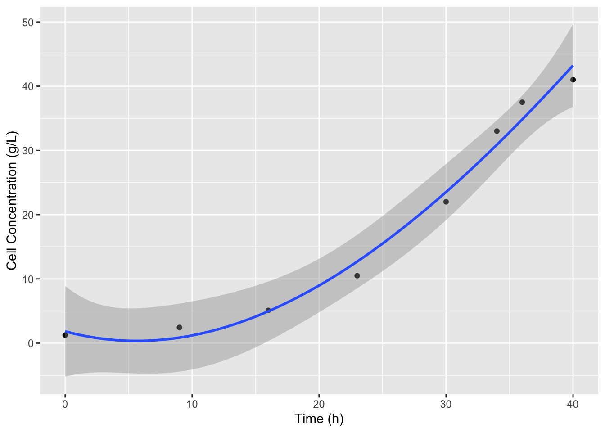
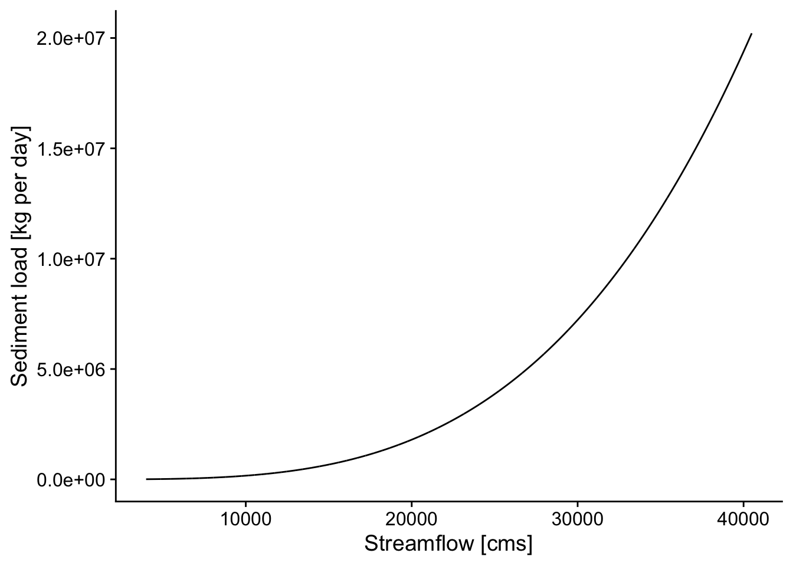
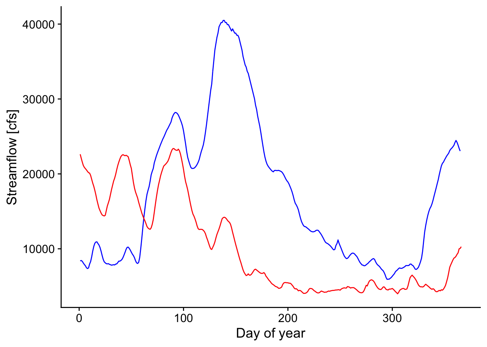
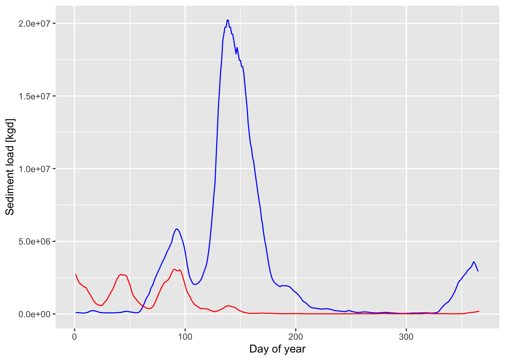

# Differentiation & Integration Examples {.unnumbered}

## Differentiation


``` r
library(readr)
library(dplyr)
```

```
## 
## Attaching package: 'dplyr'
```

```
## The following objects are masked from 'package:stats':
## 
##     filter, lag
```

```
## The following objects are masked from 'package:base':
## 
##     intersect, setdiff, setequal, union
```

``` r
library(ggplot2)
knitr::opts_chunk$set(echo = TRUE)
```

One place were we often use numerical differentiation to solve problems is in predicting and comparing cell growth rates. Cell growth can be defined by the differential equation:
$$\frac{dX}{dt} = \mu X$$
where X is the concentration of cells and $\mu$ is the specific growth rate, which in the simplest case is just a rate constant. So the rate of change of the concentration of cells is proportional to the current concentration of cells. In the simplest case, where  we can just solve this by integration by parts (IBP) to yield:
$$\ln\frac{X}{X_0} = \mu t$$
or 
$$X = X_0 e^{\mu t}$$

However, this simple case often deviates from reality, especially as whatever food (substrate) the cells are growing on becomes limited as the cells grow and consume it. To describe this, we expand the specific growth rate to include a dependence on the substrate concentration, $S$. This is called the Monod equation:
$$\mu = \frac{\mu_{max}S}{K_S+S}$$
Consider the following variables from the above formula, 
$\mu_{max}$ and $K_S$. Here $\mu_{max}$ and $K_S$ are constants known as the maximum specific growth rate at saturating concentrations of substrate and the equilibrium concentration of substrate, respectively. 

Now, we rearrange the equations to obtain a form that is able to be differentiated.

Adding this into the equation above:
$$\frac{dX}{dt} = \frac{\mu_{max}S}{K_S+S} X$$
This model fits real data much better; as substrate gets consumed within the culture, the growth rate slows. Unfortunately, we now have 2 parameters to fit and a differential equation to deal with at the same time!

## Calculating derivative values from data

To fit these parameters, we often use numerical differentiation to find $dX/dt$ values from $X$ vs time data. We will also typically measure S vs time as well. This data might look like the below:


``` r
cell_growth <- read_csv("Data/Cell_Growth_Example_Data.csv")
```

```
## Rows: 8 Columns: 3
## ── Column specification ────────────────────────────────────────────────────────
## Delimiter: ","
## dbl (3): Time (h), Cell Concentration (g/L), Glucose Concentration (g/L)
## 
## ℹ Use `spec()` to retrieve the full column specification for this data.
## ℹ Specify the column types or set `show_col_types = FALSE` to quiet this message.
```

``` r
knitr::kable(cell_growth)
```


| Time (h)| Cell Concentration (g/L)| Glucose Concentration (g/L)|
|--------:|------------------------:|---------------------------:|
|        0|                     1.25|                      100.00|
|        9|                     2.45|                       97.00|
|       16|                     5.10|                       90.40|
|       23|                    10.50|                       76.90|
|       30|                    22.00|                       48.10|
|       34|                    33.00|                       20.60|
|       36|                    37.50|                        9.38|
|       40|                    41.00|                        0.63|

In this table, Cell Concentration is $X$ and Glucose Concentration is the substrate concentration $S$. 

Now we can use this data to calculate $dX/dt$ and regress this calculated derivative against $X$ to find $\mu$ and then use a linearization of the Monod equation and an additional regression model to find the parameters $\mu_{max}$ and $K_S$.

### Difference methods

An error-prone way to do this, which basically propagates any error in the data throughout the calculation, would be to just find $\Delta X / \Delta t$ for each pair of points in the dataset. To do this, we can use the `diff` function from base R. `diff` calculates the difference between each value in a vector and the next value.

Here are  a couple of examples of `diff`

``` r
# 
diff(1:5)
```

```
## [1] 1 1 1 1
```

``` r
diff(c(1,2,4,8,16))
```

```
## [1] 1 2 4 8
```

And now to calculate the derivative at each point with `diff`

``` r
dX_dt <- diff(cell_growth$`Cell Concentration (g/L)`) / 
  diff(cell_growth$`Time (h)`) 
```

Note that the length of this is vector is 1 shorter than the full dataset

``` r
length(dX_dt)
```

```
## [1] 7
```

``` r
length(cell_growth$`Time (h)`)
```

```
## [1] 8
```

So we need to add in an NA for the first row where there can be no diff 

``` r
dX_dt <-  c(NA, dX_dt)
cell_growth
```

```
## # A tibble: 8 × 3
##   `Time (h)` `Cell Concentration (g/L)` `Glucose Concentration (g/L)`
##        <dbl>                      <dbl>                         <dbl>
## 1          0                       1.25                        100   
## 2          9                       2.45                         97   
## 3         16                       5.1                          90.4 
## 4         23                      10.5                          76.9 
## 5         30                      22                            48.1 
## 6         34                      33                            20.6 
## 7         36                      37.5                           9.38
## 8         40                      41                             0.63
```

A tidyverse way to do this in one line without having to deal with the length difference is to use the `lag` function in a mutate call, instead of `diff`. `lag` and `lead` just shift the values in a vector left or right respectively and add an `NA` to the respective side.  

``` r
lag(1:5)
```

```
## [1] NA  1  2  3  4
```

``` r
lead(1:5)
```

```
## [1]  2  3  4  5 NA
```

``` r
cell_growth %>% 
  mutate(dX_dt  = (`Cell Concentration (g/L)` - 
                     lag(`Cell Concentration (g/L)`)) / 
         (`Time (h)` - lag(`Time (h)`)))  
```

```
## # A tibble: 8 × 4
##   `Time (h)` `Cell Concentration (g/L)` `Glucose Concentration (g/L)`  dX_dt
##        <dbl>                      <dbl>                         <dbl>  <dbl>
## 1          0                       1.25                        100    NA    
## 2          9                       2.45                         97     0.133
## 3         16                       5.1                          90.4   0.379
## 4         23                      10.5                          76.9   0.771
## 5         30                      22                            48.1   1.64 
## 6         34                      33                            20.6   2.75 
## 7         36                      37.5                           9.38  2.25 
## 8         40                      41                             0.63  0.875
```

The above gives us values, but depending on how noisy the data is the derivative values could be really noisy. This is because in calculating the derivative the noise in two data points is combined, amplifying it.  

### Interpolation methods

The best way to find the derivative of a dataset is to first fit a function to the dataset to smooth the noise of the data. Then find the derivative of that curve. We can use splines for this, and this will work in many general cases, when we don't know the function. Since our data is pretty smooth and sparse (we don't have any overlapping data points) we can adjust the degrees of freedom or `df` parameter of the model to best fit our data. This might require some knowledge of how the data should look to do effectively. For example if we just use the defaults in `splines::bs`:


``` r
ggplot(data = cell_growth, 
       mapping = aes(x = `Time (h)`, y = `Cell Concentration (g/L)`)) + 
  geom_point() + 
  stat_smooth(method = lm, 
              formula = y ~ splines::bs(x = x))
```



It looks like we miss the slow down in cell growth at to the top of the curve which is what we expect because the substrate is nearly completely consumed. We can use the `df` argument in `bs` to include more splines and better fit the data. The default for `df` is 3, 8 data points minus the two outer point, minus 3 for the cubic degree of the splines. Let's increase `df` to 4.   


``` r
ggplot(data = cell_growth, 
       mapping = aes(x = `Time (h)`, y = `Cell Concentration (g/L)`)) + 
  geom_point() + 
  stat_smooth(method = lm, 
              formula = y ~ splines::bs(x = x, df = 4)) #add df
```


That looks better. Now we can recreate this model in `lm` defining an object that we can use to predict values and define derivatives. Since we have a smooth function now we can use a very small interval to calculate the derivatives, for example 0.5 hours. We also don't have to worry about not having derivative values at the first or last datapoints. 

``` r
X_t <- lm(X ~ splines::bs(x = t, df = 4), 
          data = cell_growth %>% 
            rename(X = `Cell Concentration (g/L)` , t = `Time (h)`))
# NOTE: I had to change the names of the columns here because the spaces and parentheses were F-ing things up with predict
delta_t <- 0.1
# remember predict uses data frames to define variable names
t_new <- data.frame(t = cell_growth$`Time (h)` - delta_t)
#without the renaming step the following was returning all TRUE because predict defaults to using the data passed to lm, so when it didn't recognize the variable names it was using the default data
predict(object = X_t) == predict(object = X_t, newdata = t_new)
```

```
## Warning in splines::bs(x = t, degree = 3L, knots = 26.5, Boundary.knots = c(0,
## : some 'x' values beyond boundary knots may cause ill-conditioned bases
```

```
##     1     2     3     4     5     6     7     8 
## FALSE FALSE FALSE FALSE FALSE FALSE FALSE FALSE
```

``` r
cell_growth %>% 
  mutate(dX_dt  = (predict(X_t)  - 
                     predict(X_t, t_new))/delta_t) ->
  cell_growth
```

```
## Warning: There was 1 warning in `mutate()`.
## ℹ In argument: `dX_dt = (predict(X_t) - predict(X_t, t_new))/delta_t`.
## Caused by warning in `splines::bs()`:
## ! some 'x' values beyond boundary knots may cause ill-conditioned bases
```

OK! So now we have $dX/dt$ values. Now we can calculate $\mu$ values, by dividing $dX/dt$ by $X$. I'm also going to fix the column names so we don't run into any more issues.

``` r
cell_growth <-
cell_growth %>% 
  rename(t = `Time (h)`, 
         X = `Cell Concentration (g/L)`, 
         S = `Glucose Concentration (g/L)`) %>%
  mutate(mu = dX_dt / X)
```

Now that we have our $\mu$ values we can figure out how to model the Monod equation so that we can find values for the $\mu_{max}$ and $K_S$ for these cells and media with glucose as a limiting substrate. Because the Monod equation is very nonlinear one of the easiest ways to find parameters for this equation is to linearize it by algebraic manipulation. 
$$\mu = \frac{\mu_{max}S}{K_S + S}$$
To linearize here we will multiply by $K_S + S$ 
$$(\mu*K_S) + (\mu*S) = \mu_{max}S$$
and then to get this into a convenient form of $y = mx + b$ (so we can calculate y and x values using our data table) we can subtract $\muK_S$ and divide by $S$ to yield:
$$\mu = - K_S\frac{\mu}{S} + \mu_{max}$$
This is called the Eadie-Hofstee linearization. So if we plot $\mu$ vs $\mu/S$ and find the slope and intercept of a regression model the slope will be $-K_S$ and the intercept will be $\mu_{max}$.

``` r
cell_growth %>% mutate(EH_X = mu / S) ->
  cell_growth
EH <- lm(mu ~ EH_X, data = cell_growth)
summary(EH)
```

```
## 
## Call:
## lm(formula = mu ~ EH_X, data = cell_growth)
## 
## Residuals:
##       Min        1Q    Median        3Q       Max 
## -0.092115 -0.051180 -0.041225 -0.008532  0.293031 
## 
## Coefficients:
##             Estimate Std. Error t value Pr(>|t|)  
## (Intercept)  0.12952    0.06073   2.133   0.0769 .
## EH_X        -4.70939    8.97458  -0.525   0.6186  
## ---
## Signif. codes:  0 '***' 0.001 '**' 0.01 '*' 0.05 '.' 0.1 ' ' 1
## 
## Residual standard error: 0.1315 on 6 degrees of freedom
## Multiple R-squared:  0.04388,	Adjusted R-squared:  -0.1155 
## F-statistic: 0.2754 on 1 and 6 DF,  p-value: 0.6186
```

So the $\mu_{max}$ is 0.1295245 1/h and $K_S$ is -4.709391 g/L. Now we can define a function to predict the $\DeltaX$ for each timestep, calculate the predicted $X$ values and add this to our plot. 

``` r
cell_growth_monod_dX <- function(S, dt, mu_max, K_S) {
  dX <- mu_max * S / (K_S + S ) * dt
  return(dX)
}

cell_growth <- 
  cell_growth %>% 
  mutate(monodX = X + cell_growth_monod_dX(S = .$S, 
                                   dt = .$t - lag(.$t),
                                   mu_max = EH$coefficients[1],
                                   K_S = -EH$coefficients[2]))

ggplot(data = cell_growth, 
       mapping = aes(x = t, y = X)) + 
  geom_point() +
  geom_point(aes(y = monodX), color = "green")
```

```
## Warning: Removed 1 row containing missing values or values outside the scale range
## (`geom_point()`).
```


## Integration


``` r
library(dataRetrieval)
library(ggplot2)
library(pracma)
library(readxl)
library(dplyr)
library(cowplot)
library(lubridate)
```

```
## 
## Attaching package: 'lubridate'
```

```
## The following object is masked from 'package:cowplot':
## 
##     stamp
```

```
## The following objects are masked from 'package:base':
## 
##     date, intersect, setdiff, union
```
Paper source:
Rosburg et al. (2016). The effect of flow data resolution on sediment yield estimation and channel design. https://doi.org/10.1016/j.jhydrol.2016.04.040

## Objective: calculate total annual sediment [mass/year] and water [volume/year] for a given year for a specific station

## Approach: 
Here, you'll apply numerical integration using the `trapz` function in `pracma`. You'll want to set up a data frame of x and y, with x = day of year ranging between 1-365; y is the sediment load based on the equation and given streamflow).

## Workflow

1. Read in sediment-rating curve (data here in the file 1-s2.0-S0022169416302311-mmc2.xlsx)
2. Read in streamflow data using `readNWISdv` from `dataRetrieval` package
2. Calculate average daily sediment yield [kg/s]
3. For a given year, integrate under the daily sediment yield and daily streamflow using `trapz` function within the `pracma` package. 

## Apply case scenario: 
Compare the 2011 and 2012 year for water and sediment in the Lower Mississippi River (station id 07374000). Create 1 plot (with day of year on x-axis) of streamflow (2 lines, one for 2011 and one for 2012); Create 1 plot (with day of year on x-axis) of sediment flux (2 lines, one for 2011 and one for 2012). Calculate total annual sediment mass and water volume and compare the values between 2011 and 2012. Is the ratio of sediment mass for each year the same as the ratio of water volume (e.g. mass sed 2012/mass sed 2011)? In other words, was the streamflow carrying the same amount of sediment in 2011 and 2012? Create clear graphics and write up your comparison in a paragraph. 


#### Background on sediment rating curve table and the coefficients $a$ and $b$:
From Rosburg et al.: Relationships between water discharge and sediment load often can be expressed as a simple power function: 
$$Q_s = aQ^b$$
where $Q_s$ is the sediment discharge rate (kg/s), $Q$ is the concurrently-measured water discharge rate (m^3^/s), and $a$ and $b$ are best fit regression parameters (Asselman, 2000, Syvitski et al., 2000). This function is referred to as a sediment rating curve. In this relationship, it has been suggested that the exponent $b$ is related to the transport capacity in excess of sediment supply within a river channel, while the coefficient $a$ is related to absolute sediment supply (Barry et al., 2004). The exponent, $b$, tends to increase with the size of bed material in coarse bed rivers (Emmett and Wolman, 2001).

### Read in sediment rating curve table

``` r
ds <- readxl::read_excel("Data/dataset-1-s2.0-S0022169416302311-mmc2.xlsx", 
     col_types = c("text", "text", "numeric", 
         "numeric", "numeric", "numeric", 
         "numeric", "numeric", "text", 
         "text", "numeric", "numeric", 
         "text"), skip = 1)
```
### Station Identification and Data Retreival


``` r
site_id <- '07374000'
startDate <- '2000-01-01'
endDate <- '2020-12-30'
pCode <- '00060'
rawDailyQ <- readNWISdv(siteNumbers = site_id, 
                        parameterCd = pCode, 
                        startDate = startDate, 
                        endDate = endDate)
```

```
## GET:https://waterservices.usgs.gov/nwis/dv/?site=07374000&format=waterml%2C1.1&ParameterCd=00060&StatCd=00003&startDT=2000-01-01&endDT=2020-12-30
```

### Filter sediment table for station of interest

``` r
dsm <- ds[which(ds$`Site Number`==site_id),]
```

### Calculate Daily sediment mass flux

``` r
#cfs
Q_cms <- rawDailyQ$X_00060_00003/3.28084^3 # conversion to cms
a <- dsm$a # set a coefficient from filtered rating curve table
b <- dsm$b # set b coefficient from filtered rating curve table
Qs_kgs <- a*Q_cms^b
Qs_kgd <- Qs_kgs*60*60*24 # sediment load per day in kg/day
d <- data.frame(Q_cms,Qs_kgd,rawDailyQ$Date)
colnames(d)[3] <- "Date"
p <- ggplot(d, aes(Q_cms, Qs_kgd)) + 
  geom_line() + 
  theme_cowplot() +
  xlab('Streamflow [cms]') +
  ylab('Sediment load [kg per day]')
p
```




``` r
p2 <- ggplot(rawDailyQ, aes(Date,X_00060_00003)) + 
  geom_point() + 
  theme_cowplot() +
  xlab('Date') +
  ylab('Streamflow [cfs]')
p2
```


``` r
p3 <- ggplot(d, aes(Date,Qs_kgd)) + 
  geom_point() + 
  theme_cowplot() +
  xlab('Date') +
  ylab('Sediment Flux [kg/d]')
p3
```


## Compare 2011 and 2012 in case study


``` r
d1 <- filter(d, Date > "2010-12-31" & Date < "2012-01-01")
d2011 <- trapz(d1$Qs_kgd)*.001 # include conversion seconds to days, kg to metric tons
q2011 <- trapz(d1$Q_cms*86400)/1e9 # include conversion seconds to days, scale by 1e9, so units are billion cubic meters 
q2011
```

```
## [1] 543.9495
```

``` r
d2011
```

```
## [1] 1054709
```


``` r
d2 <- filter(d, Date > "2011-12-31" & Date < "2013-01-01")
d2012 <- trapz(d2$Qs_kgd)*.001 # include conversion seconds to days, kg to metric tons
q2012 <- trapz(d2$Q_cms*86400)/1e9 # include conversion seconds to days, scale by 1e9, so units are billion cubic meters 
q2012
```

```
## [1] 319.2169
```

``` r
d2012
```

```
## [1] 194539.8
```


``` r
q2012/q2011 # ratio of total water volume per year
```

```
## [1] 0.5868502
```

``` r
d2012/d2011 # ratio of total sediment mass per year
```

```
## [1] 0.1844487
```

``` r
p2 <- ggplot() +
  geom_line(data=d1, aes(x=yday(Date),y=Q_cms), color="blue") +
  geom_line(data=d2, aes(x=yday(Date),y=Q_cms), color="red") +
    theme_cowplot() +
  xlab('Day of year') +
  ylab('Streamflow [cfs]')
p2
```



``` r
p3 <- ggplot() +
  geom_line(data=d1, aes(x=yday(Date),y=Qs_kgd), color="blue") +
  geom_line(data=d2, aes(x=yday(Date),y=Qs_kgd), color="red") +
    #theme_cowplot() +
  xlab('Day of year') +
  ylab('Sediment load [kgd]') + theme(legend.position = "right")
p3
```




``` r
d_f <- d %>% 
  #create a year column
  mutate(yr=year(Date)) %>% 
  # group by year and then integrate to find total volume or mass for each year
  group_by(yr) %>% mutate(Q_int = trapz(Q_cms)*8640/1e9) %>% 
  mutate(Qs_int = trapz(Qs_kgd)*.001)  %>% 
  summarize_all(max)
d_f
```

```
## # A tibble: 17 × 6
##       yr  Q_cms    Qs_kgd Date       Q_int   Qs_int
##    <dbl>  <dbl>     <dbl> <date>     <dbl>    <dbl>
##  1  2004 26221.  4553560. 2004-12-31  38.2  322037.
##  2  2005 32848.  9862029. 2005-12-31  38.2  367596.
##  3  2006 21266.  2219833. 2006-12-31  31.6  110515.
##  4  2007 25315.  4036111. 2007-12-31  39.1  235636.
##  5  2008 37378. 15361866. 2008-12-31  55.4  950416.
##  6  2009 33414. 10457567. 2009-12-31  56.3  699609.
##  7  2010 29450.  6781094. 2010-12-31  51.0  546120.
##  8  2011 40493. 20215198. 2011-12-31  54.4 1054709.
##  9  2012 23390.  3076925. 2012-12-31  31.9  194540.
## 10  2013 28317.  5927552. 2013-12-31  47.7  468387.
## 11  2014 24239.  3477446. 2014-12-31  43.6  263207.
## 12  2015 30016.  7238932. 2015-12-31  55.2  753439.
## 13  2016 37661. 15764729. 2016-12-31  55.5  851360.
## 14  2017 34547. 11724372. 2017-12-31  48.4  579603.
## 15  2018 38228. 16592820. 2018-12-31  59.7  974006.
## 16  2019 38794. 17451266. 2019-12-31  81.3 2325045.
## 17  2020 38511. 17018208. 2020-12-30  65.3 1584083.
```

``` r
d_f$rq <- d_f$Qs_int/d_f$Q_int/1000
d_f$m <- d_f$Qs_int/d_f$Q_cms
d_f
```

```
## # A tibble: 17 × 8
##       yr  Q_cms    Qs_kgd Date       Q_int   Qs_int    rq     m
##    <dbl>  <dbl>     <dbl> <date>     <dbl>    <dbl> <dbl> <dbl>
##  1  2004 26221.  4553560. 2004-12-31  38.2  322037.  8.42 12.3 
##  2  2005 32848.  9862029. 2005-12-31  38.2  367596.  9.63 11.2 
##  3  2006 21266.  2219833. 2006-12-31  31.6  110515.  3.50  5.20
##  4  2007 25315.  4036111. 2007-12-31  39.1  235636.  6.02  9.31
##  5  2008 37378. 15361866. 2008-12-31  55.4  950416. 17.2  25.4 
##  6  2009 33414. 10457567. 2009-12-31  56.3  699609. 12.4  20.9 
##  7  2010 29450.  6781094. 2010-12-31  51.0  546120. 10.7  18.5 
##  8  2011 40493. 20215198. 2011-12-31  54.4 1054709. 19.4  26.0 
##  9  2012 23390.  3076925. 2012-12-31  31.9  194540.  6.09  8.32
## 10  2013 28317.  5927552. 2013-12-31  47.7  468387.  9.81 16.5 
## 11  2014 24239.  3477446. 2014-12-31  43.6  263207.  6.04 10.9 
## 12  2015 30016.  7238932. 2015-12-31  55.2  753439. 13.6  25.1 
## 13  2016 37661. 15764729. 2016-12-31  55.5  851360. 15.3  22.6 
## 14  2017 34547. 11724372. 2017-12-31  48.4  579603. 12.0  16.8 
## 15  2018 38228. 16592820. 2018-12-31  59.7  974006. 16.3  25.5 
## 16  2019 38794. 17451266. 2019-12-31  81.3 2325045. 28.6  59.9 
## 17  2020 38511. 17018208. 2020-12-30  65.3 1584083. 24.2  41.1
```


Let's build one single dataset from the 2011 and 2012 data above so that we can make a nice legend on our plot.


``` r
data_2011_2012 <- 
  bind_rows(d1, d2) %>%
  mutate(Year = year(Date) %>% as.factor(),
         DOTY = yday(Date))


ggplot(data = data_2011_2012, 
       mapping = aes(x = DOTY, y = Qs_kgd, color = Year)) +
  geom_line() +
  theme_cowplot() +
  xlab('Day of year') +
  ylab('Sediment load [kgd]') 
```


