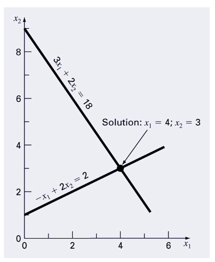
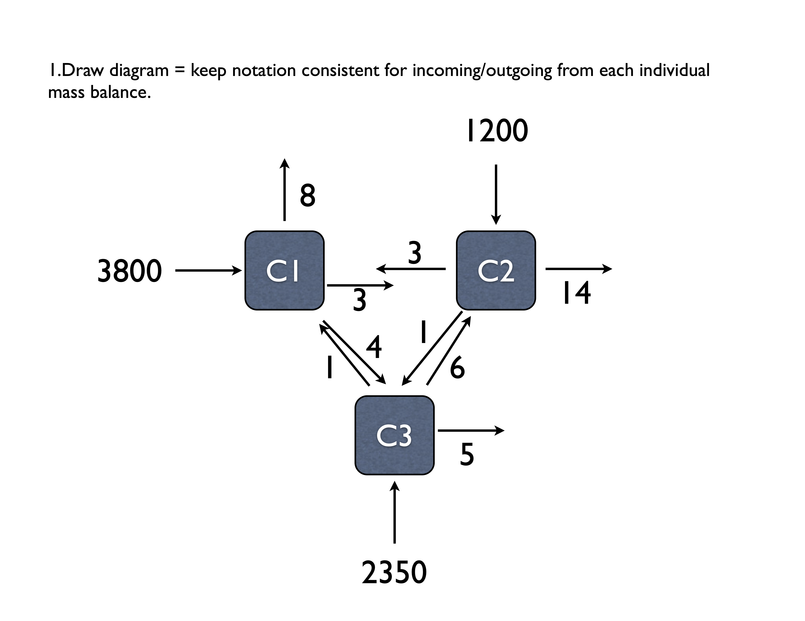
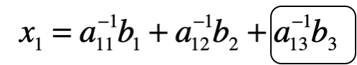

# Systems of Equations Examples {.unnumbered}

```{r setup, include=FALSE}
knitr::opts_chunk$set(echo = TRUE)
library(pracma)
```

## Example 1

Imagine you have a simple set of equations, and you plot them out. The solution is at the intersection if you plot them. Let's solve using matrix algebra:


$$
3x_1 + 2x_2 = 18 \\
-x_1 + 2x_2 = 2
$$

```{r}
# Define our matrix of coefficients
coef_matrix <- matrix(data = c(3, 2, -1, 2),
                      nrow = 2, 
                      ncol = 2, 
                      byrow = TRUE)

# Define right hand side matrix
rhs_matrix <-
  matrix(
    data = c(18, 2),
    nrow = 2,
    ncol = 1,
    byrow = TRUE
  )

# Solving the system of equations

# using inverse
# calculate the inverse of coef_matrix
inv_coef_matrix <- solve(coef_matrix)

# multiply inverse coefficient matrix by rhs to get the solution
soln <- inv_coef_matrix %*% rhs_matrix
soln

# Solve using the 'solve' function
solve(coef_matrix, rhs_matrix)
```


We'll employ the solve function. When you enter just the A matrix, you get the inverse as the output. When you enter the A and B matrix/vectors, you'll get the x vector.

`matrix(vector, ncol = col, byrow = TRUE)` = define a matrix from `vector` filling in values across `col` columns starting with the first row and proceeding left to right top to bottom.

`%*%` = matrix multiplication operator.

`solve` = function for solving systems, can input A or A & B.

### Simple Matrix and solving for X

```{r}
A <- matrix(c(3, 2, -1, 2), ncol = 2, byrow=TRUE)
Ainv <- solve(A)
B <- matrix(c(18,2), ncol = 1, byrow=TRUE)
X <- Ainv %*% B
#or 
X <- solve(A,B)
X
```

## Example 2

$$
\begin{aligned}
10 x_1 + 2x_2 - x_3 &  = 27 \\
-3 x_1 - 6x_2 + 2x_3 & = -61.5 \\
x_1 + x_2 + 5x_3 & = -21.5
\end{aligned}
$$

```{r}
A <- matrix(c(10, 2, -1, 
              -3, -6, 2, 
              1, 1, 5), 
            nrow = 3,
            byrow = TRUE)
B <- matrix(data = c(27, 
                     -61.5, 
                     -21.5), ncol = 1, byrow = TRUE)
x <- inv(A) %*% B
x
```


## Example 3 (Problem 11.3 in Chapra)


TODO: Redraw this figure with proper units and variable specifications

$$
\begin{aligned}
In &= Out \\
\text{Tank 1: } 3800 + 3c_2 + 1c_3 &= (8 + 3 + 4)c_1 \\
\text{Tank 2: } 1200 + 3c_1 + 6c_3 &= (3 + 1 + 14)c_2 \\
\text{Tank 3: } 2350 + 4c_1 + 1c_2 &= (5 + 6 + 1)c_3 
\end{aligned}
$$
and rearranging and simplifying this 

$$
\begin{aligned}
\text{Tank 1: } 3800 &=  15c_1  &- 3c_2 &- 1c_3\\
\text{Tank 2: } 1200 &=  -3c_1 &+ 18c_2 &- 6c_3  \\
\text{Tank 3: } 2350 &=  - 4c_1 &- 1c_2 &+ 12c_3 
\end{aligned}
$$


Here we'll use the PRACMA package that uses `mldivide` to solve for x in A*x=b. We can also first solve for the inverse  of A using `solve(A)`.


```{r}
library(pracma)


A <- matrix(c(15, -3, -1, 
              -3, 18, -6, 
              -4, -1, 12), 
            ncol = 3, 
            byrow=TRUE)
A
invA <- solve(A)
invA[1,1]
b <- matrix(c(3800,1200,2350))
b
x <- invA %*% b
x <- mldivide(A, b) # matrix multiplication vs element by element
x

```
### To find effect of reactor 3 on reactor 1....

This is where the matrix inverse is really cool, and provides an opportunity to quantify change in one part of a system on another component. Here, imagine we make a change in reactor 3, and want to know how this in turn changes the concentration in reactor 1. We'll walk through this in class in some more detail, but the basic premise is the following: when we multiple the inverse of A by b, the first equation for reactor 1 is the following:



Thus we can use the circled part to determine the effect of reactor 3 on 1!

```{r}
x13effect <- invA[1,3] * b[3]
x13effect
invA[1,2] * b[2]
invA[1,1] * b[1]

``` 

## Differential Equations

A bacterial culture grows according to the **logistic growth model**:

$$
\frac{dN}{dt} = rN\left(1 - \frac{N}{K}\right)
$$

where:

- $N(t)$ = population at time $t$,
- $r$ = intrinsic growth rate,
- $K$ = carrying capacity.

Our goal is to solve this ordinary differential equation (ODE) numerically to predict the population size over time.

### Model Parameters

- Initial population: $N(0) = 10^6$ cells
- Growth rate: $r = 0.8  \text{hr}^{-1}$
- Carrying capacity: $K = 10^8$ cells
- Time span: $t = 0$ to $10$ hours

### Solving with Euler’s Method

Euler’s method approximates the solution by:

$$
N(t+\Delta t) = N(t) + \Delta t \times \frac{dN}{dt}
$$

where $\Delta t$ is a small time step.

```{r}
# Parameters
r <- 0.8          # Growth rate (per hour)
K <- 1e8          # Carrying capacity
N0 <- 1e6         # Initial population
t_max <- 10       # Total time (hours)
dt <- 0.1         # Time step (hours)

# Time vector
time <- seq(0, t_max, by = dt)
n_steps <- length(time)

# Initialize vector to store population
N_euler <- numeric(n_steps)
N_euler[1] <- N0

# Euler's method loop
for (i in 1:(n_steps - 1)) {
  dNdt <- r * N_euler[i] * (1 - N_euler[i]/K)
  N_euler[i+1] <- N_euler[i] + dt * dNdt
}
```


### Solving with `deSolve::ode`

We can also use a more accurate numerical solver provided in the `deSolve` package.

```{r}
# Install deSolve if needed
# install.packages("deSolve")

library(deSolve)

# Define the model as a function
logistic_growth <- function(t, state, parameters) {
  with(as.list(c(state, parameters)), {
    dN <- r * N * (1 - N/K)
    list(c(dN))
  })
}

# Initial state and parameters
state <- c(N = N0)
parameters <- c(r = r, K = K)
times <- seq(0, t_max, by = dt)

# Solve the ODE
out <- ode(y = state, times = times, func = logistic_growth, parms = parameters)

# Convert output to data frame
out <- as.data.frame(out)
```


### Comparing Solutions

Let's plot the Euler approximation and the more accurate `ode` solver results together.

```{r}
library(ggplot2)

# Create data frame for Euler method
euler_data <- data.frame(
  time = time,
  population = N_euler,
  method = "Euler"
)

# Create data frame for ode solver
ode_data <- data.frame(
  time = out$time,
  population = out$N,
  method = "deSolve"
)

# Combine both
combined_data <- rbind(euler_data, ode_data)

# Plot
ggplot(combined_data, aes(x = time, y = population, color = method)) +
  geom_line() +
  labs(title = "Bacterial Growth Model: Euler vs deSolve",
       x = "Time (hours)",
       y = "Population (cells)",
       color = "Method") +
  theme_minimal()
```

### Discussion

- Euler’s method is simple but can introduce error, especially with larger time steps.
- `deSolve::ode` uses more advanced methods (like Runge-Kutta) for better accuracy.
- As the population $N(t)$ approaches the carrying capacity $K$, the growth slows down, illustrating resource limitation effects.
